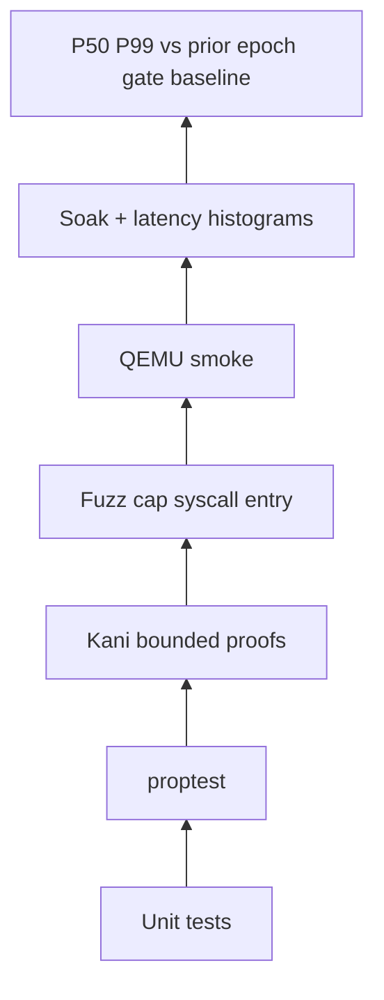
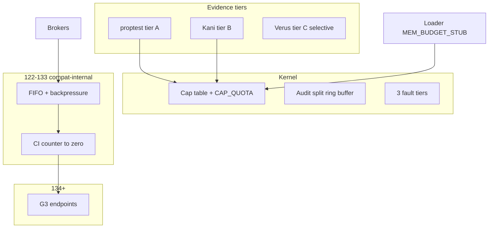

# AresOS: Build to a Rust-Native OS That Surpasses Linux and Windows

## Guiding principle: do not rush

- **One phase per cycle** — validate, soak, benchmark, **commit**, then next phase
- **Spec before code** — docs + threat-node mapping before kernel changes
- **Honest evidence tiers** — proptest is **not** formal verification; Kani/Verus are distinct tiers ([`PROOF_COVERAGE.md`](docs/PROOF_COVERAGE.md))
- **Contract before enforcement** — stubs (`MEM_BUDGET_STUB`, `CAP_QUOTA_STUB`) from phase 121; full policy later
- **One commit per phase** — phase owner signs off; documented revert + epoch failure procedures
- **Epoch 0 is deliberately larger** — schedule trade accepted to avoid undefined behavior in epochs 1–4

Estimated pace: **1–3 phases/month**. Milestone 150 is **multi-year**.

---

## Three-tier evidence model (security claims)

| Tier | Method | Proves | Does **not** prove |
|------|--------|--------|-------------------|
| **A** | Unit tests + proptest | Property on large random **sample** | All inputs |
| **B** | **Kani** at declared harness bound | All inputs **within bound** | Unbounded / async-crossing paths |
| **C** | **Verus** (objective trigger) | Selected cap-table / temporal invariants | Entire kernel |
| **D** | TLA+ / model checking (stub) | Infinite-trace / liveness where Kani+Verus inadequate | **Deferred post-150** — no ad-hoc tier claims |

**Honesty rules:**

- Never call tier A or B "complete proof" — tier B is **"passes at harness bound H"**, documented in [`KANI_SCOPE.md`](docs/KANI_SCOPE.md) (or PROOF_COVERAGE § Kani)
- Kani **cannot**: async boundaries, unbounded loops, large dynamic structures — tractability boundary is a **design decision**, not implementation detail
- When Kani is intractable: document in KANI_SCOPE; escalate per Verus triggers below; **do not** shrink bounds until proofs trivialize

**Verus triggers** (objective — in PROOF_COVERAGE.md):

1. Kani harness bound must exceed threshold **H_max** (default: depth 16) to cover a path, **OR**
2. Threat-tree node rated **critical** for TOCTOU/temporal property Kani cannot express

**Fuzz graduation** ([`FUZZ_TARGETS.md`](docs/FUZZ_TARGETS.md) or PROOF_COVERAGE § Fuzz): stub ≠ gate. Each target lists boundary conditions it **must** reach before counting as pyramid layer (see round 3 #9).

[`PROOF_COVERAGE.md`](docs/PROOF_COVERAGE.md) — invariant inventory: tier, harness bound, threat node, CI gate, Verus/Kani/fuzz status.

---

## Gap analysis (binding requirements)

### Round 1 (architectural)

| # | Gap | Fix | When |
|---|-----|-----|------|
| 1 | No threat model | [`THREAT_MODEL.md`](docs/THREAT_MODEL.md) | Epoch 0 |
| 2 | Fault escalation undefined | [`FAULT_ESCALATION.md`](docs/FAULT_ESCALATION.md) | Epoch 0 |
| 3 | Build integrity | [`BUILD_INTEGRITY.md`](docs/BUILD_INTEGRITY.md) | Epoch 2 prereq; 131–133 impl |
| 4 | No audit | [`AUDIT_SUBSYSTEM.md`](docs/AUDIT_SUBSYSTEM.md) + impl | Prereq epoch 1; epochs 1–3 |
| 5 | Coarse epoch gates | Validation pyramid + **calibrated** benchmarks | Epoch 0 |
| 6 | Rights algebra unproven | proptest **+ Kani** (+ Verus selective) | Epoch 0 |
| 7 | No admission control | E-00 + ERROR_TAXONOMY class mapping | Phase 121 |
| 8 | Compat no sunset | [`COMPAT_SUNSET.md`](docs/COMPAT_SUNSET.md) + **compat review** each epoch gate | Epoch 1 |
| 9 | OOM undefined early | **MEM_BUDGET_STUB** phase 121; full shed/terminate phase 147 | Split |
| 10 | Git no rollback | Revert procedure | Commit discipline |
| 11 | Phase 128 allowlist | [`ABI_NATIVE_SYSCALL.md`](docs/ABI_NATIVE_SYSCALL.md) + V-01 | Before 128 |
| 12 | `ares-rt` ABI | [`ABI_ARES_RT.md`](docs/ABI_ARES_RT.md) | Epoch 2 prereq; forward ABI stability policy |
| 13 | Compositor IPC | [`ABI_COMPOSITOR_IPC.md`](docs/ABI_COMPOSITOR_IPC.md) | Before 145 |
| 14 | virtio safety | [`VIRTIO_SAFETY.md`](docs/VIRTIO_SAFETY.md) | Before virtio-blk |
| 15 | Brokers before endpoints | Interim IPC bridge `compat-internal` | 122–133; removed 134 |
| 16 | Epoch 2 bootstrap | virtio-blk **then** userland | Epoch 2 |
| 17 | SMP without invariants | SMP readiness + **loom tests** | 141–142; AP epoch 5 |

### Round 2 (analytical review)

| # | Gap | Fix | When |
|---|-----|-----|------|
| 18 | proptest ≠ proof | Three-tier evidence + PROOF_COVERAGE | Epoch 0 |
| 19 | Threat model incomplete | Supply chain (`cargo audit`/`deny`), dev-key trust node, side-channel + physical **out-of-scope with re-eval marker**, **cap table exhaustion** | THREAT_MODEL epoch 0 |
| 20 | Error taxonomy organic growth | [`ERROR_TAXONOMY.md`](docs/ERROR_TAXONOMY.md) — transient/terminal/structural/system; maps all E-*/fault tiers | Epoch 0 / early epoch 1 |
| 21 | Audit read path undefined | AUDIT_SUBSYSTEM: overflow policy, read cap, versioned binary schema, IPC correlation | Epoch 1 prereq |
| 22 | OOM timing | Stub at 121; enforcement 147 | Split (see #9) |
| 23 | Interim IPC semantic debt | FIFO ordering spec, backpressure, **CI `compat-internal` counter → 0 at 134** | Epoch 1 spec |
| 24 | SMP races | **loom** (or `SharedState<T>`) per shared struct in 141–142 | Before epoch 5 AP |
| 25 | Compat sunset no feedback | **Compat review** checklist at every epoch gate; metrics in commit + matrix | All epoch gates |
| 26 | Phase co-authorship | **Phase owner** in checklist / CODEOWNERS; only owner commits `feat(phase-NNN)` | Process |
| 27 | Benchmarks unanchored | **Calibration run** on phase 120; thresholds = % budget vs baseline | Epoch 0 |
| 28 | Doc versioning | `status:` header on every `/docs/*.md`; CI lint | Epoch 0 |
| 29 | Hardware underspecified | [`ARCHITECTURE_TARGETS.md`](docs/ARCHITECTURE_TARGETS.md) — ISA priority, QEMU per epoch | Epoch 6 start |
| 30 | "Surpasses" undefined | **Falsifiable scorecard** per north-star row in DESIGN_NORTH_STAR | Epoch 0 |
| 31 | Epoch gate failure | [`EPOCH_FAILURE_PROCEDURE.md`](docs/EPOCH_FAILURE_PROCEDURE.md) — stale epoch, bisect, hard vs soft gates | Epoch 0 |

### Round 3 (maturity / forward-looking)

| # | Gap | Fix | When |
|---|-----|-----|------|
| 32 | Kani limits unacknowledged | [`KANI_SCOPE.md`](docs/KANI_SCOPE.md) — functions in scope, harness bounds, intractability policy, bounded≠complete | Epoch 0 |
| 33 | Verus trigger informal | Objective triggers in PROOF_COVERAGE (H_max, critical TOCTOU nodes) | Epoch 0 |
| 34 | Advisory handling undefined | [`SUPPLY_CHAIN_POLICY.md`](docs/SUPPLY_CHAIN_POLICY.md) — triage SLA, exceptions, "not reached" proof | Epoch 0 |
| 35 | Generation counters informal | [`GENERATION_COUNTER.md`](docs/GENERATION_COUNTER.md) — type, overflow, increment, Kani uniqueness | Epoch 0 |
| 36 | Wire schemas diverge | [`WIRE_SCHEMA_REGISTRY.md`](docs/WIRE_SCHEMA_REGISTRY.md) — audit, errors, IPC, cap serialization + compat matrix | Epoch 1 prereq |
| 37 | Suspend vs checkpoint ambiguous | **Suspend = frozen-in-memory** (no checkpoint); checkpoint **post-150** re-eval | FAULT_ESCALATION epoch 0 |
| 38 | Compat shim isolation | [`COMPAT_ISOLATION.md`](docs/COMPAT_ISOLATION.md) + threat node; per-caller sessions, no ambient shim cap | Epoch 1 |
| 39 | IPC version negotiation | [`IPC_VERSION_NEGOTIATION.md`](docs/IPC_VERSION_NEGOTIATION.md) — discovery, downgrade, max spread | Before phase 134 |
| 40 | Fuzz stubs ≠ coverage | FUZZ_TARGETS — required boundary conditions per target | Epoch 0 def; graduate phase 121+ |
| 41 | No project health visibility | `scripts/project_health.py` → [`STATUS.md`](STATUS.md) on epoch gates | Epoch 0 |
| 42 | Third-party crate policy | [`DEPENDENCY_POLICY.md`](docs/DEPENDENCY_POLICY.md) — TCB allowlist per layer | Epoch 0 |
| 43 | Revocation window underspecified | FAULT_ESCALATION + TEMPORAL alignment; Kani bounded-window property | Epoch 0 |
| 44 | Epochs 2/4/5 thin on spec | **Pre-epoch planning commit** — first commit of epoch expands checklists | Process rule |
| 45 | Source vs image rollback diverge | Source-image reconciliation in EPOCH_FAILURE_PROCEDURE | Epoch 0 |
| 46 | Accessibility not reserved | ABI_COMPOSITOR_IPC **a11y extension point** (screen reader, keyboard nav) | Before phase 145 |

### Round 4 (consistency / unstated obligations)

| # | Gap | Fix | When |
|---|-----|-----|------|
| 47 | KERNEL_OBJECT_MODEL not in plan inventory | **Ratify/extend** existing [`KERNEL_OBJECT_MODEL.md`](docs/KERNEL_OBJECT_MODEL.md) — lifecycle states, transitions, cap↔object mapping | Epoch 0 master ref |
| 48 | Rights composition undefined | Composition laws in PROOF_COVERAGE / RIGHTS_ALGEBRA — chain order, dual-cap union policy | Epoch 0 + Kani |
| 49 | No transfer protocol | [`CAP_TRANSFER_PROTOCOL.md`](docs/CAP_TRANSFER_PROTOCOL.md) — atomicity, intermediate states, panic mid-transfer | Epoch 0; Kani TOCTOU |
| 50 | Phase 134 semantic migration | Named property: interim-bridge behaviors ⊆ native endpoint; ordering smoke not just connectivity | IPC_VERSION_NEGOTIATION + phase 134 |
| 51 | Audit integrity undefined | AUDIT_SUBSYSTEM: kernel-only write, tamper policy (chain hash if any), read-cap copy model | Epoch 1 |
| 52 | Compat metric undefined | Fixed test corpus denominator; % scenarios native-only end-to-end | COMPAT_SUNSET epoch 1 |
| 53 | Reproducible build pins vague | Tool manifest (rustc, LLVM, linker, proc-macros); dual-build hash CI | BUILD_INTEGRITY epoch 2 |
| 54 | No unsafe review policy | [`UNSAFE_AUDIT.md`](docs/UNSAFE_AUDIT.md) — annotations, TCB second reviewer, count in STATUS | Epoch 0 |
| 55 | Scheduler spec absent until epoch 5 | [`SCHEDULER_MODEL.md`](docs/SCHEDULER_MODEL.md) stub — caps vs handles, revoke while runnable, checkpoints | Epoch 0 / early 1 |
| 56 | OOM shed bidirectional path | Shed/ack wire format + ERROR class + timeout; stub in phase 121 checklist | 121 stub; 147 full |
| 57 | Kani vacuity on refactor | Coverage assertions in harnesses; reviewer check on modified verified functions | KANI_SCOPE epoch 0 |
| 58 | Kernel stack overflow | Threat node; no-recursion / depth policy (clippy or lint) | THREAT_MODEL epoch 0 |
| 59 | STATUS snapshot only | Delta vs prior epoch gate; wrong-direction deltas need commit justification | project_health epoch 0 |
| 60 | Doc cross-refs unverified | CI link + heading checker for PROOF_COVERAGE citations | Epoch 0 CI |

### Round 5 (remaining gaps + future-proofing)

| # | Gap / upgrade | Fix | When |
|---|---------------|-----|------|
| 61 | Priority inversion under cap chains | SCHEDULER_MODEL: inheritance, ceiling, or explicit denial — **before epoch 1 brokers** | Epoch 0 |
| 62 | No power/thermal model | ARCHITECTURE_TARGETS placeholder; benchmark behavior when thermal N/A | Epoch 6 note; epoch 0 stub |
| 63 | Revoke while blocked in syscall | Named property **R-revoke-blocked**; Kani state machine; SCHEDULER + FAULT_ESCALATION | Epoch 0 |
| 64 | IPC cancellation / timeout | Cancel primitive + liveness DoS threat node; E-* spec | ABI_IPC / epoch 3 |
| 65 | Debug/introspection undefined | Explicit **out of scope** + threat node (ad-hoc debug bypasses caps) | THREAT_MODEL epoch 0 |
| 66 | Delegation chain depth | KERNEL_OBJECT_MODEL: depth limit or "leaf-only, untracked chain" | Epoch 0 |
| 67 | Time/clock as resource | Monotonic/wall: cap vs ambient vs deferred; RDTSC note | THREAT_MODEL epoch 0 |
| 68 | Process hierarchy / reaper | Parent death → children caps/fault propagation stub | KERNEL_OBJECT_MODEL epoch 0 |
| 69 | Audit bootstrap window | AUDIT_SUBSYSTEM: unaudited window explicitly scoped | Epoch 1 |
| 70 | MemoryRegion rights | Shared memory cap-mediated; read/write/exec/resize rights | KERNEL_OBJECT_MODEL + THREAT_MODEL |
| 71 | Machine-readable cap registry | [`CAP_REGISTRY.toml`](docs/CAP_REGISTRY.toml) or Rust enum — CI sync with docs | Epoch 0 |
| 72 | Versioned threat nodes | Structured nodes (ID, epoch, status, tier, closing-commit); machine-checkable "zero open" | THREAT_MODEL epoch 0 |
| 73 | IPC negotiation proptest | Random version pairs across spread; downgrade edge cases | Before phase 134 |
| 74 | Health JSON time series | `health_timeseries.json` appended each epoch gate | project_health epoch 0 |
| 75 | Never stabilize before 1.0 | Parallel list to "will not do" — interim IPC, stub wire formats, etc. | DESIGN_NORTH_STAR epoch 0 |
| 76 | Fault injection tier | Compile-time chaos flag for cap/syscall errors; pyramid layer | Epoch 1 stub; graduate epoch 3 |
| 77 | Semantic diff for master docs | `semantics_version` or section hash in status header; CI on foundational doc edits | Epoch 0 CI |
| 78 | Post-150 checkpoint threats | Note serialized cap state, generation across power cycle — dormancy surface | FAULT_ESCALATION epoch 0 |
| 79 | Kani harness registry | Machine-readable: function, harness file, bound, last-verified commit | KANI_SCOPE + STATUS delta |
| 80 | Memory ordering policy | Cap table ops: SeqCst vs acquire-release vs relaxed — for loom 141–142 | SCHEDULER_MODEL epoch 0 stub |

### Round 6 (process, enforcement, polish)

| # | Gap / upgrade | Fix | When |
|---|---------------|-----|------|
| 81 | Epoch 0 "all green" vague | **Doc-epoch checklist** — status lint, link/heading, CAP_REGISTRY parity, domain sign-offs | Epoch 0 |
| 82 | CAP_REGISTRY rollback | Registry reconciliation in EPOCH_FAILURE — stale if registry ↔ markdown diverge | Epoch 0 |
| 83 | Epoch 0 commit coordination | **Staging branch** + per-doc PRs → single squash gate commit for doc epochs | Process |
| 84 | Never-stabilize graduation | Exit only when full spec + code removed + compat review zero callers | DESIGN_NORTH_STAR |
| 85 | Cap type confusion | Threat node separate from confused deputy; Kani no coercion without conversion | THREAT_NODES |
| 86 | Compat shim crash | Shim tier-2: all session caps invalidated atomically; **terminal** error to callers | COMPAT_ISOLATION |
| 87 | Proc-macro supply chain | Stricter DEPENDENCY_POLICY tier; allowlist + compile-time threat | Epoch 0 |
| 88 | Clock skew / monotonic | Clock-integrity threat node (QEMU-observable); audit reordering | THREAT_MODEL |
| 89 | Audit bootstrap unbounded | Max op count or time bound + smoke verifies bound | AUDIT_SUBSYSTEM |
| 90 | Kani tractability on HW | Epoch 6 re-eval marker per harness in KANI_SCOPE | Epoch 6 |
| 91 | Verus escalation unbounded | Open trigger blocks epoch gate N+2 if unresolved | PROOF_COVERAGE |
| 92 | Composition vs delegation depth | Kani: attenuation beyond max depth fails safely | Epoch 0 |
| 93 | Proptest shrinking | Security props: log pre-shrink case or disable shrink | PROOF_COVERAGE |
| 94 | Wire schema sunset | Schema version deprecation lifecycle (mirror COMPAT_SUNSET) | WIRE_SCHEMA_REGISTRY |
| 95 | Cancel vs backpressure | Cancel out-of-band or guaranteed non-blocking | ABI_IPC epoch 3 |
| 96 | P-134 corpus unstable | Fixed P-134 corpus — format at IPC_VERSION_NEGOTIATION; **populated phase 133** (see #150) | Before 134 |
| 97 | health_timeseries retention | Schema version; epoch gates kept forever; intermediate checks capped | project_health |
| 98 | Delta justification review | Wrong-direction deltas need **second reviewer** (not phase owner) in commit | Process |
| 99 | project_health atomicity | Write temp + rename; non-zero exit blocks epoch gate | Epoch 0 |
| 100 | New cap kind post-150 | **New cap kind checklist** placeholder (registry, threat, proof, error) | Epoch 0 |
| 101 | A11y minimum contract | Unknown flags must not error; field versioned | ABI_COMPOSITOR_IPC |
| 102 | Post-150 checkpoint owner | Epoch 5 gate: named security owner + trigger for full re-eval | FAULT_ESCALATION |
| 103 | Loom gap epochs 1–4 | Provisional shared structs tracker OR early loom on cap table/audit | SCHEDULER_MODEL |
| 104 | Rust unsafe edition drift | Toolchain bump → re-confirm TCB unsafe per UNSAFE_AUDIT | UNSAFE_AUDIT |
| 105 | ISA assumption leak | **Single-ISA (x86_64) until epoch 6** policy in DESIGN_NORTH_STAR | Epoch 0 |
| 106 | health_timeseries epoch 0 | Entry `0` = baseline snapshot (not separate file) | Clarification |
| 107 | Suspend/resume state | Explicit survive list: generation yes, cap table no, pending audit — define | FAULT_ESCALATION |
| 108 | TEMPORAL_SEMANTICS.md | Ratify existing doc in epoch 0 OR absorb + remove dangling refs | Epoch 0 |
| 109 | Covenant CI enforcement | CI for never-stabilize, compat-internal counter, status headers | Epoch 0 CI |

### Round 7 (quorum, graduation criteria, comparative scorecard)

| # | Gap / upgrade | Fix | When |
|---|---------------|-----|------|
| 110 | Doc sign-off quorum | **Epoch 0: unanimous** (3/3); later doc updates: majority + written dissent | Doc-epoch checklist |
| 111 | Registry reconciliation owner | Phase owner that introduced drift drives fix; multi-phase → most recent owner | EPOCH_FAILURE |
| 112 | Staging cross-doc consistency | **Cross-document review** at squash (not per-PR isolation) — domain sign-offs | Staging workflow |
| 113 | Fault injection graduation | Deterministic tier triggers in CI; revoke-in-flight also Kani-covered before gate | FUZZ_TARGETS / epoch 3 |
| 114 | Shim crash ordering | Unordered terminal errors **or** ordered with max teardown timeout | COMPAT_ISOLATION |
| 115 | Schema sunset read-side | Deprecated schemas **stop write, remain decode forever** (audit forensics) | WIRE_SCHEMA_REGISTRY |
| 116 | Planning commit reviewer | Epochs 2/4/5 planning commit: **non-owner reviewer** named in commit | Process |
| 117 | New cap kind CI | New CAP_REGISTRY entry → grep verifies checklist docs mention kind | Epoch 1 CI |
| 118 | Phase commit + doc fixup | `fixup(phase-NNN): docs` allowed same phase window; no pyramid re-run unless behavior changes | Git discipline |
| 119 | TEMPORAL ratification checklist | All cross-refs verified vs epoch-0 FAULT_ESCALATION/SCHEDULER; fixes same commit | Epoch 0 |
| 120 | Tier downgrade procedure | PROOF_COVERAGE tier decrease → justification + second reviewer; CI signal | Epoch 0 |
| 121 | Pyramid parallelism | Staging: Kani invalidated only if harness-covered functions or deps change | KANI_SCOPE |
| 122 | Benchmark re-baseline | Rolling baseline = prior epoch gate; phase-120 historical only after epoch 2 | validation_matrix |
| 123 | Benchmark stability both ways | Flag large P99 deviation vs prior gate **and** rolling median | project_health |
| 124 | Kani version in registry | `kani_version` + re-run all security harnesses on Kani upgrade | Harness registry |
| 125 | Error subcodes explicit | Stable terminal subcodes on wire; WIRE_SCHEMA + sunset per subcode | ERROR_TAXONOMY |
| 126 | Chaos deterministic mode | Seeded injection; seed in test output for replay | Fault injection |
| 127 | SECURITY.md stub | Disclosure placeholder; milestone-150 prerequisite in DESIGN_NORTH_STAR | Epoch 0 |
| 128 | Cap namespaces | `kernel.*`, `device.*`, `compat.*` naming in CAP_REGISTRY.toml | Epoch 0 |
| 129 | Provisional struct deadline | Modified after epoch 3 → loom test for changed invariant | SCHEDULER_MODEL |
| 130 | Fuzz finding in Kani fn | Immediate Verus escalation assessment (bypasses H_max) | PROOF_COVERAGE |
| 131 | C-ABI FFI gate | Charter + threat node; UNSAFE_AUDIT placeholder | Epoch 0 |
| 132 | Audit retention policy | Min: current epoch + one soak cycle; stub epoch 1, full epoch 3 | AUDIT_SUBSYSTEM |
| 133 | Comparative scorecard row | At least one falsifiable "structurally prevents X" vs Linux DAC class | DESIGN_NORTH_STAR |
| 134 | Doc i18n scope | In or out of scope milestone 150 — note in DESIGN_NORTH_STAR | Epoch 0 |
| 135 | Never-stabilize cadence | Review every epoch gate; 3 epochs without graduation plan → recorded deferral | DESIGN_NORTH_STAR |

### Round 8 (verification completeness, identity, consistency fixes)

| # | Gap / upgrade | Fix | When |
|---|---------------|-----|------|
| 136 | Kani+Verus inadequate | **Tier D** stub (TLA+/model checking); deferred post-150; no ad-hoc formal claims | PROOF_COVERAGE epoch 0 |
| 137 | Verus N+2 intractable | At gate N+2: **accept risk** (charter + written justification) **or** block epoch indefinitely — no silent skip | PROOF_COVERAGE |
| 138 | Cascading revocation | Named **R-cascade-revoke**: traversal order, atomic-at-checkpoint; Kani coverage | GENERATION_COUNTER / FAULT_ESCALATION |
| 139 | Service identity bootstrap | THREAT_MODEL stub: lineage-only until post-150 or explicit crypto identity model | THREAT_MODEL epoch 0 |
| 140 | Cap oracle via errors | ERROR_TAXONOMY: **caller-facing** vs **audit-internal** fields; unprivileged callers get no cap_id oracle | ERROR_TAXONOMY epoch 0 |
| 141 | Monotonic clock + suspend | Epoch 0 policy: reset on resume + suspend-boundary audit marker (or explicit alternative) | FAULT_ESCALATION / AUDIT |
| 142 | Cap quota enforcement class | Quota exceeded → **structural** error (not transient E-00); before epoch 1 brokers | ERROR_TAXONOMY |
| 143 | Process audit identity | **Process audit token** (root cap_id or stable kernel-assigned token) in KERNEL_OBJECT_MODEL | Epoch 0 |
| 144 | IPC message size / fragmentation | Max size, fragmentation policy, revoke-during-partial-message outcome in wire schema | Interim IPC spec epoch 1 |
| 145 | Harness shared deps | Registry `shared_dependencies` field; invalidation transitive to all importing harnesses | KANI_SCOPE |
| 146 | Never-stabilize health JSON | `health_timeseries.json` + benchmark baseline JSON on never-stabilize list; graduation = 1.0 contract | DESIGN_NORTH_STAR |
| 147 | Suspend vs audit flush | Security partition **must flush** before suspend; max flush timeout → block suspend or hard terminate | FAULT_ESCALATION + AUDIT |
| 148 | compat-internal counter scope | Counter = **IPC bridge only** (122–133); epoch 4 sockets use COMPAT_SUNSET, not this counter | Interim IPC spec |
| 149 | No-shrink wire proptest | `no_shrink` / pre-shrink log applies to IPC_VERSION_NEGOTIATION + wire format proptests | PROOF_COVERAGE |
| 150 | P-134 corpus timing | Spec + format at IPC_VERSION_NEGOTIATION; **corpus populated at phase 133** commit | Before 134 |
| 151 | Epoch sign-off manifest | Machine-readable `epoch_signoffs/epoch-N.toml`; CI verifies quorum before squash | Epoch 0 |
| 152 | Threat node lifecycle CI | Define open/closed/regression; bound reduction below H → node re-opens | THREAT_NODES + KANI_SCOPE |
| 153 | Protocol semver | `breaking.additive.clarification` on protocol docs; CI rules per bump class | Epoch 0 CI |
| 154 | Audit completeness metric | Cap lifecycle events in audit / reference workload during soak — falsifiable like compat metric | AUDIT_SUBSYSTEM epoch 3 |
| 155 | Fuzz corpus persistence | VCS or artifact storage; min corpus size per target; wipe grace policy | FUZZ_TARGETS |
| 156 | Threat surface snapshot | Epoch gate commit: open/added/closed/re-evaluated nodes (parallel to compat review) | Process |
| 157 | Memory safety boundary map | `MEMORY_SAFETY_BOUNDARY.md` or UNSAFE_AUDIT § — directory-level unsafe allow/deny CI | Epoch 0 |
| 158 | Liveness framework | `LIVENESS_PROPERTIES.md` stub — safety vs liveness split before epoch 3 IPC | Epoch 0 |
| 159 | Deferred threat triggers | Named machine-checkable triggers per deferral (not "when hardware") | THREAT_MODEL / ARCHITECTURE_TARGETS |
| 160 | Dev key compromise recovery | SECURITY.md stub: rotation, re-sign, revocation response — milestone 150 prereq | SECURITY.md |
| 161 | Loom non-TSO memory model | Loom tests use model **not assuming x86 TSO** even on x86_64 target | SCHEDULER_MODEL / epoch 5 |
| 162 | health_timeseries forward-compat | `format_version` from entry 0; unknown fields ignored; required fields stable | project_health epoch 0 |
| 163 | Comparative scorecard expansion | Placeholder rows: seL4 verification ratio, Hyper-V ETW audit, Guix/Nix reproducibility | DESIGN_NORTH_STAR |
| 164 | Cap table portable ordering | Cap structures designed without x86 TSO assumptions; documented in SCHEDULER_MODEL | Epoch 0 |
| 165 | Verus escalation runway exhausted | Documented in EPOCH_FAILURE_PROCEDURE when N+2 reached with no Verus path | EPOCH_FAILURE |

### Round 9 (manifest schema, destruction semantics, CI hardening)

| # | Gap / upgrade | Fix | When |
|---|---------------|-----|------|
| 166 | Epoch sign-off schema | Formal `epoch_signoffs/schema.toml`: reviewer id, scope (doc list or domain enum), dissent freetext, `withdrawn`, `superseded_by` | Epoch 0 |
| 167 | Harness bound justification | `bound_justification` per harness — path depth covered + known misses (distinct from tractability) | KANI_SCOPE |
| 168 | Epoch gate commit signing | GPG-signed squash/gate commits; CI verifies against key registry; SECURITY.md + BUILD_INTEGRITY | Epoch 0 / 2 |
| 169 | Audit tamper policy | **Resolve at epoch 1** — chain hash OR privileged-write with named threat node; no open OR | AUDIT_SUBSYSTEM |
| 170 | Object destruction notify | **R-destroy-notify**: destruction → terminal at checkpoint for **all** holders; distinct from R-cascade-revoke | KERNEL_OBJECT_MODEL |
| 171 | Phase owner COI | Security-critical phases: second reviewer from **different domain** (security / kernel ABI / process) | Process |
| 172 | Fuzz target retirement | Retire gating target = tier-downgrade procedure; transfer coverage or threat-model waiver | FUZZ_TARGETS |
| 173 | Structural error recovery | Cap quota: **remediable structural** — caller may release caps and retry; not kernel-fatal | ERROR_TAXONOMY |
| 174 | Generation cold restart | Explicit policy: (c) pre-restart caps invalidated QEMU-era; document mechanism | GENERATION_COUNTER |
| 175 | Deferred trigger mechanism | `architecture_state.toml` flags; CI cross-refs `reopen_trigger` — not prose doc parsing | Epoch 0 |
| 176 | Compat shim semver | Shim behavior semver track; breaking vs additive; review on bump | COMPAT_ISOLATION |
| 177 | Planning commit CI | Planning commits run **same link/heading checker** as doc epochs — not deferred to gate | Process |
| 178 | R-cascade vs destruction | R-cascade-revoke = **delegation-chain only**; R-destroy-notify = object lifecycle teardown | FAULT_ESCALATION |
| 179 | Suspend flush fault tier | Flush timeout hard-terminate maps to **FAULT_ESCALATION tier 3** with full cap/audit/process semantics | FAULT_ESCALATION |
| 180 | Covenant counter naming | `ipc-bridge-compat-internal` counter; compat sockets = COMPAT_SUNSET only | Covenant CI |
| 181 | Semver vs never-stabilize | Semver tracks changes regardless; never-stabilize = cannot declare stable until 1.0 graduation | DESIGN_NORTH_STAR |
| 182 | health JSON semver | `format_version` follows additive-only rules; references protocol semver framework | project_health |
| 183 | architecture_state.toml | Boolean flags: `has_real_hardware_target`, `has_speculative_execution_unit`, etc. | Epoch 0 |
| 184 | Phase regression log | Append-only phase-level metric snapshots alongside epoch gates — observability | project_health |
| 185 | Attack surface metric | STATUS.md: syscall count, IPC endpoints, cap kinds, compat entry points | project_health |
| 186 | Protocol changelog | `PROTOCOL_CHANGELOG.md` or per-doc CHANGELOG — epoch, commit, rationale per bump | Epoch 0 |
| 187 | Audit coverage by op type | Completeness metric broken down: mint, delegate, revoke, transfer, attenuation, expiry | AUDIT epoch 3 |
| 188 | Never-stabilize CI schemas | Add: epoch_signoffs schema, THREAT_NODES.toml, kani_harness_registry, architecture_state.toml | DESIGN_NORTH_STAR |
| 189 | Epoch failure time budget | Max ~2 phase-cycles recovery; then charter-level decision | EPOCH_FAILURE |
| 190 | Audit privacy policy | Capture/exclude policy for audit fields; disclosure surface threat node stub | AUDIT + THREAT_MODEL |
| 191 | Prereq graph | Machine-readable phase/doc adjacency; CI ordering check | project_health epoch 0 |
| 192 | Rust edition upgrade | Dedicated review commit; re-run Kani; edition-guide triage for TCB | UNSAFE_AUDIT |
| 193 | Scorecard methodology stubs | Per comparative row: measurement definition (even if target TBD) | DESIGN_NORTH_STAR |
| 194 | Verification toolchain risk | Kani/Verus bug/deprecation contingency — analogous to SUPPLY_CHAIN_POLICY | PROOF_COVERAGE |

### Round 10 (governance, verification depth, operational hardening)

| # | Gap / upgrade | Fix | When |
|---|---------------|-----|------|
| 195 | Epoch checklist CI boundary | `epoch_checklist.toml` — each item: `ci` \| `human` \| `both` | Epoch 0 |
| 196 | Phase owner succession | Named **backup reviewer** at phase-start; inherits commit authority if owner unavailable | Process |
| 197 | Dissent resolution | Escalation path + timeout → charter override; prevents indefinite stall | epoch_signoffs schema |
| 198 | Reviewer key rotation | SECURITY.md: key rotation ceremony; CI registry update without breaking history | SECURITY.md |
| 199 | Cross-epoch prereqs | `prereq_graph.toml` edges with `blocking_epoch`; CI warns on unresolved cross-epoch deps | prereq_graph |
| 200 | Toolchain freeze policy | TOOLCHAIN_POLICY: hold duration, bump initiator, min soak before gate use | BUILD_INTEGRITY epoch 2 |
| 201 | Proptest seed policy | Pinned seed regression suite + separate nightly randomized run | PROOF_COVERAGE |
| 202 | Dead-code vacuity | `#[inline(never)]` or linker symbol assert on harness targets | KANI_SCOPE |
| 203 | Fault injection error paths | Tier B: injected fault → exact ERROR_TAXONOMY + wire schema version | FUZZ_TARGETS / KANI |
| 204 | Compositional verification | Policy: sub-properties sufficient by theorem **or** top-level harness above N kinds | PROOF_COVERAGE |
| 205 | Proptest state-space metric | Distinct `(cap_kind, operation, mask)` tuple count for rights algebra | PROOF_COVERAGE |
| 206 | Forwarding confused deputy | Separate threat node: privileged service acting on caller-supplied cap | THREAT_MODEL |
| 207 | Audit covert channel | Deferred node: timing side-channel via audit throughput; rate-limit note | THREAT_NODES |
| 208 | Fuzz corpus integrity | Committed corpus hash at graduation; verified each CI run | FUZZ_TARGETS |
| 209 | Signoff replay protection | `superseded_by` transitively GPG-signed; manifest bound to epoch number | epoch_signoffs schema |
| 210 | Kernel entropy / CSPRNG | GENERATION_COUNTER: sequential vs unpredictable policy; QEMU entropy threat node | GENERATION_COUNTER |
| 211 | ares-rt ABI forward stability | Compatibility window or stated recompile requirement per epoch | ABI_ARES_RT epoch 2 |
| 212 | Cap table sharding note | SCHEDULER_MODEL: per-core shards in/out of scope post-150; affects uniqueness proof | SCHEDULER_MODEL |
| 213 | Hypervisor guest target | ARCHITECTURE_TARGETS: guest in/out of scope + reopen_trigger | Epoch 6 / architecture_state |
| 214 | Firmware update trust | Deferred node: firmware update without OS restart; boot trust boundary | THREAT_NODES epoch 0 |
| 215 | Tooling log schema | `format_version` on all structured JSON from project tooling | project_health epoch 0 |
| 216 | Superseded doc archival | `docs/archive/`; excluded from forward link check; retained in git | Doc conventions |
| 217 | Onboarding guide | CONTRIBUTING.md — milestone 150 prereq; doc-contribution path | Milestone 150 |
| 218 | Canonical glossary | `GLOSSARY.toml` — term, doc, anchor; CI consistency check | Epoch 0 |
| 219 | Changelog sub-entries | PROTOCOL_CHANGELOG: section, bump class, phase commit per change | PROTOCOL_CHANGELOG |
| 220 | QEMU config versioned | Committed QEMU invocation script/config + changelog | ARCHITECTURE_TARGETS |
| 221 | Test environment manifest | QEMU version, host kernel, network isolation — diffed at epoch gate | BUILD_INTEGRITY / CI |
| 222 | Soak failure ownership | EPOCH_FAILURE: distinct mode; triage owner; max investigation window | EPOCH_FAILURE |
| 223 | Benchmark archival | Extend phase_snapshots with bench results; trend query tool (DX) | project_health |
| 224 | Post-quantum signing | SECURITY.md: PQC migration re-eval at milestone 150 | SECURITY.md |
| 225 | Cap model extensibility | DESIGN_NORTH_STAR forward-extensibility statement for future cap categories | Epoch 0 |
| 226 | Formal cap system model | Intermediate milestone: formal transfer/delegation model for seL4 comparison | PROOF_COVERAGE / tier D |

**Epoch 0 squash priorities:** #197 dissent resolution, #201 proptest seeds, #209 signoff replay, #218 glossary.

### Round 11 (cap semantics, observability, verification depth)

| # | Gap / upgrade | Fix | When |
|---|---------------|-----|------|
| 227 | R-destroy-notify ordering | Simultaneous terminal delivery (no order guarantee) **or** named serialized order; cross-instance race = non-issue or Kani property | KERNEL_OBJECT_MODEL / FAULT_ESCALATION |
| 228 | Empty-rights cap | Named policy: valid token / invalid at creation / valid-then-revoked; Kani composition harness | RIGHTS_ALGEBRA epoch 0 |
| 229 | Mint vs delegation authority | Named mint role in KERNEL_OBJECT_MODEL + threat node **or** explicit "all caps from root mint" | Epoch 0 |
| 230 | Time-bounded caps fwd-compat | Expiry field reserved in wire **or** "new cap kind required" — note in KERNEL_OBJECT_MODEL + WIRE_SCHEMA | Epoch 0 |
| 231 | Cap reference cycles | Teardown policy: cycles permitted or forbidden; mutual caps → unordered teardown + timeout | KERNEL_OBJECT_MODEL |
| 232 | Tracing vs audit | Separate cap-gated droppable trace channel stub; must not pollute audit partition | DESIGN_NORTH_STAR |
| 233 | Kernel panic path | Named policy: halt/reboot/spin; audit flush attempt; tier mapping or out-of-tier | FAULT_ESCALATION epoch 0 |
| 234 | Service restart identity | Stable service identity cap or name **or** post-restart correlation out-of-scope until post-150 | AUDIT + KERNEL_OBJECT_MODEL |
| 235 | Health dashboard milestone | Named DX deliverable: baseline visualization by **epoch 3 gate** | DESIGN_NORTH_STAR |
| 236 | Linker script security | Versioned in reproducibility manifest; threat node for unauthorized modification | BUILD_INTEGRITY epoch 2 |
| 237 | CI runner trust | Attacker class = compromised CI runner; scope + mitigation or out-of-scope reason | THREAT_MODEL |
| 238 | Proactive dependency review | Review cadence, initiator, min testing before proactive pin bump | SUPPLY_CHAIN_POLICY |
| 239 | Userspace allocator surface | Threat node + mitigation: hardened allocator / Rust safe / defer post-150 | THREAT_MODEL epoch 2 |
| 240 | Kernel heap integrity | Threat node; Kani on allocator invariants or TCB allowlist crate policy | THREAT_MODEL / UNSAFE_AUDIT |
| 241 | Endpoint exhaustion DoS | Endpoint creation counts toward CAP_QUOTA_STUB explicitly | CAP_QUOTA / epoch 1 |
| 242 | Generation counter observation | Generation values sensitive; omit from caller-facing errors (extends cap_id oracle policy) | GENERATION_COUNTER / ERROR_TAXONOMY |
| 243 | Epoch 0 scope freeze | Scope-freeze commit; additions after freeze need charter approval | EPOCH_FAILURE epoch 0 |
| 244 | Phase checklist schema | `phase_checklist_schema.toml` — required fields per phase checklist | Epoch 0 |
| 245 | Reviewer qualification | Domain reviewer qualification + rotation; new reviewer co-sign first 2 epochs | Process / SECURITY.md |
| 246 | External breaking-change comms | None before milestone 150; policy in SECURITY.md/CONTRIBUTING before public release | Milestone 150 |
| 247 | Process hierarchy proptest | Proptest/Kani target for parent/child/orphan/fault-propagation invariants | FUZZ_TARGETS / PROOF_COVERAGE |
| 248 | Proof bound regression oracle | On bound increase: CI runs old **and** new bound; report new failures at higher bound | KANI_SCOPE |
| 249 | Transition integration tests | Old-ABI client vs new-kernel at each epoch boundary — COMPAT_ISOLATION category | Epoch gates |
| 250 | Mutation testing stub | Non-gating mutation pass on security props at epoch gate — PROOF_COVERAGE | Epoch 3+ observability |
| 251 | Driver isolation model | DRIVER_MODEL.md stub — kernel TCB vs process+device caps vs hybrid | Epoch 2 planning |
| 252 | Network isolation placeholder | Network broker filtering cap **or** out-of-scope until post-150 — epoch 4 planning | Epoch 4 |
| 253 | Storage access control | FsNode cap mediation **or** raw block cap QEMU-era with post-150 note | Epoch 2 planning |
| 254 | QEMU→hardware transition | Re-sign artifacts, reset baselines, re-eval threat assumptions — BUILD_INTEGRITY / EPOCH_FAILURE | Epoch 6 |
| 255 | General MMIO safety | MMIO_SAFETY_POLICY.md — alignment, volatile, barriers, DMA coherency beyond virtio | Epoch 2 |

**Epoch 0 / early epoch-1 priorities:** #228, #229, #233, #243, #244, #247.

**Pre-epoch work:** #231, #240 before epoch-1 brokers; #251, #253 epoch-2 planning; #252 epoch-4 planning.

**Named milestones:** #235 epoch 3; #248/#249/#250 verification integrity.

### Round 12 (proof cache, bootstrap ceremony, fault-handler exhaustion)

| # | Gap / upgrade | Fix | When |
|---|---------------|-----|------|
| 256 | Kani/Verus CI cache key | Cache key = source hash + lockfile + tool version + harness bound; bound mismatch = miss | KANI_SCOPE |
| 257 | Proof obligation on merge | Module merge touching harness-covered code → full harness re-run + vacuity | KANI_SCOPE |
| 258 | Proptest strategy versioning | Strategy migration commit; strategy version in harness registry | PROOF_COVERAGE |
| 259 | Composition coverage metric | Cap-kind pairs covered by theorem/harness; new kind → re-eval; STATUS.md | PROOF_COVERAGE |
| 260 | Partial wait-set revocation | Named property: partial vs all-terminal on multi-cap wait; Kani | SCHEDULER_MODEL epoch 0 |
| 261 | Reply-path cap amplification | Threat node; RIGHTS_ALGEBRA no amplification via IPC reply; tier B Kani | Epoch 0 |
| 262 | Reserved expiry field opaque | Userspace cannot read/act on reserved expiry until enforced; zero = QEMU era | KERNEL_OBJECT_MODEL |
| 263 | Bootstrap cap ceremony | Explicit PID-1 cap set; only kernel-unauthorized mint; scope-creep threat node | KERNEL_OBJECT_MODEL epoch 0 |
| 264 | Cap kind version mid-flight | Cap wire includes kind schema version; unknown = structural error | WIRE_SCHEMA epoch 1 |
| 265 | Fault handler exhaustion | Reserved fault-handler partition in MEM_BUDGET_STUB; exhausted → tier 3 | FAULT_ESCALATION epoch 0 |
| 266 | Orphan endpoint policy | Owner death: queued msgs dropped; embedded caps → R-destroy-notify; senders terminal | KERNEL_OBJECT_MODEL |
| 267 | R-cascade SMP extension | Atomicity per-core checkpoint; distributed protocol = post-150 obligation | SCHEDULER_MODEL |
| 268 | Dependency day-zero soak | Min soak window for new dep versions per layer; emergency charter exempt | SUPPLY_CHAIN_POLICY |
| 269 | Compromised delegation intermediary | Threat node; R-cascade-revoke = primary defense; residual window documented | THREAT_NODES |
| 270 | Cap op timing side channel | Deferred node; `has_real_hardware_target`; constant-time = desirable not enforced QEMU | THREAT_NODES |
| 271 | Key commitment on wire | Domain separation note for crypto caps; forward-compat obligation | WIRE_SCHEMA_REGISTRY |
| 272 | Benchmark host contamination | Manifest: CPU, cores, RAM, host kernel, NUMA; warn on drift; re-baseline commit type | BUILD_INTEGRITY |
| 273 | Supersede during staging | Open staging PRs must update citations; link checker on staging branch | Doc conventions |
| 274 | Sign-off reviewer pool | Each domain: primary + backup qualified before epoch 0 gate | SECURITY.md / Process |
| 275 | Metrics gaming prevention | Degrade+recover same epoch → justify both in commit | project_health |
| 276 | GPU cap design gate | Separate GPU design doc before driver work; IOMMU trust decision | DESIGN_NORTH_STAR |
| 277 | Multitenancy scoping | Post-150; structural support now, policy layer deferred | DESIGN_NORTH_STAR |
| 278 | Deterministic replay | Post-150 record-replay; seeded chaos = QEMU-era determinism | DESIGN_NORTH_STAR |
| 279 | Formal semantics framework | Document framework choice (object-cap, etc.) before formal model | PROOF_COVERAGE |
| 280 | External interop story | Self-contained + translation layer **or** post-150 interop threat model | DESIGN_NORTH_STAR |
| 281 | Threat node `depends_on` | CI: cannot close node with open dependencies | THREAT_NODES.toml |
| 282 | Epoch retrospective | `epoch_retrospectives/epoch-N.md` — non-gating structured artifact | Process |
| 283 | Weighted attack surface | Compat entry points weighted > native syscalls; single trending metric | project_health |
| 284 | New pub API soft warning | Kernel/ABI new `pub` → soft THREAT_NODES check at epoch gate | CI |
| 285 | Milestone 150 timeline projection | Rolling avg phase duration → projected M150 date in STATUS.md | project_health |
| 286 | Shadow audit counter | QEMU/test: independent op counter vs audit log at teardown | AUDIT_SUBSYSTEM epoch 3 |

**Epoch 0 / early epoch-1 priorities:** #265, #263, #260, #261, #266, #281, #274.

### Round 13 (generics, confinement, charter, gap registry)

| # | Gap / upgrade | Fix | When |
|---|---------------|-----|------|
| 287 | Kani generic instantiation | Harness `type_params` field; new cap kind → harness review | KANI_SCOPE |
| 288 | Proof under cfg flags | Harness `feature_flags` field; prove prod + chaos where paths reachable | KANI_SCOPE |
| 289 | Proptest uniform distribution | Explicit uniform over cap kinds/ops; documented in strategy version | PROOF_COVERAGE |
| 290 | Loom coverage reporting | Loom registry: structures, interleaving bound; STATUS.md count + depth | SCHEDULER_MODEL epoch 5 |
| 291 | Remediable-error retry verify | Kani: quota-exceeded → release caps → retry; no amplification | PROOF_COVERAGE epoch 0 |
| 292 | Broker composition idempotency | Idempotent + order-independent properties; Kani before brokers | RIGHTS_ALGEBRA |
| 293 | Cap send / confinement | Non-sendable bit **or** out-of-scope threat node; affects IPC wire | KERNEL_OBJECT_MODEL epoch 0 |
| 294 | Hostile attenuation bypass | Kernel enforces attenuation at transfer; threat node; Kani | THREAT_NODES |
| 295 | Namespace collision on staging | CAP_REGISTRY CI on staging branch uniqueness | Epoch 0 CI |
| 296 | Audit write failure | Tier-3 halt **or** tier-2 counter + error code — decide epoch 1 | FAULT_ESCALATION / AUDIT |
| 297 | Compound epoch failure | Track independently with owners **or** immediate stale — define | EPOCH_FAILURE |
| 298 | Pre-restart IPC notify | Terminal to active IPC before halt (timeout) **or** caller timeout policy | FAULT_ESCALATION epoch 0 |
| 299 | Epoch gate commit review | Gate body ack from non-author, different-domain reviewer | Process |
| 300 | Reviewer currency decay | Re-qualify after N epochs/months inactive | SECURITY.md |
| 301 | CHARTER.md undefined | Authority, quorum, dissent, charter vs process, amendments | Epoch 0 |
| 302 | Parallel dissent escalation | Concurrent dissents → single charter session; max staging wall-clock | EPOCH_FAILURE |
| 303 | Information flow position | IFC design goal **or** out-of-scope pre-150 row in DESIGN_NORTH_STAR | Epoch 0 |
| 304 | Cap op rate DoS | Rate limit in CAP_QUOTA **or** out-of-scope single-tenant QEMU | THREAT_NODES |
| 305 | Boot attestation chain | Deferred post-150 + unattested-boot node **or** epoch-6 measurement plan | SECURITY.md |
| 306 | phase_snapshots compaction | Epoch entries permanent; phase entries compact after N epochs | project_health |
| 307 | Benchmark env-change tagging | Join manifests; `env-change` tag exempts wrong-direction; excludes from M150 avg | project_health |
| 308 | Threat-node proof coverage ratio | closed nodes with proof tier / total non-deferred; STATUS.md | project_health |
| 309 | Inter-doc heading citations | Foundational heading change → same commit updates all citations | Doc conventions |
| 310 | Cap kind semantics freeze | Exiting never-stabilize → semantics frozen; reinterpret = new kind | KERNEL_OBJECT_MODEL |
| 311 | Toolchain EOL procedure | Max unsupported pin duration; mandatory bump + dual-build re-verify | TOOLCHAIN_POLICY |
| 312 | First-steps DAG (Upgrade G) | Epoch-0 authoring order in `prereq_graph.toml` with `blocking_phase: epoch-0` | Epoch 0 |
| 313 | gap_registry.toml (Upgrade H) | `open`/`addressed`/`wontfix`/`split-into`; CI checks stale `when` | Epoch 0 |
| 314 | Unsafe pub static analysis (Upgrade I) | `extern "C"` + `pub unsafe fn` vs THREAT_NODES soft warning | CI epoch gate |
| 315 | Epoch-0 doc dep viz (Upgrade J) | Dependency graph in epoch gate health report | project_health epoch 0 |

**Epoch 0 staging priorities:** #301, #296, #293, #303, #312, #292, #298, #313.

### Round 14 (human factors, execution readiness, consolidation)

| # | Gap / upgrade | Fix | When |
|---|---------------|-----|------|
| 316 | Minimum viable team | CHARTER: below quorum → one person may hold multiple domains with documented justification | CHARTER epoch 0 |
| 317 | Epoch 0 time budget | 90-day max from scope-freeze; triage to minimum viable epoch 0 if exceeded | CHARTER + EPOCH_FAILURE |
| 318 | Windows comparison position | Falsifiable Windows rows **or** explicit non-commitment in scorecard | DESIGN_NORTH_STAR |
| 319 | Insider threat position | Malicious/coerced contributor — out-of-scope, second-reviewer mitigation, or residual risk | THREAT_MODEL |
| 320 | Test infra integrity | CI scripts in reproducibility manifest; project_health deterministic; QEMU script CI | BUILD_INTEGRITY epoch 0 |
| 321 | gap_registry bootstrap | One-time import from canonical gap table; reviewed before scope-freeze | First steps |
| 322 | Cross-ref stub syntax | `[CROSS-REF: doc §section — TBD]` valid in staging; errors at gate | Doc conventions |
| 323 | Epoch 0 post-gate amend | Additive/clarification semver OK; breaking = cross-doc re-sign-off | EPOCH_FAILURE |
| 324 | Distributed revocation | Out of scope pre-150; structural revision required post-150 | DESIGN_NORTH_STAR |
| 325 | Audit forensic admissibility | Trustworthy evidence statement + assumptions | AUDIT / DESIGN_NORTH_STAR |
| 326 | Checkpoint reopen trigger | FAULT_ESCALATION deferred node `reopen_trigger = has_persisted_cap_state` | FAULT_ESCALATION |
| 327 | gap_registry split depth | Acyclic split-into; max depth 3; CI enforced | gap_registry |
| 328 | Author attribution (Upgrade K) | `authored_by` in signoffs or doc header — design intent owner | epoch_signoffs |
| 329 | Decision log (Upgrade L) | `DECISION_LOG.md` — alternatives, rationale, epoch; non-gating | Epoch 0 |
| 330 | Accessibility platform scope (Upgrade M) | a11y obligation deferred post-150 **or** out-of-scope row | DESIGN_NORTH_STAR |
| 331 | Gap/doc viz epoch 0 (Upgrade N) | Static SVG/HTML from prereq_graph + gap_registry in epoch 0 gate report | project_health epoch 0 |

**Execution readiness:** Plan converged — begin Epoch 0 with CHARTER.md, gap_registry import, prereq_graph DAG. Consolidation items above are Epoch 0 doc additions, not new architecture.

**Minimum viable Epoch 0 (triage fallback):** CHARTER, gap_registry, KERNEL_OBJECT_MODEL, FAULT_ESCALATION, THREAT_NODES, RIGHTS_ALGEBRA — defer remainder to Epoch 1 prereqs.

### Round 15 (final — diminishing returns; no round 16)

| # | Gap / upgrade | Fix | When |
|---|---------------|-----|------|
| 332 | AI-assisted code review | TCB paths: same second-reviewer + attestation vs KERNEL_OBJECT_MODEL invariants | UNSAFE_AUDIT + SECURITY |
| 333 | gap `superseded` status | Moot by design decision; pointer to commit + DECISION_LOG/KERNEL_OBJECT_MODEL | gap_registry |
| 334 | Mandatory DECISION_LOG triggers | 8 gated decisions in phase_checklist_schema | phase_checklist_schema |
| 335 | Cap kind semantic proximity | New kind checklist: disjoint/specialization/generalization + DECISION_LOG | CAP_REGISTRY |
| 336 | Feature cost tracking | Marginal overhead per phase in phase_snapshots | project_health |
| 337 | Attacker goal taxonomy | Escalation, disclosure, DoS, integrity — map classes + nodes | THREAT_MODEL |
| 338 | Formal framework prereq | prereq_graph edge: framework decision blocks Tier D work | prereq_graph |
| 339 | Ergonomics retrospective | Process vs implementation time; non-gating in epoch retrospective | epoch_retrospectives |
| 340 | Emergency stabilization | CHARTER: never-stabilize bypass conditions + divergent artifact | CHARTER |
| 341 | Post-150 scope inventory | Flat deferred list + owner/timeline at M150 gate | DESIGN_NORTH_STAR |
| 342 | Threat coverage matrix (O) | Goals × surface matrix in epoch gate health report | project_health |
| 343 | Regression bisection script (P) | project_health bisect helper in EPOCH_FAILURE | project_health |
| 344 | Cap transfer walkthrough (Q) | CONTRIBUTING.md M150 deliverable | Milestone 150 |
| 345 | Plan self-sunset (R) | After scope-freeze: plan `superseded-by: gap_registry.toml`; archive | First steps |

**Pre-execution priorities:** #337 attacker goals, #334 mandatory decisions, #345 self-sunset.

---

## Falsifiable north-star scorecard (in DESIGN_NORTH_STAR.md)

Each row has a **finish line**, not just aspiration:

| Dimension | Surpassed when (falsifiable) |
|-----------|---------------------------|
| **Security** | Threat model has **zero open nodes** (machine-checkable structured registry); each node has tier A/B/C evidence |
| **Fault handling** | Every ledger fault mode maps to FAULT_ESCALATION tier; QEMU smoke per tier observes correct cap/endpoint state |
| **Rights algebra** | Kani passes **at documented harness bounds** (KANI_SCOPE); proptest passes; cap quota enforced; Verus only where triggers met |
| **Project health** | STATUS.md on each epoch gate shows proof tiers, compat counter, open threat nodes |
| **IPC** | All E-* spec cases executable; interim bridge counter = 0 post-134 |
| **Audit** | Cap lifecycle + IPC correlation queryable via audit read cap; overflow policy tested |
| **Compat** | COMPAT_SUNSET metric (fixed corpus denominator) trending up; no surface past deprecation date |
| **Object model** | KERNEL_OBJECT_MODEL lists all kinds, states, transitions; all dependent docs cross-ref valid |
| **Build trust** | Reproducible build CI green; boot rejects unsigned A/B image |
| **SMP** | Every 141–142 shared struct has passing loom test; AP bring-up gated on review |
| **vs Linux (security)** | At least one historical DAC failure class (e.g. ambient path confused deputy) has structural prevention + tier B/C evidence — not marketing, falsifiable row |
| **vs seL4 (verification)** | **Methodology:** % kernel syscall paths with ≥tier-B evidence vs seL4 reported proof scope; target TBD | 
| **vs Hyper-V (audit)** | **Methodology:** audit event coverage on named reference workload (cap lifecycle + IPC); target TBD |
| **vs Guix/NixOS (reproducibility)** | **Methodology:** dual-build hash match rate per BUILD_INTEGRITY manifest; target TBD |
| **Disclosure** | SECURITY.md process defined before public release (milestone 150 prereq) |
| **Documentation i18n** | Explicit in-scope / out-of-scope for milestone 150 stated in DESIGN_NORTH_STAR (default: English-only until post-150 unless charter exception) |
| **Cap model extensibility** | Forward-extensibility statement: current namespaces/delegation/transfer sufficient for socket, GPU, crypto, TEE caps **or** named revision triggers |
| **Formal cap model** | Intermediate milestone: formal transfer/delegation model sufficient to operationalize seL4 comparison row |
| **Contributor onboarding** | [`CONTRIBUTING.md`](CONTRIBUTING.md) maps process to first-contribution path — milestone 150 prereq |
| **Health dashboard** | Baseline trend visualization from health_timeseries + phase_snapshots — **available by epoch 3 gate** |
| **Tracing channel** | Performance/diagnostic trace separate from audit — out of scope post-150 stub; no audit partition pollution |
| **Multitenancy** | Post-150 policy layer; cap model structurally supports isolation; quota/namespace/audit partition deferred |
| **GPU caps** | Separate design doc + IOMMU trust decision before any GPU driver work |
| **External interop** | Self-contained cap model; interop via explicit translation layer; post-150 interop = separate threat model |
| **Deterministic replay** | Post-150; seeded fault injection = primary QEMU-era determinism anchor |
| **Milestone 150 projection** | Rolling average phase duration → projected completion date in STATUS.md |
| **Information flow** | IFC as design goal with mechanisms **or** out-of-scope pre-150; existing nodes address known channels |
| **Boot attestation** | Deferred post-150 with unattested-boot node **or** epoch-6 measurement plan |
| **vs Windows** | Falsifiable row(s) **or** explicit: informal goal, no M150 commitment (title ≠ scorecard) |
| **Distributed revocation** | Out of scope pre-150; not incremental extension |
| **Audit forensics** | Admissibility / chain-of-custody assumptions stated |
| **Accessibility** | Platform a11y obligation deferred post-150 with structural reservation **or** out-of-scope |

---

## THREAT_MODEL.md — full scope (epoch 0)

Beyond capability-layer attacks:

- **Attacker taxonomy:** local unprivileged, compromised service, kernel exploit, remote, **compromised build host**, **compromised dev signing key**, **compromised CI runner** (QEMU era: out-of-scope if CI not release pipeline — state explicitly), **malicious/coerced insider contributor** (position: second-reviewer on security-critical paths; formal semantic independence post-150; or documented residual risk)
- **Mint authority escalation:** if mint ≠ delegate — dedicated threat node (see KERNEL_OBJECT_MODEL)
- **Userspace allocator:** heap exploitation surface in ares-rt — mitigation policy epoch 2 (hardened allocator / Rust safe / defer post-150)
- **Kernel heap integrity:** slab/double-free — Kani on allocator invariants or TCB allowlist crate
- **Endpoint exhaustion:** endpoint creation consumes quota beyond cap slots — covered by CAP_QUOTA_STUB
- **Linker script tampering:** unauthorized layout change — threat node; covered by reproducibility manifest
- **Trust boundary diagram** — kernel ↔ services ↔ compat shim ↔ build pipeline
- **Cap attack trees:** confused deputy, TOCTOU transfer (tier **B** Kani on [`CAP_TRANSFER_PROTOCOL`](docs/CAP_TRANSFER_PROTOCOL.md)), **cap table exhaustion** (`CAP_QUOTA_STUB`)
- **Kernel stack overflow:** dedicated node; mitigation per [`UNSAFE_AUDIT.md`](docs/UNSAFE_AUDIT.md) / no-recursion policy — define before epoch 1
- **Supply chain:** `cargo audit` / `cargo deny` per [`SUPPLY_CHAIN_POLICY.md`](docs/SUPPLY_CHAIN_POLICY.md) — triage owner, critical SLA, exception process, "not reached" documentation
- **Compat shim confused deputy:** dedicated threat node; mitigation in [`COMPAT_ISOLATION.md`](docs/COMPAT_ISOLATION.md)
- **Forwarding confused deputy:** privileged service uses caller-supplied cap in privileged context — **separate node** from shim; mitigation: caller attestation or non-forgeable authority field on cap wire format
- **Audit covert channel:** sandboxed process observes audit timing/throughput — deferred node; `reopen_trigger` = `has_real_hardware_target`; split-buffer may need rate-limiting/partitioning
- **Firmware trust boundary:** firmware update without full OS restart — deferred node (epoch 6); affects boot trust before caps minted
- **Side channels (Spectre/Meltdown class):** acknowledged; **out of scope until real hardware epoch**; re-evaluate in ARCHITECTURE_TARGETS / epoch 6
- **Physical/boot attacks:** out of scope for QEMU era; TPM optional; **re-evaluate at real hardware epoch**
- **IPC liveness / cancel abandonment:** saturated endpoint + caller gives up — DoS vector; mitigation via cancel/timeout primitive (epoch 3)
- **Debug/introspection:** **out of scope milestone 150** — no ad-hoc `/proc`-style ambient introspection; any future debug = cap-gated + threat node
- **Time/clock:** document policy — monotonic/wall as **cap**, ambient (compat only), or deferred; RDTSC-class access noted for epoch 6 side-channel re-eval
- **Shared memory bypass:** if MemoryRegion not cap-mediated, explicit ambient-channel threat node (default: **cap-mediated**)
- **Service identity bootstrap:** how a service proves identity at initial cap handshake — stub: **process-tree lineage only** until post-150 unless charter adds crypto identity; distinct from confused deputy
- **Structured threat nodes:** `THREAT_NODES.toml` — `id`, `added_epoch`, `status`, `evidence_tier`, `closing_commit`, `reopen_trigger`, **`depends_on`** (node IDs); CI zero `open`; **cannot close node with open dependencies**
- **Threat node lifecycle:** `closed` requires closing_commit + evidence tier met + all `depends_on` closed; **re-opens automatically** if linked Kani bound drops below closing bound; `deferred` requires named **trigger condition** (machine-checkable)
- **Reply-path cap amplification:** IPC reply must not carry cap with more rights than original — dedicated node; tier B Kani
- **Compromised delegation intermediary:** R-cascade-revoke primary defense; compromise-to-revoke window = documented residual risk
- **Cap operation timing side channel:** deferred; `has_real_hardware_target`; constant-time ops desirable, not enforced QEMU era
- **Bootstrap cap set scope creep:** only listed PID-1 caps from kernel without prior cap authorization
- **Attenuation bypass by hostile intermediary:** kernel enforces attenuation at transfer boundary — not caller-applied
- **Cap operation rate DoS:** rate limits per process **or** out-of-scope QEMU single-tenant — named choice
- **Unattested boot:** if no TPM/measurement chain until post-150 — dedicated deferred node
- **Deferred re-eval triggers:** `reopen_trigger` references keys in [`architecture_state.toml`](architecture_state.toml) (not prose doc parsing) — CI flags flag=true with no re-eval commit
- **Audit log privacy:** audit contents are an information-disclosure surface; AUDIT_SUBSYSTEM capture/exclude policy (stub: capture all, review post-150)
- **Type confusion:** cap kind A used where kind B expected — **separate** from confused deputy; Kani: no coercion without audited conversion (critical during multi-wire-format epochs 1–3)
- **Compat shim crash:** all session caps invalidated; **terminal** errors to all callers — **unordered simultaneous** OR ordered with **max teardown timeout** (remaining callers get terminal unconditionally after timeout)
- **Clock integrity:** skew / virtual-time manipulation — QEMU-observable behaviors; audit ordering; re-eval epoch 6 hardware
- **Closure statement:** what "secure" means in QEMU era vs hardware era

---

## ERROR_TAXONOMY.md (epoch 0 / early epoch 1)

Unified versioned error algebra — **not** organic errno growth:

| Class | Caller action | Examples |
|-------|---------------|----------|
| **Transient** | Retry | Queue full (E-00 saturated), temporary resource busy |
| **Terminal** | Drop cap / reconnect | Generation bump, service crashed, cap revoked mid-flight |
| **Structural** | Caller bug or remediate | Protocol violation, wrong cap kind |
| **Structural (remediable)** | Release resources, then retry | **Cap quota exceeded** — not kernel-fatal; caller may drop caps and retry |
| **System** | Escalate / OOM path | Kernel exhaustion, budget exceeded |

- Every E-*, R-*, T-*, V-* maps to exactly one class
- Wire format carries `error_schema_version` — registered in [`WIRE_SCHEMA_REGISTRY.md`](docs/WIRE_SCHEMA_REGISTRY.md)
- Maps to FAULT_ESCALATION tiers (tier 2 → terminal subcodes)
- Distinguishes **restarting** vs **crashed** vs **revoked-in-flight** via **stable terminal subcodes** on wire (WIRE_SCHEMA_REGISTRY + schema sunset)
- Each class has defined subcode set; new subcodes follow wire sunset policy
- **Caller-facing vs audit-internal:** wire/caller responses to **unprivileged** callers omit **cap_id and generation** oracle fields (generation counter observation is sensitive — G-242); audit and privileged debug paths carry full correlation fields
- **Empty-rights cap operation:** ERROR_TAXONOMY class per RIGHTS_ALGEBRA empty-rights policy (structural or terminal)
- **Cap quota exceeded:** **remediable structural** — not transient; caller may release caps and retry; not service-restart fatal
- **Third-party holders:** independent caps to same object unaffected by single-cap revoke; **object destruction** → **R-destroy-notify** terminal at checkpoint for all holders
- **Bidirectional signals** (OOM shed/ack, userland→kernel reports): registered in WIRE_SCHEMA_REGISTRY; stub contract in phase 121; full spec before 147

---

## KERNEL_OBJECT_MODEL.md — master reference (epoch 0: ratify + extend)

**Exists** from phase 110 ([`docs/KERNEL_OBJECT_MODEL.md`](docs/KERNEL_OBJECT_MODEL.md)) but must be **extended** for implementation epoch 0 — grounding doc for GENERATION_COUNTER, FAULT_ESCALATION, ERROR_TAXONOMY ("wrong cap kind"), COMPAT_ISOLATION, rights algebra.

**Epoch 0 additions:**

- Enumerate all kinds (Process, Endpoint, MemoryRegion, Service, Device, FsNode, GpuContext, BrokerSession, …)
- **Lifecycle states** per kind (e.g. Created → Active → Teardown → Invalidated)
- **Valid transitions** and which operations apply in each state
- Cap kind ↔ object kind mapping; valid operations per cap kind
- **MemoryRegion rights:** read, write, execute, resize (or subset) — all cross-process shm **cap-mediated**
- **Delegation depth:** max chain depth **or** explicit "leaf cap only, provenance untracked" policy
- **Process hierarchy:** parent/child; parent tier-2 fault propagation; child cap fate on parent death; reaper stub (even if "no reparent, children terminated")
- **Process audit token:** stable identifier in audit records — default **root cap_id** of process (no ambient numeric UID); no POSIX UID model
- **Object destruction:** lifecycle transition to Invalidated → **R-destroy-notify** — all cap holders get terminal error at checkpoint (distinct from R-cascade-revoke on delegation chain)
- **R-destroy-notify delivery:** **simultaneous** terminal to all holders (no ordering guarantee) **or** named serialized order — document choice; holder cannot re-query destroyed object; operation on **different instance** of same kind is non-issue (document explicitly)
- **Mint vs delegation:** either named **mint authority** role (higher than delegate) + threat node, **or** explicit policy: all caps originate from kernel root mint — no silent conflation
- **Reference cycles:** mutual caps between services — policy: permitted with **unordered teardown + timeout** **or** forbidden at kernel-object level — decide in epoch 0
- **Time-bounded caps (forward-compat):** expiry field **reserved in wire** **or** expiry requires new cap kind — note in WIRE_SCHEMA_REGISTRY; **reserved expiry opaque to userspace** until enforcement (zero/reserved in QEMU era; read/act = structural error)
- **Bootstrap cap ceremony:** explicit cap set handed to PID-1 equivalent — **only** caps created without existing cap authorization; threat node for scope creep
- **Orphan endpoints:** endpoint owner process death — pending queue dropped; embedded caps → R-destroy-notify; senders get terminal at checkpoint
- **Cap kind schema version:** on wire; unrecognized kind version → **structural** error (not terminal)
- **Cap send / confinement:** non-sendable (confined) right bit **or** confinement out-of-scope pre-150 with threat node — affects IPC wire format
- **Kind semantics freeze:** once cap kind graduates never-stabilize list, semantics **frozen**; reinterpretation requires **new kind** (not field reuse)
- **FsNode / storage:** filesystem-level cap mediation **or** raw block-device cap QEMU-era with post-150 FsNode mediation note (epoch 2 planning)
- **Service identity:** stable service identity cap or loader-registered name for audit correlation across restart **or** explicit out-of-scope until post-150
- Cross-ref GENERATION_COUNTER increment events to state transitions
- Ground truth synced with [`CAP_REGISTRY.toml`](docs/CAP_REGISTRY.toml) (machine-readable)

Dependent specs cite KERNEL_OBJECT_MODEL sections; CI verifies registry ↔ markdown parity.

---

## CAP_REGISTRY.toml (epoch 0 — machine-readable ground truth)

- Cap kinds, valid operations, transition rules per object kind
- **Namespaces:** `kernel.*`, `device.*`, `compat.*` naming convention
- CI: every kind in KERNEL_OBJECT_MODEL has registry entry; no orphan registry entries
- **New kind CI:** registry diff since last epoch gate → grep verifies checklist docs cite new kind
- **Staging branch uniqueness:** new cap kinds unique on staging branch — prevents merge-dropped orphan threat/proof entries
- Rust kernel enums generated or validated against registry (exhaustive match where feasible)

---

## Rights algebra — composition laws (epoch 0)

Extend [`RIGHTS_ALGEBRA.md`](docs/RIGHTS_ALGEBRA.md) / PROOF_COVERAGE § Composition:

| Law | Spec |
|-----|------|
| **Chained attenuation** | `attenuate(attenuate(r, m1), m2) = attenuate(r, m1 ∪ m2)` (monotone) |
| **Transfer then attenuate vs reverse** | Document order; Kani proves no amplification either path |
| **Dual caps same object** | Union policy: **no implicit union** — operations require explicit cap; or defined `effective_rights` rule |
| **Broker composition** | Permission broker multi-step mint must equal single attenuation from grant |
| **Broker idempotency** | Multi-step mint **idempotent** (repeatable) and **order-independent** where applicable — Kani before epoch 1 brokers |
| **Empty-rights cap** | Named policy: valid existence token / invalid at creation / valid-then-immediately-revoked — Kani composition harness verifies |
| **IPC reply amplification** | No rights gain via round-trip IPC reply cap — tier B Kani |
| **Attenuation enforcement** | Kernel applies attenuation at transfer — hostile intermediate cannot skip `m2` |

Kani + proptest properties for each law before epoch 1 brokers.

**Compositional verification policy:** sub-property proofs sufficient **by stated composition theorem** in PROOF_COVERAGE **or** dedicated top-level composition harness required when cap kind count exceeds threshold **N** (default TBD in epoch 0).

**Composition coverage metric:** count of cap-kind **pairs** with theorem or harness coverage; new cap kind → metric re-evaluated; reported in STATUS.md.

**Proptest state-space metric:** count distinct `(cap_kind, operation, mask)` tuples exercised in rights-algebra corpus — reported in STATUS.md alongside proptest count.

**Proptest strategy versioning:** strategy changes require migration commit documenting preserved/lost state classes; `strategy_version` in harness registry.

**Proptest uniform distribution:** rights-algebra strategies use **explicit uniform** over cap kinds and operations — not default arbitrary skew.

**Remediable structural retry:** named Kani target — quota-exceeded → release N caps → retry succeeds; no amplification or state inconsistency in release-retry cycle.

---

## CAP_TRANSFER_PROTOCOL.md (epoch 0)

TOCTOU state machine for tier B Kani:

- **Atomic unit:** single syscall (or documented multi-step with named intermediate states)
- **During transfer:** source slot state (reserved/consumed), destination state (pending/active)
- **Panic mid-transfer:** FAULT_ESCALATION tier applies; cap never in both tables
- **Receiver ack:** required or not — explicit
- Harness **vacuity assertions** — transfer path reached (see KANI_SCOPE)

Cross-ref: TEMPORAL checkpoints, audit transfer events, ERROR_TAXONOMY revoke-in-flight.

---

## SCHEDULER_MODEL.md stub (epoch 0 / early epoch 1)

Minimum spec **before epoch 1 brokers** (full fairness policy in epoch 5 planning commit):

- Scheduler sees **cap handles**, not raw object mutation
- **Revoke while runnable-not-running:** caps invalid at next authority checkpoint on that task
- **R-revoke-blocked:** thread blocked in long syscall/wait on cap C — when C revoked, wait ends with **terminal error** (named property; Kani state machine between FAULT_ESCALATION and scheduler)
- **Partial wait-set revocation:** multi-cap wait (`select`/poll-equivalent) — named policy: **(a)** partial return (terminal for revoked, valid for live) **or** **(b)** entire wait terminal — Kani coverage required before epoch 1 brokers
- **R-cascade-revoke:** **delegation-chain revocation only** — parent revoke invalidates subtree atomically at checkpoint (depth-first); **not** object destruction (see R-destroy-notify)
- **Priority inversion under cap chains:** choose and document one: **priority inheritance**, **priority ceiling**, or **explicit denial** (no inheritance) — not undocumented behavior
- **Memory ordering:** cap table ops classified SeqCst / acquire-release / relaxed — loom 141–142 verifies against this policy; **loom model must not assume x86 TSO** (portable ordering even on x86_64 target)
- **Portable cap-table design:** data structures avoid TSO-only assumptions; document in SCHEDULER_MODEL for future non-x86 port
- **Cap table sharding (post-150 note):** per-core shards in/out of scope; if sharded, generation uniqueness extends to distributed proof — document decision now to avoid SMP rework
- **R-cascade-revoke SMP:** atomicity at **per-core checkpoint** in QEMU/SMP era; distributed cross-core checkpoint protocol = **named post-150 obligation** (not implicit extension)
- **Context switch** barriers ↔ authority checkpoint definition
- Caps held across syscall boundary — document for TOCTOU analysis

Defer: deadline scheduling, full fairness metrics (epoch 5).

**Shared structures epochs 1–4:** **provisional** in tracker until epoch 5 loom — **rule:** struct modified after epoch 3 gate → loom test required for changed invariant (provisional cannot be a parking lot).

---

## IPC cancellation (epoch 3 — spec in epoch 0 stub)

- Caller abandoning saturated send: **cancel token** or timeout (align [`ABI_ASYNC.md`](docs/ABI_ASYNC.md))
- ERROR_TAXONOMY class for abandoned operations
- Threat-model liveness node — unbounded wait = DoS
- Interim bridge: E-00 covers saturation; native endpoints need cancel in phase 134+ checklist
- **Cancel must not block on saturated queue** — out-of-band cancel or guaranteed non-blocking path (liveness deadlock prevention)

---

## GENERATION_COUNTER.md (epoch 0)

- **Type:** `u64` everywhere (kernel, audit, wire) — overflow not practical; if ever narrowed, wrap policy is explicit charter revision
- **Increment:** service restart, hard revoke, broker session end, endpoint teardown — per [`KERNEL_OBJECT_MODEL.md`](docs/KERNEL_OBJECT_MODEL.md)
- **Uniqueness property:** no two concurrently valid caps share `(object_id, generation)` — **Kani at declared bound** + proptest
- **Cold restart (QEMU-era):** option **(c)** — all pre-restart caps structurally invalidated; generation/object_id reuse safe within new session; mechanism documented (no persisted floor required until post-150 checkpoint work)
- **Entropy / unpredictability:** generation counters and object IDs are **sequential and predictable** in QEMU era unless charter requires CSPRNG — if unpredictability required, document kernel entropy source (QEMU-provided) + threat node
- **Observable generation values:** treat as **sensitive** — omit from unprivileged caller-facing errors (consistent with cap_id oracle policy); audit covert-channel node covers timing
- **Time-bounded expiry:** forward-compat note — reserved wire field or new cap kind required (see KERNEL_OBJECT_MODEL)
- Cross-ref: audit correlation, ERROR_TAXONOMY terminal codes, WIRE_SCHEMA_REGISTRY cap serialization

---

## Revocation window semantics (FAULT_ESCALATION + TEMPORAL)

Align with [`TEMPORAL_SEMANTICS.md`](docs/TEMPORAL_SEMANTICS.md) checkpoint model:

- **Revoke takes effect** at next **authority checkpoint** (syscall return, cap op completion, endpoint wait completion) unless hard revoke specified
- **In-flight messages** carrying revoked cap: intercepted or returned as terminal error per T-* spec — **one** documented outcome (no double-use)
- **Caller view:** revoke is atomic at checkpoint boundary; window before checkpoint is bounded — **Kani property** on transfer/revoke state machine
- **R-revoke-blocked:** blocked-in-syscall path — see SCHEDULER_MODEL
- **R-cascade-revoke:** delegation-chain revocation only — subtree invalidated atomically at checkpoint; Kani at declared bound
- **R-destroy-notify:** object destruction (tier 3 lifecycle) → terminal at checkpoint for **all** independent cap holders; **simultaneous delivery** (default) or named serialized order; own Kani harness
- **Kernel panic:** unrecoverable kernel fault — named path: audit flush attempt → **halt/reboot/spin** in QEMU; maps to tier 3 **or** explicit out-of-tier panic class; smoke-test observable via serial
- **Fault handler under exhaustion:** tier-2 handlers use **reserved MEM_BUDGET partition**; if exhausted → unconditional tier 3 (no tier-2 retry)
- **Audit write failure:** security policy — tier-3 halt **or** tier-2 escalation with in-memory counter + named error (resolved epoch 1)
- **Pre-restart notification:** tier-3 halt/reboot — deliver terminal to active IPC callers before halt (max timeout) **or** callers use own timeout as terminal equivalent (QEMU era policy named)
- Threat-model TOCTOU node maps to this spec + tier B evidence

---

## Suspend vs checkpoint (OOM / fault)

| State | Milestone 150 semantics |
|-------|-------------------------|
| **Suspend** (phase 147) | **Frozen-in-memory** — no persistent checkpoint; resume = continue or cold restart without saved state beyond generation policy |
| **Checkpoint/restore** | **Out of scope until post-150** — re-evaluate marker in FAULT_ESCALATION |

**Post-150 threat surface (note now):** serialized memory images expose cap state on disk; generation persistence across power cycles; device state reconstruction — document in FAULT_ESCALATION § Dormancy so post-150 spec is not surprised.

**Suspend/resume state (explicit):**

| Survives suspend? | Policy |
|-------------------|--------|
| Generation counters | Yes (in-memory) |
| Cap table contents | No checkpoint — same as pre-suspend unless policy says otherwise |
| Pending audit events | **Security partition non-droppable** — must flush before suspend completes |
| Monotonic clock | **Reset on resume** (QEMU skew); audit events across suspend carry **suspend-boundary marker** |
| IPC in-flight | Terminal error or cancel per R-revoke-blocked |

**Suspend flush protocol:** kernel attempts audit flush with **max timeout**; on timeout → **block suspend** or **hard terminate** (never suspend with undrained security partition). Hard terminate maps to **FAULT_ESCALATION tier 3** — defined cap table, audit, and process-hierarchy effects (not an ad-hoc fault path).

Benefit of suspend over terminate: may avoid full cap revocation; contract in ERROR_TAXONOMY.

**Post-150 checkpoint:** epoch 5 gate adds **named security domain owner** + deferred threat node with **`reopen_trigger = has_persisted_cap_state`** in architecture_state.toml (machine-checkable, not prose-only).

---

## WIRE_SCHEMA_REGISTRY.md (epoch 1 prereq)

Single registry for all versioned binary formats:

| Schema | Owner doc | Notes |
|--------|-----------|-------|
| Audit events | AUDIT_SUBSYSTEM | `audit_schema_version` |
| Errors | ERROR_TAXONOMY | `error_schema_version` — forensic decode must pair versions |
| IPC envelopes | ABI_IPC / IPC_VERSION_NEGOTIATION | Per-surface IDs |
| Cap checkpoint wire | GENERATION_COUNTER | Generation field width |

Each entry: stable numeric ID, canonical doc pointer, **reader/writer compatibility matrix**. Audit events that reference errors must record **both** schema versions.

**Cap serialization:** includes **cap kind schema version**; receiver rejects unknown with structural error. **Crypto/auth formats:** domain separation / key-commitment prevention noted; forward-compat for time-bounded signed caps.

**Schema sunset:** production **write** stops after migration epoch; **decode never removed** (read-only flag in registry) — required for audit/forensics and unregistered consumers. Registered producers/consumers tracked; unregistered readers rely on perpetual decode.

---

## IPC_VERSION_NEGOTIATION.md (before phase 134)

- Version identifier location in message/envelope
- Unsupported version: error class (structural vs transient)
- **Downgrade responsibility:** receiver advertises max; caller negotiates or fails
- **Max version spread** policy (e.g. N-1 support vs lockstep rebuild — pick one explicitly)
- **Semantic compatibility (phase 134):** state whether native endpoint ordering is **equivalent superset** of interim FIFO-per-session, or document differences + migration tests
- **Named property P-134:** all broker behaviors verified under interim bridge also pass under native endpoints (ordering smoke, not connectivity-only)
- **proptest** (tier A, security): version pairs + wire format — random spread, downgrade paths; **`no_shrink` or pre-shrink log**
- **P-134 corpus:** format + inclusion rules in IPC_VERSION_NEGOTIATION doc; **corpus populated at phase 133** (last interim-bridge impl) as fixed read-only list — **not** at spec-only commit
- Required before interim bridge removal

---

## COMPAT_ISOLATION.md (epoch 1, with COMPAT_SUNSET)

- Compat shim is a **privileged translator** — minimum caps; **no ambient cap reused across callers**
- Per-caller **session** with attenuated broker view
- Confused deputy threat node in THREAT_MODEL with test plan
- Longest-lived attack surface in QEMU era — isolation is not optional
- **Shim crash:** tier-2 fault; terminal errors to all affected callers; teardown **unordered** or **timeout-bounded ordered** (see THREAT_MODEL)
- **Shim semver:** `breaking.additive.clarification` on shim behavior (backpressure, error mapping, session lifecycle); breaking bumps require compat review + corpus check

**COMPAT_SUNSET metric (explicit formula):**

- **Numerator:** count of scenarios in **fixed test corpus** (established epoch 0) that complete end-to-end using **native ABI only**
- **Denominator:** total scenarios in corpus (fixed — does not grow with implementation)
- **Metric:** `100% × numerator / denominator`
- Epoch gate: delta vs previous epoch in commit body + STATUS.md delta

**Transition integration tests:** old-ABI client vs new-kernel at **each epoch boundary** — catches compat cliff between phase tests and full sunset; named test category in epoch gate matrix.

---

## CHARTER.md (epoch 0 — governance foundation)

Referenced by scope-freeze exceptions, Verus N+2, emergency dep bumps, C-ABI FFI, compound failures, dissent override. Minimum contents:

| Topic | Spec |
|-------|------|
| **Authority** | Who may invoke charter decisions |
| **Quorum** | How charter decisions are made (votes, dissent recording) |
| **Scope** | Charter-level vs process-level decisions |
| **Amendments** | How CHARTER.md itself changes |
| **Parallel escalation** | Multiple concurrent dissents → single charter session |
| **Minimum viable team** | Below quorum threshold: one person may hold multiple domains with documented justification; reviewed each epoch gate |
| **Epoch 0 time budget** | **90 days** max from scope-freeze commit; exceed → triage to minimum viable Epoch 0 (not failure) |

Without CHARTER.md, all "charter approval" fallbacks are undefined.

---

## SECURITY.md (epoch 0 stub — full process milestone 150 prereq)

| Topic | Epoch 0 stub |
|-------|----------------|
| **Responsible disclosure** | "Process to be defined before public release" |
| **Dev signing key compromise** | Rotation, artifact re-sign, revocation of prior images, runtime response to revoked key — procedure deferred; attacker class acknowledged in THREAT_MODEL |
| **Epoch gate commit signing** | Squash/gate commits **GPG-signed**; CI verifies signature against known-good key registry (prevents forged `epoch_signoffs/` manifest) |
| **Key rotation** | Named ceremony for reviewer key expiry/compromise/departure; CI registry update without invalidating historical commit verification |
| **Post-quantum migration** | Re-evaluate signing algorithms against NIST PQC at milestone 150; migration path noted now |
| **External breaking-change comms** | None before milestone 150; policy defined before public release |
| **Domain reviewer qualification** | Qualification + rotation; new reviewer co-sign first 2 epochs; **each domain: primary + backup** identified before epoch 0 gate |
| **Reviewer currency** | Must participate in ≥1 epoch gate review per N epochs/months; stale reviewers re-qualify via co-sign; **solo team:** same person satisfies currency with documented multi-domain role |
| **Insider threat** | Position statement — proofs verify code as written, not intent; mitigation path documented |
| **Boot attestation** | Position: deferred post-150 **or** epoch-6 measurement chain plan |
| **Security contact** | Placeholder email/handler TBD |

Full disclosure + key-compromise playbooks required before milestone 150 public release (DESIGN_NORTH_STAR scorecard row).

---

## SUPPLY_CHAIN_POLICY.md + DEPENDENCY_POLICY.md (epoch 0)

**SUPPLY_CHAIN_POLICY** — when `cargo audit` fires:

| Situation | Response |
|-----------|----------|
| Critical, no fix | Exception process + documented risk acceptance; SLA for re-check |
| Critical, breaking fix | Planned dependency bump + matrix re-run |
| Dev-toolchain only | Layer policy from DEPENDENCY_POLICY |
| Vulnerable path not reached | Documented + verified (code path analysis or Kani/fuzz) |

**Proactive dependency review:** scheduled pin review (not only audit-triggered) — cadence, initiator, minimum pyramid re-run before proactive bump committed.

**Day-zero dependency soak:** minimum hold period for new versions before TCB admission (e.g. 30d kernel TCB, 7d build tooling); emergency security fix exempt with charter approval.

**Toolchain end-of-life:** maximum period on unsupported pinned component before **mandatory** bump; bump breaking reproducibility → BUILD_INTEGRITY dual-build re-verification per CHARTER if needed.

**DEPENDENCY_POLICY** — crate acceptance by layer:

| Layer | Policy |
|-------|--------|
| Kernel TCB | Strictest — **zero or curated allowlist** with review |
| Kernel support | Allowlist + audit |
| Userland `ares-rt` | Curated |
| Build tooling | Least restricted |
| **Proc-macros (TCB-adjacent)** | **Strictest allowlist** — compile-time code generation; separate from runtime deps |

Review process for adding crate to each layer.

---

## New cap kind checklist (epoch 0 placeholder)

Post-150+ extensions require: KERNEL_OBJECT_MODEL, CAP_REGISTRY.toml, PROOF_COVERAGE, THREAT_NODES, ERROR_TAXONOMY (if needed), WIRE_SCHEMA (if on wire), G1/charter review if new handle semantics.

---

## UNSAFE_AUDIT.md (epoch 0)

| Rule | Detail |
|------|--------|
| **Annotation** | Every `unsafe` block: justification comment + invariant doc ref (e.g. VIRTIO_SAFETY §) |
| **TCB kernel** | Second reviewer beyond phase owner for new `unsafe` in cap table / syscall entry / MMIO |
| **Complexity** | Kani required for `unsafe` functions above complexity threshold (defined in KANI_SCOPE) |
| **Limits** | Optional max `unsafe` lines per module — exceptions documented |
| **Tracking** | `project_health.py` reports **unsafe block count by module**; delta in STATUS.md |
| **Toolchain bump** | On `rustc` bump: **re-confirm** all TCB `unsafe` invariants — not compile-only |
| **Rust edition upgrade** | **Dedicated review commit** (not bundled with phase); re-run all Kani harnesses; triage edition-guide semantic changes for TCB |
| **C-ABI FFI** | Kernel-boundary FFI: **charter approval** + dedicated threat node (gate, not prohibition) |

**Memory safety boundary** ([`MEMORY_SAFETY_BOUNDARY.md`](docs/MEMORY_SAFETY_BOUNDARY.md) or UNSAFE_AUDIT §): spatial map of which crates/modules may contain `unsafe`; directory-level CI deny rules (e.g. cap-table crate except explicitly listed files); TCB modules require second reviewer.

General policy beyond VIRTIO_SAFETY.md.

---

## KANI_SCOPE.md — vacuity policy (epoch 0)

When verified functions change:

- Harnesses include **coverage assertions** (prove interesting path reached), **or**
- Phase owner attests harness still exercises relevant paths (documented in commit)

CI fails on vacuous pass for security-critical targets: transfer protocol, revocation window, generation uniqueness.

**Dead-code elimination:** harness targets require `#[inline(never)]` **or** linker symbol assertion — prevents optimizer from compiling away entry point while vacuity assertion also becomes unreachable.

Refactors that move logic to unverified helpers require KANI_SCOPE update in same commit.

**Harness registry:** function, harness path, bound, **`bound_justification`** (path depth covered + known misses), `last_verified_commit`, **`kani_version`**, **`shared_dependencies`**, `tractability_note` (why deeper bound is impractical) — on Kani upgrade: re-run all security-critical harnesses before upgrade complete. Change to any `shared_dependencies` entry invalidates **all** harnesses listing it.

**Bound increase regression oracle:** on bound increase, CI runs harness at **old and new** bound; report failures at new bound absent at old — catches proofs that were wrong but hidden by shallow bound.

**CI proof cache key:** `source_hash` + `Cargo.lock` hash + `kani_version`/`verus_version` + harness **bound** — bound mismatch = cache miss (never silent stale pass).

**Module merge rule:** merge commit touching harness-covered modules → **full harness re-run** + vacuity re-check (not diff-only invalidation).

**Harness registry fields:** `type_params` (generic instantiations covered), `feature_flags` (cfg active during proof — include `chaos_caps` where fault paths reachable).

**Loom harness registry (epoch 5):** shared structures covered, max interleaving depth — reported in STATUS.md alongside Kani count.

**Tier downgrade:** PROOF_COVERAGE tier decrease requires explicit commit justification + **second reviewer** — separate CI signal from vacuity.

**Fuzz → Verus:** crash/findings in Kani-covered function → **immediate Verus escalation assessment** (evidence bound was insufficient).

**Parallelism (staging):** prior phase Kani results invalidated only if harness-covered functions or their **transitive deps** change.

**Hardware transition (epoch 6):** each harness with tractability note **re-reviewed** — bound still meaningful or escalate Verus.

**Verus escalation deadline:** trigger open at epoch gate **N** → blocks gate **N+2** if still unresolved (two-epoch runway). At **N+2** with Verus still intractable: **accept risk** (charter approval + written justification in PROOF_COVERAGE) **or** block epoch indefinitely — documented in EPOCH_FAILURE_PROCEDURE; no silent waiver.

**Tier D (post-150 stub):** infinite-trace / liveness properties neither Kani nor Verus covers — TLA+ or model checking deferred; no ad-hoc formal tier claims until charter defines tier D.

**Formal cap system model (intermediate milestone):** document **formal semantic framework** choice (object-capability, etc.) before writing model; then formal transfer + delegation sufficient for seL4 comparison row.

**Mutation testing (observability):** non-gating mutation pass on security-critical properties at epoch gates (epoch 3+) — verifies tests would catch deliberate regressions.

**Process hierarchy coverage:** proptest target for lifecycle invariants (see FUZZ_TARGETS).

**Verification toolchain risk:** Kani/Verus bug, deprecation, or interface break = verification supply-chain event (analogous to SUPPLY_CHAIN_POLICY): cross-version harness re-runs detect tool bugs; coverage gap documented; epoch gate blocked until triaged.

**Proptest (security properties):** log **pre-shrink** failing case alongside minimal counterexample, or `no_shrink` for tier-A security gates.

**Proptest seeds:** **pinned seed** for CI regression suite (deterministic replay); **separate nightly** randomized run for coverage breadth — both reported in STATUS.md.

**Composition + delegation depth:** Kani proves attenuation beyond max delegation depth **fails safely** (no unexpected rights).

---

## BUILD_INTEGRITY.md — reproducibility manifest (epoch 2)

Beyond signing:

- **Pinned manifest:** `rustc`, `llvm`, linker, **`linker script`** (security artifact), `bootimage`, proc-macro crate versions (`rust-toolchain` + lockfile policy)
- **CI:** dual clean build → compare artifact hashes; failure blocks epoch 2 gate
- **Toolchain bump:** same triage as SUPPLY_CHAIN_POLICY (security update vs reproducibility break)
- **TOOLCHAIN_POLICY:** hold duration, bump initiator, **minimum soak** before gate commits may use new toolchain; full Kani re-run; **EOL mandatory bump** procedure
- **Test environment manifest:** QEMU version, host CI kernel, network isolation, **CPU model, core count, RAM, NUMA topology** — committed; diffed at epoch gate; drift → warn + optional `rebaseline-env` commit type
- Signing ceremony + reproducibility verification = **one trust chain**
- **Epoch gate commits:** GPG-signed; signature verified in CI against key registry (cross-ref SECURITY.md)
- **QEMU→hardware transition (epoch 6):** which artifacts re-signed; benchmark baselines reset; threat-model assumptions re-evaluated; signing key registry carries forward
- **CI / test infrastructure:** CI scripts + QEMU invocation in reproducibility manifest; `project_health.py` output **deterministic** given identical inputs; QEMU script changes → link/heading CI

---

## ABI_ARES_RT.md (epoch 2 prereq — native runtime ABI)

- Syscall surface, startup contract, signal/error mapping for `ares-rt`
- **Forward stability policy:** either (a) **compatibility window** — kernel supports N-1 ares-rt ABI for M epochs, or (b) **explicit recompile required** each epoch — pick one in epoch 2; prevents silent native ABI breaks while compat metric shows 100% native
- Distinct from compat shim sunset — this is AresOS's **own** native ABI evolution
- Registered in WIRE_SCHEMA_REGISTRY where wire formats apply

---

## DRIVER_MODEL.md (epoch 2 planning stub)

Chosen isolation model (mark one):

| Model | Implication |
|-------|-------------|
| **Kernel TCB drivers** | Driver exploit = kernel scope; MMIO in UNSAFE_AUDIT TCB |
| **Process + device caps** | Drivers in services; DMA via MemoryRegion caps |
| **Hybrid** | Boot-critical in kernel; hot-plug in services |

Epoch 2 virtio-blk must not embed implicit choice conflicting with long-term model.

---

## MMIO_SAFETY_POLICY.md (epoch 2 — general case beyond virtio)

Extends VIRTIO_SAFETY.md:

- Alignment, volatile access, memory barriers, DMA coherency
- Applies to all device MMIO regions — not virtio-only ad hoc rules

---

## OOM shed / acknowledge protocol

| Phase | Contract |
|-------|----------|
| **121 stub** | Outline in checklist: kernel→service shed signal cap, ack timeout → ERROR_TAXONOMY class, FAULT_ESCALATION path |
| **147 full** | Wire format in WIRE_SCHEMA_REGISTRY; bidirectional; non-ack → suspend → terminate |

---

## FUZZ_TARGETS.md (epoch 0 definitions; graduate to gate)

| Target | Must reach before "real" gate |
|--------|------------------------------|
| Cap table | Double-free handle, transfer of revoked cap, attenuation to superset |
| Syscall entry | Invalid handle, wrong kind, revoke/use race |
| Process hierarchy | Parent death, child cap fate, orphan, fault propagation — proptest tier A |

Epoch 0: stubs exist. Phase 121+: targets must meet coverage definition or remain **non-gating** (reported in STATUS.md).

**Corpus persistence:** fuzz corpora in VCS or artifact storage; **minimum corpus size** per target before gate; corpus wipe (e.g. target signature change) → gate status reset or documented grace period in FUZZ_TARGETS.

**Corpus integrity:** committed **hash at graduation**; CI verifies hash each run — detects silent corpus degradation (removed boundary coverage).

**Fault injection error verification:** tier B requirement — when fault injected, caller receives **exact** ERROR_TAXONOMY class/subcode at declared wire schema version (Kani or proptest, not smoke-only).

**Target retirement:** removing a **graduated** gating target (e.g. interim IPC at phase 134) requires same procedure as PROOF_COVERAGE tier downgrade — second reviewer, justification; coverage transferred to new target or threat-model waiver.

---

## LIVENESS_PROPERTIES.md (epoch 0 stub — before epoch 3 IPC)

Safety vs liveness split — prevents conflation in PROOF_COVERAGE:

| Category | Examples | Verification approach |
|----------|----------|----------------------|
| **Safety** | No confused deputy, no use-after-revoke | Kani tier B, proptest |
| **Liveness** | IPC progress, bounded wait, cancel eventually succeeds, scheduler starvation freedom | Documented claims; **tier D stub** for infinite-trace; explicit "unverified liveness" where no tool applies |

Cross-ref: R-revoke-blocked, IPC cancellation, SCHEDULER_MODEL fairness (epoch 5). Kani handles safety well; liveness requires different tools or honest acknowledgment.

---

## Project health — STATUS.md + deltas (epoch 0+)

`scripts/project_health.py` generates [`STATUS.md`](STATUS.md) — **committed on each epoch gate**:

**Snapshot:** Kani count + bounds; loom harness count + max depth; proptest count; fuzz graduation; `ipc-bridge-compat-internal` counter; COMPAT_SUNSET metric; proof tier distribution; open threat nodes; **threat_node_proof_coverage_ratio** (closed with proof / non-deferred); **unsafe count by module**; **kernel_attack_surface_weighted**; **composition_coverage**; **milestone_150_projected_date** (excludes `env-change` benchmark deltas); epoch certification.

**Epoch gate health report:** static SVG/HTML from `prereq_graph.toml` + `gap_registry.toml` — **available from Epoch 0 gate** (simplified); full dashboard by Epoch 3.

**Delta vs previous epoch gate STATUS.md** (in commit body + STATUS § Delta):

| Metric | Wrong direction → |
|--------|-------------------|
| Kani proof count ↓ | Justification required |
| Unsafe block count ↑ | Justification required |
| Compat metric ↓ | Justification required |
| Open threat nodes ↑ | Justification required |
| Fuzz graduated count ↓ | Justification required |

Wrong-direction delta: **second reviewer** (not phase owner) must acknowledge justification in commit body.

**Degrade-and-recover same epoch:** metric wrong-direction then recovery within same epoch → commit must justify **both** degradation and recovery (prevents gaming).

**Time series:** `health_timeseries.json` — **`format_version`** from entry `0`; follows **additive-only semver rules** (no required-field removal, no breaking type changes — refs protocol semver framework); unknown fields ignored; **epoch gate entries kept permanently** (entry `0` = epoch 0 baseline).

**Phase regression log:** append-only `phase_snapshots.jsonl` — phase-level snapshots; **epoch gate entries never compacted**; phase entries older than N epochs may compact to summary (second-reviewer commit; raw archived first).

**Benchmark delta tagging:** join current + prior test environment manifests; environment change → tag `env-change` (no wrong-direction justification; optional `rebaseline-env`; excluded from M150 rolling average).

**Tooling JSON output:** all structured JSON from `project_health.py` and project tooling includes **`format_version`** (refs additive-only semver).

**project_health.py:** **atomic** write (temp + rename); non-zero exit → **blocks epoch gate**; no partial STATUS.md.

---

## Documentation CI (epoch 0)

- `status:` header lint (existing)
- **Link checker** — internal `docs/` cross-refs resolve
- **Heading checker** — PROOF_COVERAGE citations point to existing section headings in target docs
- Same CI gate as epoch 0 doc batch
- **Covenant enforcement CI:** never-stabilize interfaces not exported as stable; **`ipc-bridge-compat-internal`** counter (not compat socket ABI); registry ↔ markdown parity

---

## Doc-epoch gate checklist (epoch 0 — no implementation pyramid)

Machine-readable [`epoch_checklist.toml`](epoch_checklist.toml) — each item annotated `verification = "ci" | "human" | "both"`. "All green" = all CI items pass + all human/both items satisfied.

**All green** for documentation-only epoch 0 means:

- [ ] Every `docs/*.md` has valid `status:` header — **ci**
- [ ] Link + heading checker passes — **ci**
- [ ] CAP_REGISTRY.toml ↔ KERNEL_OBJECT_MODEL parity passes — **ci**
- [ ] THREAT_NODES.toml: structured entries present; CI schema valid — **ci**
- [ ] Semantic diff baselines recorded for foundational docs — **both**
- [ ] Domain sign-off: **security**, **kernel ABI**, **process** — **epoch 0 requires unanimous 3/3**; recorded in **`epoch_signoffs/epoch-0.toml`** — **both** (CI verifies quorum + GPG)
- [ ] **Cross-document consistency review** at squash — **human**
- [ ] TEMPORAL_SEMANTICS **ratification** — **both**
- [ ] `project_health.py` succeeds atomically; `health_timeseries.json` entry `0` written — **ci**
- [ ] `GLOSSARY.toml` present; glossary CI passes — **ci**
- [ ] **Epoch 0 scope-freeze** acknowledged (or freeze commit made) before squash — **human**

**Staging workflow:** per-document PRs → staging branch → **cross-doc review** → one squash gate commit. Later doc-only updates: **majority + written dissent** OK.

---

## AUDIT_SUBSYSTEM.md (epoch 1 prereq)

| Decision | Spec |
|----------|------|
| **Write path** | **Kernel-only** — no userspace write path to log |
| **Integrity** | **Resolved epoch 1** — choose chain hash **or** privileged-write-only with named threat node for compromised-kernel-writer; no open OR |
| **Write failure** | If kernel audit write fails: tier-3 halt **or** tier-2 counter + named error — security policy (epoch 1) |
| **Privacy** | Capture/exclude policy for fields (process names, args); stub: capture all, review post-150; threat node for disclosure surface |
| **Overflow** | Split buffer — security partition non-droppable; secondary drop-oldest + audit-of-audit |
| **Read path** | `AuditReader` cap — kernel-verified copy to reader **or** read-only mapped snapshot (not mutable shared write surface) |
| **Serialization** | Versioned binary schema — pairs `audit_schema_version` + `error_schema_version` when events reference errors |
| **Correlation** | `message_id` + `cap_id` + `generation` on IPC-related events |
| **Forensics** | Required for tier-2/3 fault reconstruction |
| **Admissibility** | Statement whether audit log constitutes trustworthy forensic evidence and under what assumptions |
| **Retention** | Min retain: current epoch duration + one full soak cycle (stub epoch 1; full epoch 3) |
| **Bootstrap window** | **Bounded:** max cap-op count **or** max wall-time from init; smoke verifies bound; ops in window unaudited but counted |
| **Completeness metric** | % cap lifecycle events in audit vs reference workload — **broken down by op type** (mint, delegate, revoke, transfer, attenuation, expiry); full metric epoch 3 |
| **Service identity** | Stable identity across restart (identity cap or registered name) **or** explicit: post-restart forensic correlation out-of-scope until post-150 |
| **Suspend interaction** | Security partition flush required before suspend — see FAULT_ESCALATION flush protocol |
| **Tracing** | **Not** audit — separate cap-gated droppable trace channel deferred post-150; no non-security events in security partition |
| **Shadow audit (test)** | QEMU/test-only independent op counter; teardown compares to audit log — discrepancy = test failure (epoch 3) |

---

## Resource stubs (phase 121 — contract before enforcement)

| Stub | Phase 121/122 | Phase 147 (full) |
|------|---------------|------------------|
| `MEM_BUDGET_STUB` | Budget struct + loader hook; **reserved fault-handler partition**; over-budget → `AresError::System` | shed → **suspend (frozen-in-memory)** → terminate + G5 log |
| `CAP_QUOTA_STUB` | `caps_held(service) ≤ cap_quota(service)` — includes **endpoint creation**; optional **op rate limits** if chosen over out-of-scope; greppable annotation | Enforced on all mint paths + Kani/proptest property |

Soak tests epochs 1–4 exercise stub paths — behavior **defined**, not undefined.

---

## Interim IPC bridge — full spec (phases 122–133)

Tagged `compat-internal`; **not** PipeLite (A5); **not** native truth. **Scope:** IPC bridge **only** (phases 122–133) — epoch 4 compat sockets use COMPAT_SUNSET metric, **not** this counter.

- **Ordering:** FIFO per session; no cross-session ordering (documented subset of eventual endpoint semantics)
- **Message size:** max message size in wire schema; fragmentation policy explicit (if enabled: fragments covered by same FIFO guarantee; **revoke during partial message** → documented terminal/cancel outcome)
- **Backpressure:** Bounded queue; saturated → E-00 transient error (not silent drop)
- **Migration:** Phase 134 narrows to native endpoints — not semantic swap
- **Removal test:** CI counts **`ipc-bridge-compat-internal`** call sites from phase 121; **asserts zero by phase 134** (not checklist-only); compat socket ABI tracked by COMPAT_SUNSET metric only
- **Spec case** for interim semantics + teardown checklist

---

## Validation pyramid + calibrated benchmarks



**Calibration:** Phase 120 = historical reference. **Hard gate baseline** = **previous epoch gate** measurement (re-baseline each epoch gate after epoch 2). Threshold = max regression % vs prior epoch gate.

**Stability:** flag P99 deviations vs prior gate **and** rolling median of all epoch gates (large swings either direction → review in commit).

| Layer | Gate |
|-------|------|
| Unit + proptest | Every phase |
| Kani | In-scope functions per KANI_SCOPE only — every phase |
| Fuzz | From phase 121 when targets meet FUZZ_TARGETS coverage def |
| Smoke | Every phase |
| Fault injection | **Seeded** chaos; deterministic replay; each tier triggerable in CI; revoke-in-flight Kani; **injected fault → exact ERROR_TAXONOMY at wire version** (tier B) | Epoch 1 stub; gate epoch 3 |
| Soak | Epoch milestones |
| Benchmark | Epoch milestones — **hard gate** |

---

## Documentation conventions (epoch 0)

Every [`docs/*.md`](docs/) file:

```yaml
status: authoritative | superseded-by: <path> | epoch-scoped: <range>
```

CI lint fails on missing `status:` header. Superseded docs moved to **`docs/archive/`** — excluded from forward link-check validation; retained in git history. **Staging branch:** link checker runs on staging; supersede during open staging requires all PRs update citations before squash.

**Canonical glossary:** [`GLOSSARY.toml`](GLOSSARY.toml) — term, defining doc, section anchor; CI checks term usage consistency across docs.

**Protocol doc versioning:** `breaking.additive.clarification` semver on KERNEL_OBJECT_MODEL, FAULT_ESCALATION, ERROR_TAXONOMY, WIRE_SCHEMA_REGISTRY — **breaking** → cross-doc review required; **additive** → dependent doc annotation; **clarification** → no extra review. CI enforces bump class rules. Changes recorded in [`PROTOCOL_CHANGELOG.md`](docs/PROTOCOL_CHANGELOG.md) — per bump: class, **affected section**, rationale, **linked phase commit**; multiple sub-entries per epoch when independent changes land together.

**Foundational heading changes:** same commit must update all known citations; CI lists files referencing old heading on protocol semver bump.

**Cross-reference stubs (staging):** `[CROSS-REF: path §section — TBD]` — link checker accepts during staging; **errors at gate commit** if any remain.

**Author attribution:** `authored_by` in doc header or epoch signoffs — design intent owner, distinct from reviewer.

**Never stabilize before 1.0** (in DESIGN_NORTH_STAR): interim IPC bridge, MEM_BUDGET_STUB / OOM shed stub wire formats, compat-internal channels, debug introspection TBD, **`health_timeseries.json` schema**, **benchmark baseline JSON schema**, **`epoch_signoffs/` manifest schema**, **`epoch_checklist.toml` schema**, **`gap_registry.toml` schema**, **`GLOSSARY.toml` schema**, **THREAT_NODES.toml schema**, **kani_harness_registry schema**, **architecture_state.toml schema**, **test environment manifest**. Graduation = stable 1.0 contract with explicit semver. **Cap kind semantics frozen** once kind graduates this list (#310).

**Semver vs never-stabilize:** protocol doc semver (`breaking.additive.clarification`) tracks **all changes** regardless of stability status; never-stabilize means the artifact **cannot be declared stable** until 1.0 graduation — accumulating breaking bumps does not imply approaching stability.

**Graduation off never-stabilize:** (1) full spec, (2) code removed, (3) compat review zero callers. **Cadence:** review list every epoch gate; item on list **3 epochs** without graduation plan → **deferral decision** recorded in DESIGN_NORTH_STAR.

**Single-ISA policy:** **x86_64 only until epoch 6** — code may assume x86_64 QEMU semantics; porting before ARCHITECTURE_TARGETS requires explicit charter exception.

**TEMPORAL_SEMANTICS.md ratification (epoch 0 — completion condition):**

- Every cross-reference in TEMPORAL_SEMANTICS resolves to an existing section in its target doc
- Revocation-window, checkpoint, and suspend semantics verified **against epoch-0 FAULT_ESCALATION and SCHEDULER_MODEL** (not prior phase-110 assumptions)
- Any inconsistency fixed in the **same epoch-0 squash commit** — not deferred to epoch 1
- Ratification recorded in doc-epoch checklist sign-off (process domain)

---

## Process: phase ownership + epoch/compatibility gates

**Phase owner:** `phase-owner:` in checklist footer or CODEOWNERS per phase directory. Only owner creates `feat(phase-NNN)` after full pyramid green. **`backup-reviewer:`** named at phase-start — inherits commit authority if owner unavailable (mandatory for security-critical phases).

**Security-critical phases** (cap table, audit subsystem, FAULT_ESCALATION tiers): wrong-direction delta second reviewer must be from a **different domain** than phase owner — domains = epoch sign-off domains (security, kernel ABI, process).

**Compat review** (every epoch gate commit body — structured, tracked in matrix):

1. Coverage metric delta since last epoch?
2. Any `ares-abi-v*` surface past deprecation date still present?
3. New native capability making a compat shim redundant?

**Threat surface snapshot** (parallel to compat review — every epoch gate commit body):

1. Open threat node count vs prior gate?
2. Nodes added / closed this epoch (with closing_commit refs)?
3. Deferred nodes whose **trigger condition** is now met — re-eval commit required?
4. Audit completeness metric delta (when active, epoch 3+)?
5. New `pub` / `pub unsafe` / `extern "C"` kernel surfaces since last gate — THREAT_NODES updated? (static analysis soft warning)

**Epoch retrospective (non-gating):** [`epoch_retrospectives/epoch-N.md`](epoch_retrospectives/) — timeline delta, unplanned gaps found, process changes made; generated at each epoch gate.

**Epoch sign-off manifest:** `epoch_signoffs/epoch-N.toml` per formal schema in `epoch_signoffs/schema.toml`:

| Field | Rule |
|-------|------|
| `reviewer` | Identity format (email or key id) |
| `domain` | `security` \| `kernel_abi` \| `process` |
| `scope` | Document path list **or** domain enum — partial scope counts toward quorum **only for listed docs** |
| `dissent` | Required freetext (empty string if none) |
| `timestamp` | ISO-8601 |
| `withdrawn` | `true` retracts within staging window; does not count toward quorum |
| `superseded_by` | Pointer to **GPG-signed** correction commit; CI verifies transitively; manifest **bound to epoch number** — cannot reuse across epochs |
| `epoch` | Required — must match path `epoch-N.toml` |
| `authored_by` | Optional design-intent author (Upgrade K) |

**Dissent resolution:** dissent blocks squash until resolved. Path: (1) address dissent in follow-up staging commit; (2) if unresolved after **14 days**, escalate to **CHARTER.md** review; (3) charter may override with recorded justification. **Parallel dissent:** concurrent dissents escalated together in one charter session; max epoch-0 staging wall-clock before mandatory escalation.

CI verifies: unanimous 3/3 domains for epoch 0; no withdrawn signatures; commit **GPG-signed** against key registry; `superseded_by` chain fully signed.

**Epoch gate failure** ([`EPOCH_FAILURE_PROCEDURE.md`](docs/EPOCH_FAILURE_PROCEDURE.md)):

| Situation | Action |
|-----------|--------|
| Single phase caused failure | `revert(phase-NNN)` → `fix(phase-NNN)` |
| Multi-phase benchmark regression | Bisect epoch commits; mark epoch **stale** in matrix; block next epoch until re-certified |
| Soft vs hard gate | Benchmark/Kani-in-scope = **hard**; extended soak duration = soft (debt ticket + deadline) |
| Verus escalation exhausted at N+2 | Accept risk (charter + PROOF_COVERAGE justification) or block epoch indefinitely |
| Epoch marked stale | **Recovery budget:** ~2 phase-cycles at current pace; beyond → charter-level project decision (not indefinite technical freeze) |
| Soak test failure | **Triage owner:** epoch lead (or named soak owner); max investigation window before epoch marked stale — distinct from phase revert path |
| Compound hard-gate failure | Define: independent revert paths per failure with owners **or** immediate epoch stale on any compound failure |

**Epoch gate commit review:** structured gate body (compat review + threat snapshot) requires **non-author acknowledgment** from different-domain reviewer — distinct from sign-off quorum.

**Source ↔ image reconciliation:**

- Define **consistent state**: signed image reproducible from tagged source commit (or documented exception)
- Runtime A/B rollback without source revert → mark source **ahead of deployed image** in STATUS.md; reconciliation procedure before next release
- Git revert without image rollback (QEMU-only) → verify reproducible build still produces bootable signed image from reverted source
- Procedure in EPOCH_FAILURE_PROCEDURE — not independent rollback silos

**CAP_REGISTRY reconciliation:** registry ↔ markdown mismatch → epoch **stale**; **owner** = phase owner who introduced drift (most recent if multi-phase); reconciled in one commit before gate proceeds.

**Epoch 0 scope freeze:** after **`scope-freeze` commit**, new epoch-0 docs require **charter approval** — prevents unbounded foundation growth; distinct from epoch failure recovery.

**Epoch 0 time budget:** **90 days** from scope-freeze; if exceeded → triage to **minimum viable Epoch 0** (CHARTER, gap_registry, KERNEL_OBJECT_MODEL, FAULT_ESCALATION, THREAT_NODES, RIGHTS_ALGEBRA); defer rest to Epoch 1 prereqs.

**Epoch 0 post-gate amendment:** additive/clarification protocol semver with second reviewer OK; **breaking** change to foundational doc → full cross-doc review + affected domain re-sign-off (same as epoch gate failure severity).

**Phase checklist schema:** [`phase_checklist_schema.toml`](phase_checklist_schema.toml) — required fields: threat node mapping, proof tier, harness bound, fuzz target (if applicable), compat review entry, OOM stub ref, benchmark baseline ref, `phase-owner`, `backup-reviewer`.

**Pre-epoch planning commit** (epochs 2, 4, 5 especially):

- Expands all phase checklists for that epoch to epoch-1 detail level
- Lists new threat nodes, fuzz targets, wire schema entries
- **Reviewed before implementation** — requires **non-owner reviewer** named in commit body (epochs 2, 4, 5 mandatory)
- **Same CI as doc epochs:** link + heading checker runs on planning commit — not deferred to epoch gate

**Prereq graph:** machine-readable `prereq_graph.toml` (phase/doc adjacency + **cross-epoch edges** with `blocking_epoch` + **epoch-0 authoring DAG** with `blocking_phase: epoch-0`); `project_health.py` enforces doc authoring order on staging branch.

**Gap registry:** [`gap_registry.toml`](gap_registry.toml) — `status`, addressing commit, implementing doc section; **`split-into` acyclic, max depth 3**; CI flags stale `open` gaps. **Bootstrap:** one-time import from canonical gap table (this plan) via script; output reviewed before scope-freeze.

---

## architecture_state.toml (epoch 0 — deferred threat triggers)

Structured boolean flags CI reads deterministically (not prose doc parsing):

```toml
has_real_hardware_target = false
has_speculative_execution_unit = false
has_tpm_integration = false
has_external_network = false
has_persisted_cap_state = false
has_hypervisor_guest_target = false
```

Each `deferred` threat node's `reopen_trigger` references a key here. CI: flag `true` + no re-eval commit → blocks epoch gate.

---

## Architecture



---

## Epoch 0 — Foundation (before phase 121)

**Documents (one commit when all green):**

| Doc | Key contents |
|-----|--------------|
| [`KERNEL_OBJECT_MODEL.md`](docs/KERNEL_OBJECT_MODEL.md) | Bootstrap caps, send/confinement, kind semantics freeze, orphan endpoints |
| [`phase_checklist_schema.toml`](phase_checklist_schema.toml) | Required fields per phase checklist |
| [`CAP_REGISTRY.toml`](docs/CAP_REGISTRY.toml) | Machine-readable cap taxonomy; CI ↔ markdown sync |
| [`CAP_TRANSFER_PROTOCOL.md`](docs/CAP_TRANSFER_PROTOCOL.md) | Transfer atomicity; TOCTOU Kani machine |
| [`SCHEDULER_MODEL.md`](docs/SCHEDULER_MODEL.md) | Partial wait-set revocation; R-revoke-blocked; SMP cascade note |
| [`THREAT_NODES.toml`](docs/THREAT_NODES.toml) | Structured versioned threat nodes |
| [`TEMPORAL_SEMANTICS.md`](docs/TEMPORAL_SEMANTICS.md) | **Ratify** — cross-ref checklist vs FAULT_ESCALATION/SCHEDULER_MODEL; fixes same commit |
| [`DESIGN_NORTH_STAR.md`](docs/DESIGN_NORTH_STAR.md) | Scorecard; comparative rows (Linux, seL4, Hyper-V, Guix/Nix); i18n; never-stabilize |
| [`CHARTER.md`](CHARTER.md) | Charter authority, quorum, amendments — foundation for all charter fallbacks |
| [`SECURITY.md`](SECURITY.md) | Disclosure stub; reviewer currency; boot attestation position |
| [`gap_registry.toml`](gap_registry.toml) | Machine-readable gap lifecycle tracking |
| [`LIVENESS_PROPERTIES.md`](docs/LIVENESS_PROPERTIES.md) | Safety vs liveness split; tier D pointer |
| [`MEMORY_SAFETY_BOUNDARY.md`](docs/MEMORY_SAFETY_BOUNDARY.md) | Crate/module unsafe allow map; directory CI rules |
| [`epoch_checklist.toml`](epoch_checklist.toml) | Checklist items with ci/human/both verification |
| [`GLOSSARY.toml`](GLOSSARY.toml) | Canonical terms + CI consistency |
| [`epoch_signoffs/schema.toml`](epoch_signoffs/schema.toml) + [`epoch-0.toml`](epoch_signoffs/epoch-0.toml) | Formal sign-off schema + dissent resolution |
| [`architecture_state.toml`](architecture_state.toml) | Deferred threat trigger flags |
| [`prereq_graph.toml`](prereq_graph.toml) | Phase/doc prereq adjacency for CI |
| [`PROTOCOL_CHANGELOG.md`](docs/PROTOCOL_CHANGELOG.md) | Per-bump rationale for protocol docs |
| [`DECISION_LOG.md`](docs/DECISION_LOG.md) | Alternatives considered, rationale, epoch — non-gating |
| [`FAILURE_MODES_LEDGER.md`](docs/FAILURE_MODES_LEDGER.md) | Pathologies + OOM + cap exhaustion |
| [`THREAT_MODEL.md`](docs/THREAT_MODEL.md) | Full scope + service identity stub + deferred trigger conditions |
| [`FAULT_ESCALATION.md`](docs/FAULT_ESCALATION.md) | Fault-handler partition; audit write failure; pre-restart IPC notify |
| [`RIGHTS_ALGEBRA.md`](docs/RIGHTS_ALGEBRA.md) | Empty-rights; broker idempotency; attenuation at kernel boundary |
| [`GENERATION_COUNTER.md`](docs/GENERATION_COUNTER.md) | u64; ties to object model |
| [`ERROR_TAXONOMY.md`](docs/ERROR_TAXONOMY.md) | Four classes; caller vs audit fields; cap quota = structural |
| [`PROOF_COVERAGE.md`](docs/PROOF_COVERAGE.md) | Tiers; **composition laws**; Verus triggers |
| [`KANI_SCOPE.md`](docs/KANI_SCOPE.md) | Bounds; intractability; **vacuity policy** |
| [`FUZZ_TARGETS.md`](docs/FUZZ_TARGETS.md) | Coverage definitions |
| [`SUPPLY_CHAIN_POLICY.md`](docs/SUPPLY_CHAIN_POLICY.md) | Advisory triage |
| [`DEPENDENCY_POLICY.md`](docs/DEPENDENCY_POLICY.md) | Layer allowlists |
| [`UNSAFE_AUDIT.md`](docs/UNSAFE_AUDIT.md) | unsafe review policy; C-ABI FFI charter gate |
| [`EPOCH_FAILURE_PROCEDURE.md`](docs/EPOCH_FAILURE_PROCEDURE.md) | Stale epoch; epoch-0 scope freeze; registry reconciliation ownership |

**Also epoch 0:** fixed **compat test corpus** file list for COMPAT_SUNSET denominator; `kani_harness_registry` with `kani_version`

**Code / CI:**

- proptest + Kani (KANI_SCOPE) + **vacuity assertions** on critical harnesses
- Composition law tests + transfer protocol Kani
- `cargo audit` / `cargo deny` per SUPPLY_CHAIN_POLICY
- Doc `status:` lint + **link/heading checker**
- no-recursion / stack-depth policy (clippy or project lint) — per THREAT_MODEL
- Phase-120 benchmark calibration → baseline JSON
- `project_health.py` → STATUS.md + delta + `health_timeseries.json`; Kani harness registry check
- CAP_REGISTRY ↔ KERNEL_OBJECT_MODEL CI; threat node registry CI (zero `open`; deferred trigger check; bound-reduction re-open)
- `epoch_checklist.toml` + `epoch_signoffs/` + `gap_registry.toml` CI; CHARTER.md present; GPG + key registry; `GLOSSARY.toml`; THREAT_NODES `depends_on`; Kani cache key + `type_params` + `feature_flags`; new-`pub` + `pub unsafe`/`extern C` soft warnings; CAP_REGISTRY staging uniqueness; `prereq_graph.toml` epoch-0 DAG; protocol semver + heading citation check; staging-branch link checker; doc dep graph in gate report
- IPC negotiation proptest stub (graduate before 134)
- Fault-injection feature flag stub (`chaos_caps` or similar)
- Semantic diff on foundational doc headers
- Expand phase-121 checklist (**OOM shed stub**, scheduler inversion policy ack)

**Commit:** single squash `docs(epoch-0): constitutional foundation and evidence tiers` + STATUS.md + `health_timeseries.json` entry `0`

**Acknowledged trade:** Epoch 0 is weeks, not days — intentional. Staging branch + per-doc PRs allowed; gate commit is atomic.

---

## Epoch 1 — Platform services (121–130)

**Prereq before 122:** AUDIT_SUBSYSTEM + **WIRE_SCHEMA_REGISTRY** + interim IPC spec case

**Prereq before 134:** IPC_VERSION_NEGOTIATION

| Phase | Deliverable |
|------:|-------------|
| 121 | Service loader; E-00; **MEM_BUDGET_STUB** + **CAP_QUOTA_STUB**; **OOM shed/ack stub**; audit bootstrap; `phase-owner` |
| — | [`COMPAT_SUNSET.md`](docs/COMPAT_SUNSET.md) + [`COMPAT_ISOLATION.md`](docs/COMPAT_ISOLATION.md) |
| 122–126 | Brokers on interim IPC (ordering + backpressure); audit on mint; **compat-internal CI counter** starts |
| 127 | FAULT_ESCALATION tier 2; ERROR_TAXONOMY terminal codes for restart/crash/revoke-in-flight |
| — | [`ABI_NATIVE_SYSCALL.md`](docs/ABI_NATIVE_SYSCALL.md) before 128 |
| 128 | G4 + V-01 |
| 129–130 | Scoped grants; integration |

**Epoch 1 gate:** 1000× restart soak; audit correlation demo; benchmark within baseline budget; **compat review** in commit; interim IPC spec complete; Kani green.

---

## Epoch 2 — Storage then userland

**Pre-epoch planning commit (first):** expand phase checklists; virtio + userland threat nodes; fuzz target updates; **DRIVER_MODEL** + **MMIO_SAFETY_POLICY** + **storage access policy** (FsNode vs raw block).

**Prereqs:** ABI_ARES_RT, VIRTIO_SAFETY, BUILD_INTEGRITY (doc), DRIVER_MODEL, MMIO_SAFETY_POLICY

**Order:** Commit A virtio-blk switchover → Commit B `ares-rt` userland. Sim-block stubbed post-gate.

**Epoch 2 gate:** compat review; BUILD_INTEGRITY ratified; virtio safety host tests; STATUS.md updated.

---

## Epoch 3 — IPC + build integrity (131–140)

- 131–133: signed images, reproducible build CI, boot verify
- **134: endpoints; interim bridge removed; CI counter = 0; P-134 semantic ordering smoke**
- 135–138: audit IPC correlation; ERROR_TAXONOMY on wire
- 140: 1M message soak; benchmark gate; compat review
- **Epoch 3 gate:** health trend **dashboard/visualization** deliverable from health_timeseries + phase_snapshots; transition integration tests at epoch 2→3 boundary

---

## Epoch 4 — Networking (compat)

**Pre-epoch planning commit (first):** expand checklists for virtio-net, compat socket ABI, network fault domain, new threat nodes, COMPAT_SUNSET entries, fuzz targets (packet boundaries, fd table races); **network isolation placeholder** (broker-filtered caps vs external-routable vs post-150).

**Deliverables:**

- virtio-net driver (shared virtio framework with epoch 2)
- Compat TCP/UDP + multi-fd `select` — registered in WIRE_SCHEMA_REGISTRY + COMPAT_SUNSET metric
- Network broker (phase 125) becomes functional
- Benchmark gate socket P99; compat review; STATUS.md

---

## Epoch 5 — Scheduler, GUI, SMP (141–150)

**Pre-epoch planning commit (first):** SMP loom test plan, compositor checklist, OOM phase 147 suspend semantics confirmation.

| Item | Detail |
|------|--------|
| 141–142 | Service scheduler; SMP readiness invariants; **loom test per new shared structure**; E-00 priority ceiling |
| Before 145 | ABI_COMPOSITOR_IPC — a11y extension: **versioned field**, unknown capability flags **must not error** (minimum contract); post-150 impl OK |
| 145 | Compositor vs spec + isolation smoke |
| 147 | **Full OOM** — suspend=frozen-in-memory; terminate path; MEM_BUDGET_STUB enforcement |
| End epoch 5 | AP bring-up only after loom + SMP review — not just `-smp 2` boot |

**Epoch 5 gate:** compat review; full matrix; benchmarks; compositor crash smoke.

---

## Epoch 6 — Targets + hardware

- [`ARCHITECTURE_TARGETS.md`](docs/ARCHITECTURE_TARGETS.md) — x86_64 primary; **versioned QEMU config script** + changelog; hypervisor-guest in/out of scope; **boot attestation** position (deferred or epoch-6 plan); secondary ISA porting model
- **Power/thermal:** out of scope until epoch 6; document that benchmark baselines assume no throttling; re-eval marker for clock scaling impact on P99 gates
- Re-evaluate threat model: side-channel, physical, TPM, RDTSC/time caps
- Semantic lint CI; SDK maturity; real hardware
- **Milestone 150 gates:** CONTRIBUTING.md complete; SECURITY.md disclosure + key-compromise playbooks; PQC migration re-eval; external breaking-change communication policy
- **QEMU→hardware transition:** re-sign artifacts; reset benchmark baselines; re-evaluate deferred threat nodes; signing infrastructure carries forward

---

## Per-phase workflow

```mermaid
flowchart LR
  EpochPlan[Pre-epoch planning commit if epoch start]
  EpochPlan --> Spec[Checklist + docs]
  Spec --> Owner[Phase owner review]
  Owner --> Threat[Threat node + proof tier + harness bound]
  Threat --> Impl[Impl]
  Impl --> Pyramid[Unit proptest Kani-scope fuzz-if-graduated]
  Pyramid --> Smoke[Smoke soak bench]
  Smoke --> Ledger[Ledger compat review]
  Ledger --> Commit[feat phase-NNN]
```



---

## Git discipline

- **One commit per phase**; epoch 0 = one commit; epoch 2 = two minimum
- **Phase owner** only commits when pyramid green
- **Revert:** `revert(phase-NNN)` → `fix(phase-NNN)`; re-run full pyramid
- **Doc fixup:** `fixup(phase-NNN): docs` — same phase window; **no pyramid re-run** unless behavior changes
- **Epoch stale:** per EPOCH_FAILURE_PROCEDURE.md

Message format:

```text
feat(phase-NNN): <title>

Smoke: scripts/phaseNN_*.py
Proof: PROOF_COVERAGE rows <ids>
Ledger: <rows>
Compat-review: metric=<n> delta=<+/-m>
```

---

## What we will not do (covenant — CI-enforced where marked)

| Rule | CI enforced? |
|------|----------------|
| Merge docs without `status:` | Yes |
| `ipc-bridge-compat-internal` counter > 0 past phase 134 | Yes |
| CAP_REGISTRY ↔ markdown mismatch | Yes |
| Stabilize never-stabilize interfaces | Yes (lint/export check) |
| New CAP_REGISTRY kind without checklist docs | Yes (grep-based) |
| PROOF_COVERAGE tier downgrade without justification | Yes (CI signal) |
| Epoch gate without valid `epoch_signoffs/` manifest | Yes |
| Threat node `open` at epoch gate | Yes |
| Close threat node with open `depends_on` | Yes |
| `gap_registry` open gap past `when` epoch | Yes (warn) |
| Epoch gate without CHARTER.md | Yes |
| Deferred threat trigger met without re-eval commit | Yes (architecture_state.toml) |
| Epoch gate commit unsigned or bad GPG key | Yes |
| Planning commit without link/heading check | Yes |
| Fuzz corpus hash mismatch | Yes |
| Epoch signoff manifest epoch mismatch or unsigned supersede chain | Yes |
| CONTRIBUTING.md missing at milestone 150 gate | Review (milestone 150 prereq) |
| `unsafe` in forbidden module/path | Yes (MEMORY_SAFETY_BOUNDARY) |
| Other items below | Review + process |

- Call proptest or bounded Kani "complete proof"
- Shrink Kani harness bounds until proofs trivialize
- Gate CI on fuzz stubs that do not meet FUZZ_TARGETS coverage
- Block merge on `cargo audit` without SUPPLY_CHAIN_POLICY triage path
- Run epochs 1–4 without MEM_BUDGET_STUB / CAP_QUOTA_STUB / ERROR_TAXONOMY
- Treat suspend as checkpoint (post-150 only for checkpoint/restore)
- Ship compat shim without COMPAT_ISOLATION per-caller sessions
- Ship interim IPC without ordering, backpressure, CI removal counter
- Remove interim bridge without IPC_VERSION_NEGOTIATION
- Pass SMP without loom tests on 141–142 shared structures
- Start epoch implementation without pre-epoch planning commit
- Diverge source and signed image without reconciliation procedure
- Merge docs without `status:` header or broken internal cross-refs
- Ship phase 134 with connectivity-only migration test (must include P-134 ordering)
- Refactor Kani-verified functions without vacuity check
- Add kernel `unsafe` without UNSAFE_AUDIT compliance
- Start epoch 1 brokers without documented priority-inversion policy
- Treat shared memory as ambient (must be MemoryRegion caps)
- Add ad-hoc debug introspection without cap model + threat node
- Stabilize interfaces on **never stabilize before 1.0** list
- Batch phases in one commit
- Extend compat without COMPAT_SUNSET + epoch gate compat review

---

## First steps (execution) — **ready to begin**

1. **CHARTER.md** (MV team policy, 90-day budget, charter authority) + **import gap_registry.toml** from canonical gap table (script output reviewed)
2. **prereq_graph.toml** epoch-0 authoring DAG + cross-ref stub convention for circular deps during staging
3. **KERNEL_OBJECT_MODEL** + **FAULT_ESCALATION** + **RIGHTS_ALGEBRA** + **THREAT_NODES** + **DESIGN_NORTH_STAR** (Windows position, IFC, a11y, distributed revocation)
4. **DECISION_LOG.md** + **BUILD_INTEGRITY** CI script stub + remaining epoch 0 docs per DAG
5. **scope-freeze** commit → 90-day clock starts; staging cross-doc review; no unresolved `[CROSS-REF — TBD]` at squash
6. **Doc-epoch checklist all green** + domain sign-offs → squash **commit epoch 0** (gap/doc viz in gate report)
7. Epoch 1 prereqs + Phase 121 per plan

**If 90-day budget exceeded:** triage to minimum viable Epoch 0 set; defer remainder — not project failure.

**Plan self-sunset (Upgrade R):** after gap_registry import reviewed + **scope-freeze** commit, this planning document is `status: superseded-by: gap_registry.toml` and archived. Living truth = gap_registry + CHARTER + DESIGN_NORTH_STAR + spec docs.