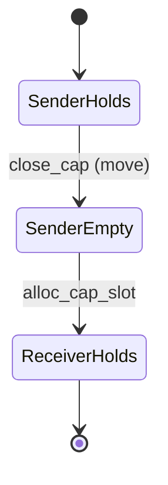

# Contributing to Clan OS

## Epoch 0 process

1. Author foundational docs per `prereq_graph.toml` DAG on staging branch
2. Cross-doc review before epoch 0 gate squash
3. Unanimous 3/3 domain sign-offs in `epoch_signoffs/epoch-0.toml`
4. GPG-signed gate commit per `SECURITY.md`

## Scope commits

- One commit per implementation scope: `feat(scope-NNN): ...`
- Scope owner only commits their scope (`scope_checklist_schema.toml`)

## Cross-references

Staging may use `[CROSS-REF: doc §section — TBD]`; must be resolved at gate.

## Milestone 150 deliverables

### Capability transfer walkthrough

State machine for **move** transfer (`cap_transfer_move` in `kernel/src/kernel_object.rs`):

1. **Pre:** Sender holds cap at slot `S` referencing `(ObjectId, Generation, Rights)`.
2. **Validate:** `get_cap(sender, S)` succeeds; generation matches object registry.
3. **Move:** `close_cap_for_process(sender, S)` — sender slot empty (R-05).
4. **Post:** `alloc_cap_slot(receiver, cap)` — receiver gets same or attenuated rights; no amplification (R-06).
5. **TOCTOU guard:** Sender slot must stay empty between steps 3–4 (`scripts/transfer_toctou_check.py`).

See `docs/KERNEL_OBJECT_MODEL.md`, `docs/CAP_TRANSFER_PROTOCOL.md`, and `docs/RIGHTS_ALGEBRA.md` R-01/R-05/R-06.

## Ergonomics feedback

Each epoch retrospective (`docs/epoch_retrospectives/TEMPLATE.md`) records process vs implementation time — feeds charter amendments.
