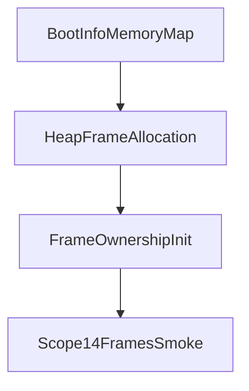

# Frame Ownership

Scope 14 introduces a persistent frame ownership service. It records a bounded pool of usable physical frame addresses from the bootloader memory map after the kernel heap has consumed its boot-time frames.

## What It Tracks

The frame ownership registry records:

- tracked frame token
- physical frame start address
- current owner
- available and allocated frame counts
- allocation, release, and failed-allocation counters

Owners are intentionally simple in this scope: kernel, image, page-table, and test. Later scopes can use these records to back executable images and inactive user page tables.

## Boot Flow



Scope 14 skips frames already consumed by heap initialization and tracks a bounded subset of remaining usable frames. It does not replace the boot allocator or install user page-table mappings.

## Shell And Syscalls

The shell exposes:

- `frames`

Syscalls expose tracked, available, allocated, allocation, release, and failed-allocation counts.

Boot emits:

```text
See [VALIDATION_GATES.md](VALIDATION_GATES.md) for gate serial lines.
```

## Safety Boundary

Scope 14 is ownership bookkeeping. Scope 13 mapping stubs still use deterministic frame tokens and do not consume real owned frames.

Scope 15 consumes owned frames for frame-backed executable image records. Those frames are still not installed into user page tables or executed.
