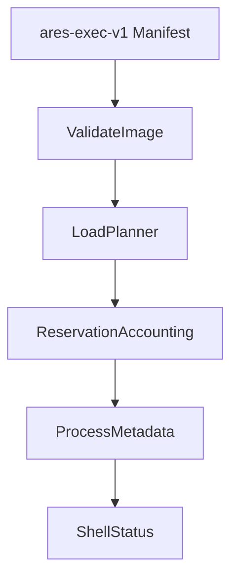

# Executable Load Plans

Phase 12 turns validated executable images into deterministic load plans. It models how an ELF image would be placed in memory, but still does not allocate real user frames, switch page tables, enter Ring 3, or jump to stored code.

## Load Plan Contents

A `LoadPlan` contains:

- source image name and path
- entry point
- page-aligned load regions
- total planned image pages
- reserved stack pages
- copy actions for file-backed bytes
- zero-fill actions for BSS-style memory beyond file bytes

The seeded `/bin/hello.elf` fixture creates one executable region with a four-byte copy action and a zero-fill action for the remainder of the page.

## Reservation Accounting

Address-space descriptors now include reservation metadata:

- user pages
- stack pages
- executable pages
- writable pages
- read-only pages
- mapping state

The mapping state remains `Planned` in Phase 12. Phase 13 can convert a prepared plan into `MappedStub`, which is still accounting-only; no active page table is mutated by shell or loader paths.

## Loader Prepare Flow



The loader exposes `prepare_program_image(credentials, name)` for image programs. `run hello` still returns unsupported execution, preserving the Phase 11 safety boundary.

Phase 13 adds `map_prepared_program(credentials, name)`, which takes the same validated plan and creates deterministic frame-token mapping records. It records copy and zero-fill byte counts, but does not write image bytes into executable memory.

## Shell And Smoke

The shell exposes:

- `bin prepare <program>`
- `bin map <program>`
- richer `bin info <program>`
- `bin plans` or `loadplans`
- `bin mappings`

Boot emits:

```text
See [VALIDATION_GATES.md](VALIDATION_GATES.md) for gate serial lines.
```

Phase 13 additionally emits:

```text
See [VALIDATION_GATES.md](VALIDATION_GATES.md) for gate serial lines.
```

## Deferred Work

- real frame allocation for user images
- page-table mapping and CR3 switching
- Ring 3 entry and syscall return paths
- jumping to ELF entry points
- relocation, dynamic linking, and memory-mapped file backing
