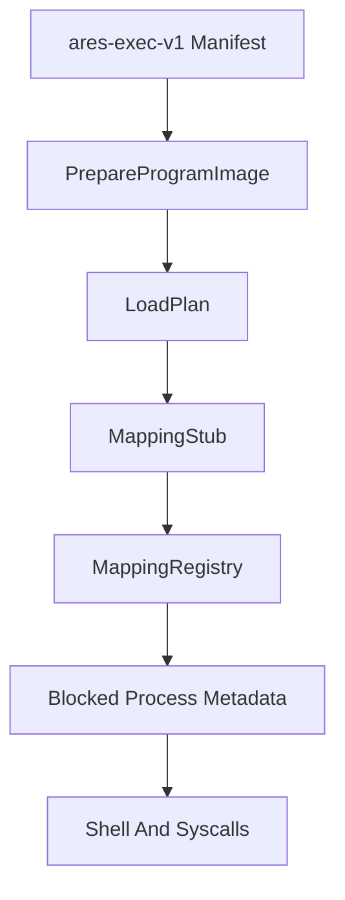

# Mapping Stubs

Phase 13 turns Phase 12 load plans into deterministic frame-backed mapping stubs. These records model the frames and actions an executable image would need, while still avoiding page-table mutation, CR3 switching, Ring 3 entry, or jumps to ELF code.

## What A Mapping Stub Contains

A `MappedImage` records:

- mapping id
- image name and source path
- address-space id
- mapped regions and pages
- deterministic frame tokens
- executable, writable, and read-only page counts
- copied and zero-filled byte counts
- owner credentials
- `MappingState::MappedStub`

Frame tokens are deterministic accounting handles. They are not physical frames allocated by `BootInfoFrameAllocator`.

## Mapping Flow



`map_prepared_program(credentials, name)` validates permissions, builds the load plan, creates the mapping stub, stores it in the registry, records blocked process metadata, and updates loader counters.

## Registry Behavior

The registry is bounded and deterministic. Each successful mapping creates a new mapping id and a new record. Mapping the same prepared image twice creates a second record with a stable id order rather than mutating or reusing the previous record.

Registry failures return clear errors and do not add mapping records.

## Shell And Smoke

The shell exposes:

- `bin map <program>`
- `bin mappings`
- `bin plans`

Boot emits:

```text
Phase13-MappingStub: mapped=..., rejected=..., pages=..., copied=..., zeroed=..., exec_blocked_ok=true
```

## Safety Boundary

Mapping stubs are still accounting records. They do not write executable memory, install user page tables, switch CR3, enter Ring 3, or run ELF entry points. `run hello` remains blocked with unsupported execution until a future phase implements real user-mode execution.
