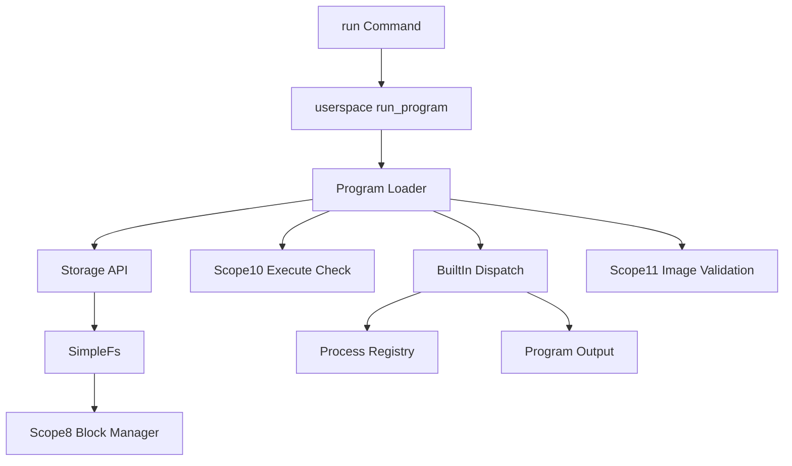

# Program Loader Design (Scopes 9-11)

Clan OS Scope 9 introduces stored program records. Programs are discovered from `/bin/*` files in the Scope 7 filesystem mounted through the Scope 8 block manager.

Scope 9 did not execute raw machine code. Instead, each stored program was a small manifest that mapped a filesystem record to a known built-in entry target. Scope 11 extends that contract with discoverable ELF64 image records that can be validated but not executed yet.

## Manifest Format

```text
clan-exec-v1
name=echo
kind=builtin-alias
entry=echo
description=Print arguments
requires=execute
trust=system
owner=admin
```

Required fields:

- `name`
- `kind=builtin-alias`
- `entry`

Optional fields:

- `description`
- `requires=execute`
- `trust=system` or `trust=user`
- `owner`

Image programs use:

```text
clan-exec-v1
name=hello
kind=elf64-image
entry=0x400000
image=/bin/hello.elf
requires=execute
trust=user
owner=user
description=ELF image validation fixture
```

## Loader Flow



## Shell Commands

- `run <program> [args...]`
- `programs`
- `bin list`
- `bin info <program>`
- `bin validate <program>`

## Runtime Observability

The kernel emits:

```text
See [VALIDATION_GATES.md](VALIDATION_GATES.md) for gate serial lines.
```

Loader status is also available through syscall/status helpers:

- program count
- launch count
- failed launch count
- denied launch count
- image count
- valid image count
- invalid image count
- unsupported execution count

Scope 11 also emits:

```text
See [VALIDATION_GATES.md](VALIDATION_GATES.md) for gate serial lines.
```

## Validation

```bash
python scripts/gate/run.py --gate loader_security --timeout 180
python scripts/validation_matrix.py --soak-duration 30 --latency-duration 30 --boot-wait 90 --smoke-timeout 180
```

## Scopes 37–43 — Hardware Load and Trust

- Scope 37 discovers `elf64-image` manifests and runs allowlisted hardware paths including `tickprobe`.
- Scopes 41–42 map `libc_stub` at `0x700000` and apply `GLOB_DAT` import relocs (see [SHARED_LIBRARIES.md](SHARED_LIBRARIES.md)).
- Scope 43 runs `trust=system` manifests without name allowlist membership (see [SECURITY.md](SECURITY.md)).

## Deferred Work

- Arbitrary unsigned ELF execution for user-supplied binaries
- Program signatures and revocable trust roots
- Per-process library namespaces and multiple `DT_NEEDED` dependencies
