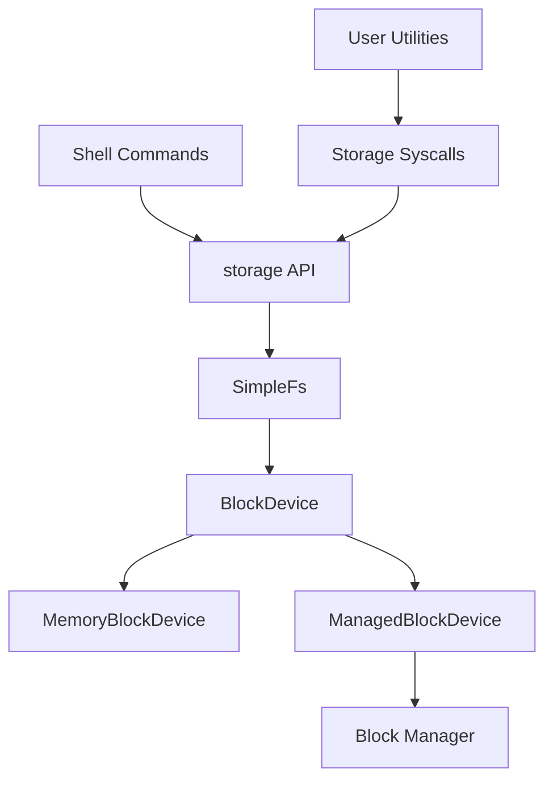

# Storage Design (Scope 7)

Clan OS Scope 7 introduced a small persistent storage stack on top of a block-device boundary. Scope 8 mounts that filesystem through a managed block backend so the same filesystem API can run on driver-plumbed storage.

## Layers



## Filesystem Format

- Sector size: 512 bytes
- Header sector: magic, version, file count
- Directory table: fixed-size entries
- File data: one sector per file
- Maximum files: 16
- Maximum file size: 512 bytes
- Maximum path length: 48 bytes

Each write updates file data and flushes the directory/header metadata to the backing block device. Remount validation proves data survives unmount/mount cycles on the same device instance.

## Runtime API

Primary kernel APIs live in `kernel/src/storage.rs`:

- `init()`
- `format()`
- `remount()`
- `list_files()`
- `read_file(path)`
- `create_file(path)`
- `write_file(path, contents)`
- `delete_file(path)`
- `info()`
- `smoke_persistence()`
- `smoke_driver_backend()`

## Shell Commands

- `ls`
- `cat <path>`
- `touch <path>`
- `write <path> <text>`
- `rm <path>`
- `mount`
- `format`
- `fsinfo`

## Validation

```bash
python scripts/gate/run.py --gate shell_storage --timeout 180
python scripts/validation_matrix.py --soak-duration 30 --latency-duration 30 --boot-wait 90 --smoke-timeout 180
```

Validation emits `ClanOS-Gate: name=shell_storage ok=true` (see [VALIDATION_GATES.md](VALIDATION_GATES.md)).

## Scope 8 Backend

By default, runtime storage uses `ManagedBlockDevice`, which delegates sector I/O to the active block backend. Scope 8 registers `qemu-sim-block0` through the block manager as a deterministic driver-backed backend for QEMU validation.

`MemoryBlockDevice` remains available for focused filesystem tests.

## Scopes 36, 45–47

- Scope 36 — `ReadFileProbe` / `WriteFileProbe` syscalls copy through validated user buffers.
- Scopes 45–46 — FD table maps open files to storage indices (`OpenFile`, `CloseFile`, `ReadFd`, `WriteFd`). See [FILE_DESCRIPTORS.md](FILE_DESCRIPTORS.md).
- Scope 47 — file-backed demand paging reads filesystem pages on user `#PF`. See [DEMAND_PAGING.md](DEMAND_PAGING.md).

File owner/mode metadata and checked APIs were introduced in Scope 10 ([SECURITY.md](SECURITY.md)).

## Deferred Work

- Real AHCI/NVMe/virtio block drivers
- FAT/ext-style filesystem compatibility
- Journaling and crash consistency
- Per-process FD namespaces and mmap-style file mapping
