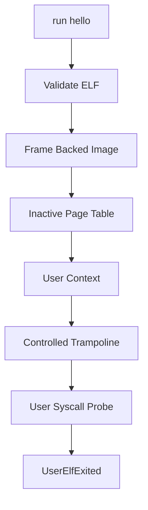

# Minimal User ELF MVP

Scope 20 enables the seeded `/bin/hello` ELF path to complete through the guarded user execution pipeline. It is intentionally narrow: only the known hello image is accepted, and it returns deterministic kernel-recorded output and exit status.

## Execution Flow



The loader exposes `execute_minimal_user_elf(credentials, "hello")`. It records a successful guarded execution and returns:

```text
hello: exit=0 tick=<tick-count>
```

## Shell And Smoke

The existing command now succeeds:

```text
run hello
```

Boot emits:

```text
See [VALIDATION_GATES.md](VALIDATION_GATES.md) for gate serial lines.
```

## Safety Boundary

Scope 20 is a minimal MVP for the seeded hello image.

Later scopes extend the same pipeline:

- Scopes 28–29 — hardware hello and allowlisted `hello` / `exit42`
- Scope 37 — manifest-discovered ELF images including `tickprobe`
- Scope 43 — `trust=system` execution without name allowlist (see [SECURITY.md](SECURITY.md))

Arbitrary unsigned user ELFs, full dynamic linking, and production isolation remain deferred. See [SHARED_LIBRARIES.md](SHARED_LIBRARIES.md) and [USER_PAGE_TABLES.md](USER_PAGE_TABLES.md).
