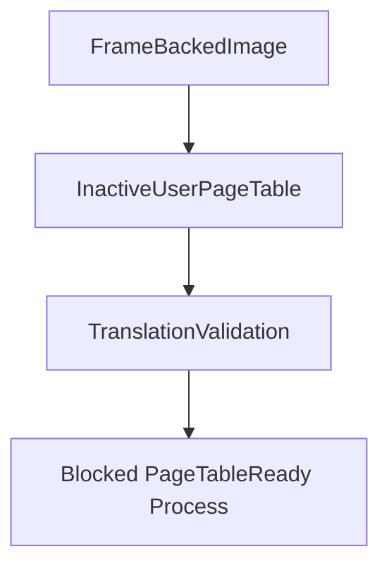

# Inactive User Page Tables

Scope 16 builds inactive user page-table descriptors from Scope 15 frame-backed images. These descriptors model the virtual-to-physical mappings a future CR3 switch would use, but they do not switch CR3 or execute user code. Scope 17 uses them to construct user entry frames.

## Table Contents

An `InactiveUserPageTable` records:

- page-table id
- address-space id
- user virtual page mappings
- owned frame tokens and physical frame addresses
- load permissions
- executable, writable, and read-only page counts
- whether required kernel mappings are shared
- whether the table is ready for CR3 switching

Scope 16 keeps `cr3_switch_ready=false`; later scopes will add entry and switch mechanics.

## Loader Flow



The loader exposes `build_user_page_table(credentials, name)`. It prepares, maps, frame-backs, and then describes the inactive page table for the image.

## Shell And Smoke

The shell exposes:

- `bin pagetable <program>`
- `bin plans`

Boot emits:

```text
See [VALIDATION_GATES.md](VALIDATION_GATES.md) for gate serial lines.
```

## Safety Boundary

Scope 16 validates translation through descriptor lookup only. It does not install hardware page tables, switch CR3, enter Ring 3, or execute ELF code. Scope 17 adds entry-frame descriptors, but still does not perform the privilege transition.

## Hardware Page Tables (Scopes 21–22)

Scope 21 builds real x86_64 tables from inactive descriptors. Scope 22 activates user CR3 for translation checks without executing user code.

## Per-Process CR3 (Scopes 30–31)

Scope 30 verifies distinct CR3 values across processes. Scope 31 binds CR3 on preemptive scheduler context switch ([SCHEDULER.md](SCHEDULER.md)).

## W^X Policy (Scope 48)

`user_paging` rejects user mappings that combine writable and executable page flags. Demand paging paths must not install W+X pages ([DEMAND_PAGING.md](DEMAND_PAGING.md)).

Boot smoke:

```text
See [VALIDATION_GATES.md](VALIDATION_GATES.md) for gate serial lines.
```

## mprotect (Scope 53)

`Mprotect` allows toggling writable vs read-only on non-executable user pages. Requests that would create writable+executable mappings are rejected. A guard page below the default stack is left unmapped; `probe_stack_guard` records guard probes during smoke.

Boot smoke:

```text
See [VALIDATION_GATES.md](VALIDATION_GATES.md) for gate serial lines.
```

## VMA Registry (Scope 63)

Each process keeps a list of `VmaRegion` records (base, length, protection, backing). `mmap` and `munmap` register and remove regions; overlapping mappings are rejected. Anonymous mmap hints advance via `vma::next_anon_hint`.

Boot smoke:

```text
See [VALIDATION_GATES.md](VALIDATION_GATES.md) for gate serial lines.
```

## munmap (Scope 62)

`Munmap` unmaps anonymous mmap pages and the read-only file mmap page. Image and executable ranges are rejected. Unmap triggers `smp::request_tlb_shootdown()`.

Boot smoke:

```text
See [VALIDATION_GATES.md](VALIDATION_GATES.md) for gate serial lines.
```
