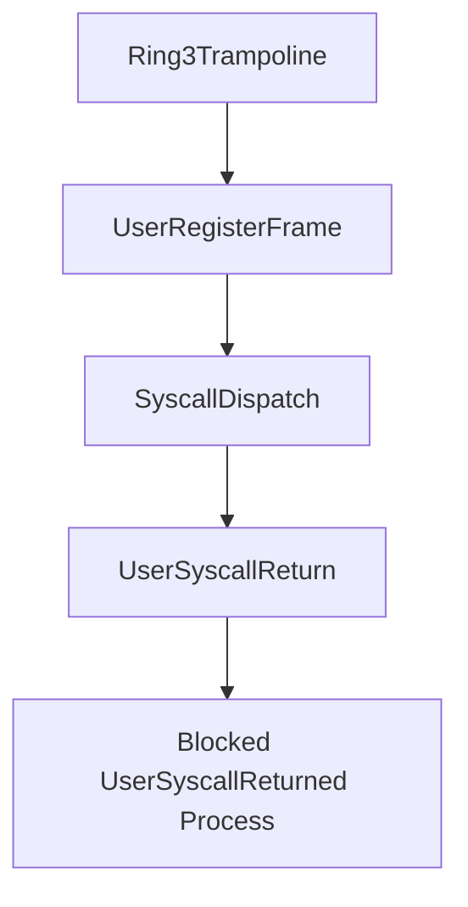

# User Syscall Return ABI

Phase 19 adds a user-facing syscall register-frame ABI. It preserves the existing `invoke_raw` dispatcher and wraps it with user entry and return metadata. Phase 20 uses this controlled ABI as part of the guarded `/bin/hello` ELF MVP.

## ABI Records

A `UserRegisterFrame` records:

- syscall id
- first argument
- return value
- optional error

A `UserSyscallReturn` records the same fields plus whether control returned to the user context.

## Loader Flow



The loader exposes `run_user_syscall_probe(credentials, name)`. It prepares the controlled user path and dispatches a tick-count syscall probe through the user ABI.

## Shell And Smoke

The shell exposes:

- `bin usyscall <program>`
- `bin plans`

Boot emits:

```text
Phase19-SyscallReturn: syscalls=..., returns=..., rejected=..., abi_ok=true, returned_ok=true
```

## Safety Boundary

Phase 19 validates syscall entry/return metadata. It does not yet execute CPU `syscall`/`sysret` instructions or run arbitrary ELF syscall instructions. Phase 20 runs the seeded hello path through the guarded pipeline only.

## Hardware Syscall Table (Phases 25–46)

Phase 25 enables real `syscall`/`sysret`. Phase 35 registers an allowlist in `user_syscall_hw::ALLOWED_HW_SYSCALLS`. Later phases add:

| ID | Name | Phase |
|---:|------|-------|
| 1 | `GetTickCount` | 25 |
| 60 | `UserCopyProbe` | 26 |
| 61 | `ExitProcess` | 34 |
| 62 | `WaitProcess` | 34 |
| 63 | `ReadFileProbe` | 36 |
| 64 | `WriteFileProbe` | 36 |
| 65 | `ReadPathProbe` | 44 |
| 66 | `OpenFile` | 45 |
| 67 | `CloseFile` | 45 |
| 68 | `ReadFd` | 46 |
| 69 | `WriteFd` | 46 |

Arguments for FD and path syscalls use `rsi` / `rdx` in the hardware entry stub. See [FILE_DESCRIPTORS.md](FILE_DESCRIPTORS.md).

Boot smokes include `Phase35-SyscallTable`, `Phase36-StorageCopyin`, `Phase44-UserPath`, `Phase45-FileFd`, and `Phase46-FdIO`.
