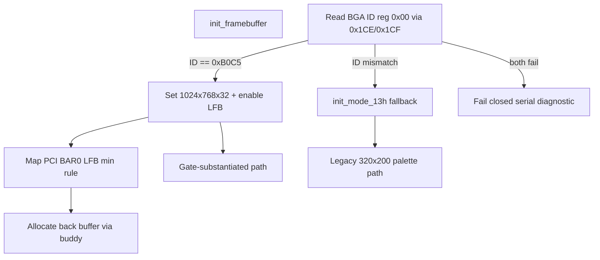

# ADR-0004: Bochs VBE RGB Desktop Framebuffer

```yaml
status: authoritative
adr_id: ADR-0004
decision_date: 2026-06-21
revision_date: 2026-06-21
depends_on: ADR-0001
blocks: kernel framebuffer refactor, desktop gate smokes, desktop_screendump_check
implementation_scope: 470
q5_status: locked-pr0
```

## Context

The functional desktop epoch (scopes 351–375) ships **VGA mode 13h**: 320×200×256 palette-indexed pixels at `0xA0000` ([`kernel/src/framebuffer.rs`](../../../kernel/src/framebuffer.rs)). Draw primitives, double buffer, shell, and window manager all use single-byte palette indices end-to-end.

Higher-resolution **true RGB** is the target for scope **470**. Alternatives considered at epoch level:

| Mechanism | Outcome |
|-----------|---------|
| VBE via BIOS calls (real mode / v86) | Rejected — awkward from protected/long-mode `no_std` kernel |
| VBE protected-mode interface only | Rejected — less universally reliable in QEMU |
| **Bochs VBE extensions (`bga`)** | **Selected** — I/O ports `0x1CE`/`0x1CF`, linear framebuffer via PCI BAR |
| virtio-gpu | Deferred — full virtio queue protocol; follow-on ADR candidate |

QEMU gate corpus already pins `-vga std -machine pc` ([`scripts/desktop_screendump_check.py`](../../../scripts/desktop_screendump_check.py)). [`architecture_state.toml`](../../../architecture_state.toml) `has_real_hardware_target = false` — gate honesty matches ADR-0002 pinned-corpus discipline.

**Q1–Q5 locked below.** Do **not** touch `kernel/src` until this ADR merges (same discipline as ADR-0002/0003).

---

## Locked decisions

### Q1 — Target mode: **1024×768×32 BGRx8888**

| Item | Locked value |
|------|----------------|
| Resolution | 1024 × 768 |
| Depth | 32 bpp, **BGRx8888** (4 bytes/pixel; B, G, R, X byte order matching QEMU BGA LFB) |
| Normative constants | [`config/desktop_framebuffer.toml`](../../../config/desktop_framebuffer.toml) — created in PR1; kernel reads or `include` same values |
| Layout | Shell/window/taskbar constants **must be rescaled** for 1024×768 in the RGB migration PR (today's 320×200 coords pin UI to a corner) |

**Rejected:** vague "higher res"; 800×600 as gate target (undershoots stated goal); 24 bpp (extra format branch, no BGA benefit).

---

### Q2 — Pixel format compositor migration: **Option A — direct RGB rewrite (no palette shim)**

Codebase audit: **3 modules**, ~50 call sites (`framebuffer.rs`, `desktop_shell.rs`, `window_manager.rs`) use `u8` palette indices / `fill_rect_buf` / `draw_text_buf`. A palette→RGB shim at flush would add a **~3 MiB** full-frame conversion every refresh and preserve obsolete dual semantics permanently.

| Change | Decision |
|--------|----------|
| Pixel type | `type Pixel = u32` with named `COLOR_*` constants in BGRx8888 |
| Buffer API | Buddy-allocated `&mut [Pixel]` back buffer (Q4), not `[u8; BUFFER_LEN]` |
| Primitives | Rewrite `plot_pixel`, `fill_rect_buf`, `draw_text_buf`, `draw_cursor`, `flush_to_screen` for 4-byte pixels |
| Font | Keep 1-bit glyph bitmap; foreground `Pixel`, background unchanged |
| `Window.body_color` | `u8` → `Pixel` |

**Rejected:** palette compatibility shim (permanent dual path + per-frame conversion cost).

---

### Q3 — Mode-set mechanism and fallback: **Option B — BGA primary, mode 13h dev fallback**



| Item | Decision |
|------|----------|
| Detection | Bochs VBE ID register **0xB0C5** read **before** mode-set |
| LFB address | PCI BAR0 of QEMU std VGA (**vendor 0x1234 / device 0x1111**, class display) via existing [`device.rs`](../../../kernel/src/device.rs) PCI config reads; map as MMIO |
| Mode 13h | **Not** run before BGA; replaced on BGA success. Fallback only when ID probe fails |
| Scope boundary | **Gate matrix pins `-vga std`** (ADR-0002 pinned-corpus parallel). BGA path is gate-substantiated |
| Fallback path status | **Alive but gate-unsubstantiated** — not "known-dead" ([`GATE_AUDIT.md`](../../GATE_AUDIT.md) § Dead source inventory tracks *unwired* `.rs`; mode 13h stays compiled and **may run** on non-BGA dev hardware). **Permanently outside** validation matrix for this ADR epoch. **No separate mode-13h gate** unless a future ADR ties fallback to `has_real_hardware_target = true`. GATE_AUDIT honesty tier: **Partial / dev-only fallback, untested by gates** — same class as ADR-0003 digest-only grace tier, not a fourth known-dead file |
| Dual-probe failure | If BGA ID probe fails **and** `init_mode_13h()` returns false: **fail closed** — emit `Desktop: init failed bga_id={:#04x} mode13=false`, `mode_active() == false`, desktop gates fail. **No** silent garbage framebuffer, **no** pretend-success compositor path |
| Serial telemetry | BGA success: `Desktop: bga 1024x768 depth=32 lfb={phys:#x} id={:#04x}`. Mode-13h fallback: `Desktop: fallback mode13h 320x200` |

**Rejected:** real-mode BIOS VBE calls; VBE-only without fallback; virtio-gpu this epoch; treating fallback as gate-substantiated without ADR amendment.

---

### Q4 — Performance / memory budget: **Buddy-allocated back buffer + MMIO LFB map**

| Resource | Size | Where it lives |
|----------|------|----------------|
| LFB (device) | 3 145 728 bytes (1024×768×4) | PCI BAR — **mapped** (`map_bytes` rule below), not buddy-allocated |
| Back buffer | 3 145 728 bytes | **Buddy allocator** (~768 × 4 KiB frames), owner `FrameOwner::VideoBuffer` (new owner class) |
| Double buffer total | ~3.0 MiB kernel RAM + ~3.0 MiB MMIO | **Not** static BSS, **not** heap (`HEAP_SIZE` = 4 MiB — insufficient and wrong lifetime) |
| Flush | `copy_from_slice` of 1024×768 `u32` words | Acceptable at 10 Hz ([`desktop_runtime.rs`](../../../kernel/src/desktop_runtime.rs)) |

**LFB map bound rule (locked — same fail-closed posture as ADR-0002 never trusting caller-supplied digest):**

1. `computed_size = width × height × (bpp / 8)` from BGA mode-set registers after successful mode-set (Q1 constants).
2. `bar_size` from PCI BAR0 length decode (existing PCI config path).
3. **`map_bytes = min(computed_size, bar_size)`** — map and expose only the smaller. Never map beyond `computed_size` because BAR is larger; never map beyond `bar_size` because computed size is larger.
4. If either source is invalid or `map_bytes == 0`: fail closed with serial diagnostic; do not map.

Back-buffer buddy allocation uses **`computed_size`** only (kernel RAM, independent of BAR).

**Required `memory_layout` smoke (not optional):** when BGA path active, verify back-buffer buddy allocation **and** LFB MMIO map succeeded. Emit serial proof e.g. `ClanOS-Video: back_frames={n} lfb_map_ok=true`. Wired into `memory_layout_gate()` before scope **470** close. Buddy failure at ~768 contiguous frames is a real failure mode — same "don't pass without proof it ran" discipline as ADR-0003 sunset checks.

Implementation notes:

- Remove `lazy_static! { [u8; BUFFER_LEN] }` — 6 MiB static BSS bloats kernel image.
- `smoke_desktop_shell` stack `[0u8; BUFFER_LEN]` must become buddy-backed or smaller smoke fixture.

**Rejected:** expanding `HEAP_SIZE` for video; single-buffer-only (regression vs double-buffer gate smokes); optional allocation smoke.

---

### Q5 — Validation gate implications: **Semantic bump + extended smokes**

| Item | Decision |
|------|----------|
| `VALIDATION_GATE_VERSION` | Bump **once** when kernel verification semantics change (e.g. `2.6.0` → `2.7.0`) — same rule as ADR-0003: seed/progress work does not bump; semantic change does |
| Kernel smokes | BGA ID readback; mode active; known pixel write to back buffer + flush; LFB readback spot-check |
| **`memory_layout` smoke** | **Required** — back-buffer allocation + LFB map when BGA active (Q4); executed in QEMU before scope close, not compile-only |
| Dual-probe negative | Host or kernel fixture: dual-probe failure → `mode_active() == false`, diagnostic serial, desktop gates fail. **PR1:** negative fixtures proven **before** BGA positive path trusted (ADR-0002 `signed_elf.py` discipline) |
| LFB bound negative | Host fixture: `bar_size > computed_size` and `bar_size < computed_size` cases; map uses `min`; invalid sources fail closed |
| `desktop_preview` / `desktop` | Existing compositor/shell/mouse smokes must pass on **BGA path** under pinned QEMU args |
| Host screendump | [`scripts/desktop_screendump_check.py`](../../../scripts/desktop_screendump_check.py): **full PPM analysis** at 1024×768 (not a sub-region crop). Validates the delivered frame surface, not a plausible corner |
| Matrix | Wire `desktop_screendump_check.py` into [`scripts/validation_matrix.py`](../../../scripts/validation_matrix.py) (currently standalone) — PR2 |
| Gate audit | Desktop leaf → **Real (BGA mode-set + pixel path)**; mode-13h fallback → **Partial / dev-only, gate-unsubstantiated** in [`GATE_AUDIT_401_500.md`](../../GATE_AUDIT_401_500.md) |

**Rejected:** gate version bump per draw-primitive commit; claiming Real without BGA smokes; optional allocation smoke; sub-region-only screendump check.

---

## Out of scope (this ADR)

- virtio-gpu (deferred epoch — future ADR)
- Real hardware VGA beyond QEMU `-vga std`
- Userland compositor IPC schema change (`compositor.ipc.v1` caps unchanged unless required)
- Anti-aliased fonts / GPU acceleration
- Separate mode-13h validation gate (unless `has_real_hardware_target` ADR)

---

## Alternatives considered (epoch level)

| Option | Outcome |
|--------|---------|
| Palette shim for incremental migration | Rejected — Q2 (dual path + ~3 MiB/frame conversion) |
| BIOS VBE calls | Rejected — Q3 |
| virtio-gpu first | Rejected — scope; revisit later |
| Static BSS for video buffers | Rejected — Q4 |
| Expand `HEAP_SIZE` for video | Rejected — Q4 |
| Sub-region screendump analysis | Rejected — Q5 (full PPM) |

---

## Consequences

- Positive: true RGB desktop at 1024×768 under pinned QEMU; clean I/O-port mode-set without real-mode trampoline
- Positive: direct RGB migration is one-time cost (~50 sites); avoids permanent shim
- Negative: `VALIDATION_GATE_VERSION` bump; threat node lifecycle open until PR1 proofs land
- Negative: `threat_node_lifecycle_check` / `release_scorecard_check` fail while `T-desktop-bga-mmio` is **open** (PR0 → PR1 gap — intentional **one PR window only**, not a new normal)
- **Drift trigger:** if PR1 does not merge before scope **470** closes or **2026-07-05** (whichever first), expected CI red has become unacceptable drift — escalate, do not normalize
- **Scope honesty:** `ClanOS-Gate: name=desktop ok=true` after this ADR lands means **BGA path under `-vga std`**, not arbitrary hardware or mode-13h fallback

---

## Security implications

- Attack surface: BGA I/O mode-set + PCI BAR MMIO map + multi-MiB buddy allocation — threat node **`T-desktop-bga-mmio`** ([`docs/THREAT_NODES.toml`](../../THREAT_NODES.toml))
- **Lifecycle (locked):** node status **`open`** in PR0 (this ADR). Status **`closed`** only in PR1 when dual-probe negative fixture, LFB bound negative fixture, and required `memory_layout` smoke **exist and pass in QEMU** — not opened-and-closed in the same commit as formality
- LFB bound: `map_bytes = min(computed_size, bar_size)`; fail closed on invalid sources (Q4)
- Failure mode: init failure → `mode_active() == false` → desktop gates false

---

## Verification approach

- Host: BGA register-sequence fixtures; dual-probe-failure negative; LFB bound mismatch negatives (PR1, before positive trust)
- Kernel: QEMU — BGA smokes + required `memory_layout` video smoke **executed**, not compile-only
- Tier A: proptest on `Pixel` packing and `map_bytes` min rule (bounded)
- Matrix: `desktop_screendump_check` full PPM at 1024×768 (PR2)

---

## Implementation epoch (scope 470)

Build order — separate PRs:

| PR | Content | Status |
|----|---------|--------|
| **PR0 (doc)** | This ADR + `DECISION_LOG` + **`T-desktop-bga-mmio` open** | **Done** |
| **PR1** | `bga.rs`: probe, mode-set, PCI LFB map (`min` rule), buddy back buffer, **required** `memory_layout` video smoke, dual-probe + LFB bound negatives, gate `2.7.0`, close threat node | **Done** |
| **PR2** | RGB compositor rewrite + layout rescale; full PPM `desktop_screendump_check` + matrix wiring | Pending |
| **PR3** | `GATE_AUDIT_401_500` reclassification; `STATUS.md`; `project_health.py` | Pending |

**PR1 bar (same standard as ADR-0002 PR2):** negative fixtures proven to fail before BGA positive path trusted; required `memory_layout` smoke **run in QEMU**, not merely compiled.
