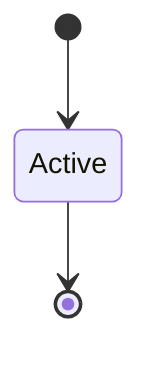

# Audit Subsystem

```yaml
status: authoritative
semantics_version: 1.0.0
epoch: 0
authored_by: migration
```

```yaml
status: authoritative
semantics_version: 1.1.0
```

Epoch 1 implementation prereq. Tamper policy decided epoch 0.

---

## Tamper policy

**Adopted (DECISION_LOG `#audit_tamper_policy`):** **chain hash**.

- Kernel-only append path
- Each record: `prev_hash`, `payload`, `record_hash = H(prev_hash || payload)`
- Read-cap export verifies chain on access
- Privileged-write without verifiable chain: **rejected** at epoch 1 implementation

Threat node: `T-audit-tamper`.

---

## Epoch 0 positions

- Bootstrap unaudited window scoped explicitly at scope 121 implementation
- Forensic admissibility assumptions in `DESIGN_NORTH_STAR.md`
- Covert channel via audit throughput: deferred node `T-audit-covert-channel`

---

## Epoch 1 deliverables

Overflow policy, read cap, versioned binary schema, IPC correlation — epoch 1 gate.

---

## State machine



