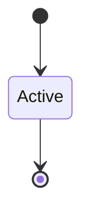

# Compat Shim Isolation

```yaml
status: authoritative
semantics_version: 1.0.0
epoch: 0
authored_by: migration
```

```yaml
status: authoritative
semantics_version: 1.0.0
```

Threat node: `T-compat-shim-escape`.

---

## Policy

- Compat syscalls operate on **per-caller FD sessions** — no ambient shim capability
- Path broker (scope 115) is **compat-only** — no parallel native handle type (G1)
- `compat-internal` IPC bridge is **not** PipeLite (A5) and **not** native truth
- Native processes cannot enumerate global namespace (scope 117)

---

## Broker boundary

Platform brokers mint caps only via documented grant paths (`storage_broker`, `permission_broker`). Compat ELF loading unchanged (scope 119 bridge).

---

## State machine



