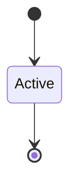

# Error Taxonomy

```yaml
status: authoritative
semantics_version: 1.0.0
epoch: 0
authored_by: migration
```

```yaml
status: authoritative
semantics_version: 1.0.0
```

Four classes mapping all E-*, R-*, T-*, V-* cases.

---

## Classes

| Class | Caller action | Examples |
|-------|---------------|----------|
| **Transient** | Retry | Queue full, resource busy |
| **Terminal** | Drop cap / reconnect | Generation bump, revoke-in-flight |
| **Structural** | Fix caller | Protocol violation, wrong cap kind |
| **Structural (remediable)** | Release resources, retry | Cap quota exceeded |
| **System** | Escalate / OOM | Kernel exhaustion |

---

## Wire format

Carries `error_schema_version` — registered in `WIRE_SCHEMA_REGISTRY.md` (epoch 1 prereq).

---

## Caller vs audit

Unprivileged wire responses omit `cap_id` and `generation` oracle fields. Audit carries full correlation.

---

## State machine



