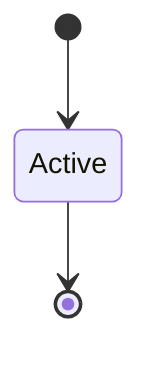

# Formal Model (Tier D)

```yaml
status: authoritative
semantics_version: 1.0.0
epoch: 0
authored_by: migration
```

```yaml
status: ratified-stub
semantics_version: 0.2.0-epoch13
framework: selective-verus
```

Tier D formal semantics — epoch 13 graduation. Framework decision: **selective Verus** on cap transfer + checkpoint paths; Kani tier B elsewhere per [PROOF_COVERAGE.md](PROOF_COVERAGE.md).

Prereq satisfied: `formal_semantics_framework_decision` recorded in epoch-13 signoff.

---

## Scope (planned)

- Cap transfer / delegation state machine
- Generation invalidation across power cycle (checkpoint epoch 13)
- Selective Verus paths per [PROOF_COVERAGE.md](PROOF_COVERAGE.md) triggers

---

## State machine



