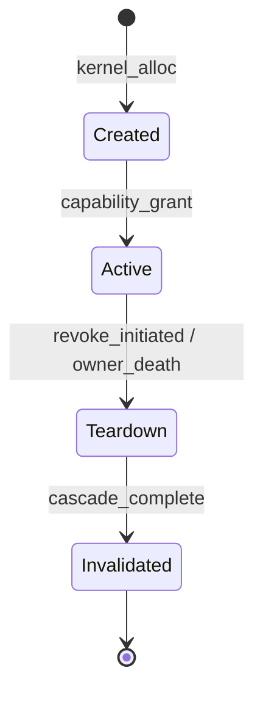
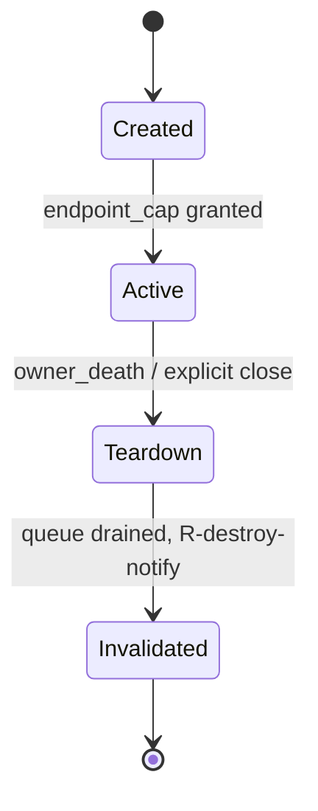
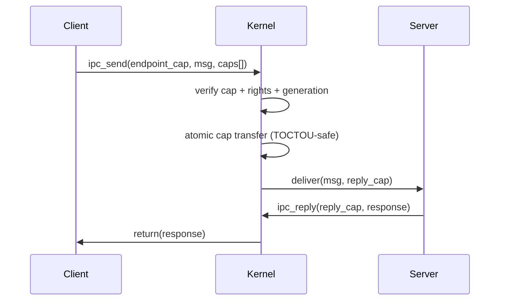

# Kernel Object Model

```yaml
status: authoritative
version: 0.1.0
epoch: 0
authored_by: kernel
```

Universal kernel object lifecycle, handle semantics, and per-kind state machines. Consolidates and supersedes the flat-path draft at `docs/KERNEL_OBJECT_MODEL.md` for new cross-references; both remain synchronized at gate commits.

See: [SECURITY_MODEL.md](SECURITY_MODEL.md), [../RIGHTS_ALGEBRA.md](../RIGHTS_ALGEBRA.md), [../GENERATION_COUNTER.md](../GENERATION_COUNTER.md), [../CAP_REGISTRY.toml](../CAP_REGISTRY.toml).

---

## Overview

Every kernel-managed resource is a **kernel object** with stable `ObjectId`, monotonic `Generation`, typed `Kind`, and rights subset. User processes hold **capabilities** — handles referencing `(ObjectId, Kind, Generation, Rights)` in a per-process capability table. The kernel never exposes raw object pointers to userspace.

**Gate G1 (phase 115+):** no new handle semantics without charter revision.

---

## Invariants

1. Immutable object identity; authority changes invalidate via generation bump.
2. One handle table per process; `CapHandle` is the universal reference type.
3. Delegate and attenuate never amplify rights (axiom A1).
4. Mint creates authority only via bootstrap ceremony or auditable broker path from root.
5. Destroyed or invalidated objects trigger R-destroy-notify to all holders at authority checkpoint.

---

## Universal lifecycle state machine



---

## Object kinds

| Kind | Role | Server / module |
|------|------|-----------------|
| **Process** | Schedulable task + cap table | kernel `obj/process` |
| **Thread** | Schedulable unit within process | kernel `obj/thread` |
| **Endpoint** | IPC port / mailbox | kernel `ipc/endpoint` |
| **MemoryRegion** | Cap-scoped mapping | kernel `mm/region` |
| **Notification** | Async signal object | kernel `ipc/notify` |
| **Service** | Restartable platform instance | `service_loader` |
| **Device** | Gated hardware access | device brokers |
| **FsNode** | Path-scoped filesystem view | storage broker |
| **GpuContext** | Compositor / GPU session | graphics servers |

Registry ground truth: `docs/CAP_REGISTRY.toml` ↔ `kernel` cap kind definitions (CI sync).

---

## Per-kind transitions

### Endpoint



Owner death: queued messages dropped; embedded caps trigger R-destroy-notify; senders receive terminal at checkpoint.

### MemoryRegion

Rights: read, write, execute, resize (subset per grant). All cross-process shared memory is cap-mediated. DMA buffers carry cache-coherency annotations.

### Process

Parent/child hierarchy with tier-2 fault propagation. Process audit token: stable root `cap_id` — no ambient POSIX UID in native model.

---

## Handle operations

| Operation | Semantics |
|-----------|-----------|
| **Create** | Mint cap with rights ≤ object max for mint path |
| **Transfer** | Move (consume sender) or borrow (time-bounded) per RIGHTS_ALGEBRA |
| **Delegate** | Attenuate to new cap; no amplification |
| **Revoke** | Generation bump; R-cascade-revoke on delegation chain |
| **Close** | Drop slot; object persists if other caps exist |

### IPC transfer sequence



---

## Revocation models

| Model | Scope | Trigger |
|-------|-------|---------|
| **R-cascade-revoke** | Delegation chain from revoked authority | Explicit revoke |
| **R-destroy-notify** | All caps to object instance | Teardown / Invalidated |

R-destroy-notify delivery: **simultaneous** at authority checkpoint; no ordering guarantee among holders.

---

## Reference cycles

**Permitted** with unordered teardown. Cycle detected at service restart → participants enter Teardown; 5s default timeout → terminal caps at checkpoint if unresolved.

---

## Bootstrap cap ceremony

PID-1 receives the only caps created without prior authorization. Threat node: `T-bootstrap-scope-creep`. Scope documented in `service_loader` manifest; CI smoke verifies ceremony bounds.

---

## Error handling

| Condition | Class |
|-----------|-------|
| Invalid cap index | Structural |
| Generation mismatch | Terminal |
| Insufficient rights | Structural |
| Cap quota exceeded | StructuralRemediable |
| Kind/version mismatch | Structural |

---

## Security considerations

- Type confusion: kind A never usable as kind B without audited conversion.
- Cap send confinement: non-sendable bit enforced at IPC transfer.
- Orphan endpoints: no ambient channel naming; endpoint caps are explicit grants.

---

## Verification approach

- Tier B Kani: transfer atomicity, generation uniqueness, revocation window.
- Tier A proptest: rights composition laws.
- Integration: `tests/integration/cap_ceremony/`, phase 121+ smokes.

---

## Cross-references

- [SECURITY_MODEL.md](SECURITY_MODEL.md)
- [../SCHEDULER_MODEL.md](../SCHEDULER_MODEL.md) — scheduler cap handles
- [../FAULT_ESCALATION.md](../FAULT_ESCALATION.md) — tier 2/3 on object teardown
- [../../DECISION_LOG.md](../../DECISION_LOG.md) — mint authority, cycle policy, R-destroy-notify ordering
