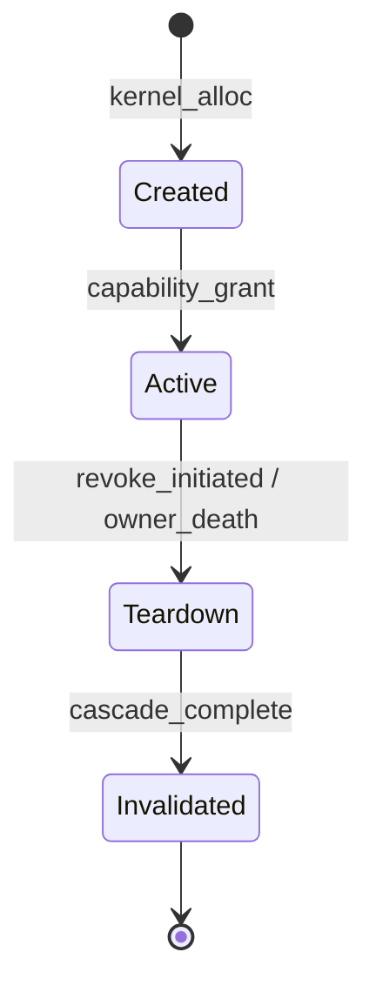
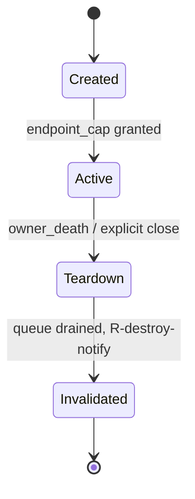
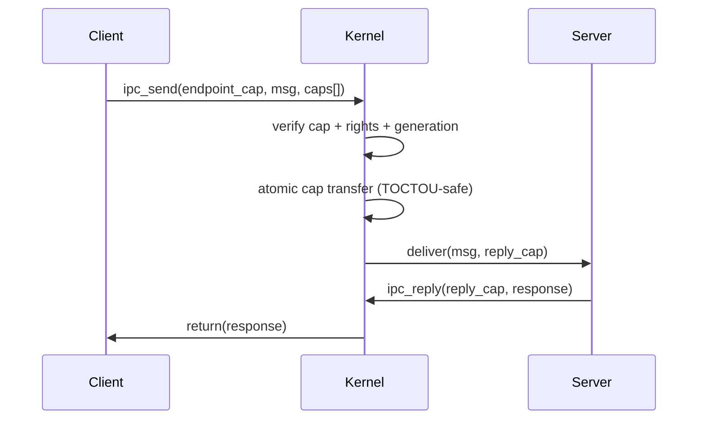
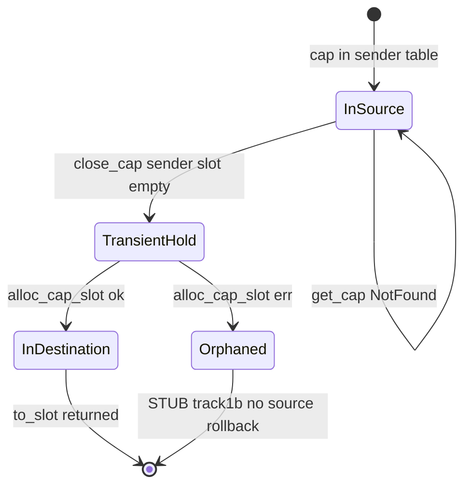

# Kernel Object Model

```yaml
status: authoritative
semantics_version: 1.3.0
epoch: 0
authored_by: kernel
```

Universal kernel object lifecycle, handle semantics, and per-kind state machines. Canonical location for the model formerly at `docs/KERNEL_OBJECT_MODEL.md` (flat copy superseded-by this path).

**Gate G1** — phases **115+** must not introduce new handle semantics without charter revision.

Phase **110** constitutional default: **immutable object identity + generation invalidation**.

See: [SECURITY_MODEL.md](SECURITY_MODEL.md), [../AXIOMS.md](../AXIOMS.md), [../RIGHTS_ALGEBRA.md](../RIGHTS_ALGEBRA.md), [../SEMANTIC_SPECS.md](../SEMANTIC_SPECS.md) (R-03, E-03, T-02), [../GENERATION_COUNTER.md](../GENERATION_COUNTER.md), [../CAP_REGISTRY.toml](../CAP_REGISTRY.toml).

---

## Design decision (phase 110)

**Adopted:** each kernel object has a stable `ObjectId` and a monotonic **generation** counter. Authority changes invalidate derived capabilities via generation bump — not in-place mutation of object rights.

**Rejected for native (unless charter exception):** mutable authority containers where the same `ObjectId` silently changes rights in place. That model complicates aliasing, temporal visibility (A6), borrow/move, and meta-semantics.

---

## Overview

Every kernel-managed resource is a **kernel object** with stable `ObjectId`, monotonic `Generation`, typed `Kind`, and rights subset. User processes hold **capabilities** — handles referencing `(ObjectId, Kind, Generation, Rights)` in a per-process capability table. The kernel never exposes raw object pointers to userspace.

Not a literal Rust trait in the kernel yet — architectural contract:

| Field | Meaning |
|-------|---------|
| `ObjectId` | Stable identity for object lifetime |
| `Kind` | One of the kinds below |
| `Generation` | Invalidation epoch; bump on revoke / restart / teardown |
| `Rights` | Subset of rights for this handle (see [RIGHTS_ALGEBRA.md](../RIGHTS_ALGEBRA.md)) |
| `Metadata` | Kind-specific, non-authority data |

**One handle table:** `CapHandle` references `(ObjectId, Kind, Rights subset, Generation)` for any kind.

---

## Invariants

1. Immutable object identity; authority changes invalidate via generation bump.
2. One handle table per process; `CapHandle` is the universal reference type.
3. Delegate and attenuate never amplify rights (axiom A1).
4. Mint creates authority only via bootstrap ceremony or auditable broker path from root.
5. Destroyed or invalidated objects trigger R-destroy-notify to all holders at authority checkpoint.

---

## Universal lifecycle state machine

| State | Meaning |
|-------|---------|
| **Created** | Object allocated; caps may be minted per mint path |
| **Active** | Normal operations per cap rights |
| **Teardown** | Draining; no new grants; in-flight ops complete at checkpoint |
| **Invalidated** | Generation bumped or object destroyed; caps terminal at checkpoint |

Valid transitions: Created → Active → Teardown → Invalidated. Invalidated is terminal.



Generation increment events cross-ref [GENERATION_COUNTER.md](../GENERATION_COUNTER.md).

---

## Object kinds

| Kind | Role | Examples / module |
|------|------|-------------------|
| **Process** | Schedulable task + cap table + credentials | User ELF, native app; kernel `obj/process` |
| **Thread** | Schedulable unit within process | kernel `obj/thread` |
| **Endpoint** | Async IPC port / mailbox | Native IPC; kernel `ipc/endpoint` |
| **MemoryRegion** | Cap-scoped mapping | Shared buffers, anon mappings; kernel `mm/region` |
| **Notification** | Async signal object | kernel `ipc/notify` |
| **Service** | Restartable platform instance | Storage broker, permission broker; `service_loader` |
| **Device** | Gated hardware access | Block device cap; device brokers |
| **FsNode** | Broker-mediated storage view | Not ambient path visibility; storage broker |
| **GpuContext** | Compositor / GPU session | Userspace driver stack; graphics servers |
| **BrokerSession** | Authority delegation channel | Permission broker minting |

Registry ground truth: [CAP_REGISTRY.toml](../CAP_REGISTRY.toml) ↔ kernel cap kind definitions (CI sync via `cap_registry_sync.py`).

---

## Handle semantics (frozen at G1)

1. **Create** — mint cap with initial rights subset ≤ object's max rights for that mint path
2. **Transfer** — move (consume sender) or borrow (time-bounded, non-delegable) per [RIGHTS_ALGEBRA.md](../RIGHTS_ALGEBRA.md)
3. **Delegate** — attenuate rights to new cap; no amplification (A1)
4. **Revoke** — generation bump and/or slot invalidation per [TEMPORAL_SEMANTICS.md](../TEMPORAL_SEMANTICS.md)
5. **Close** — drop handle slot; may not destroy object if other caps exist

Phase 115 **path broker** uses compat handles only — must not add a parallel handle type.

---

## Generation invalidation

When generation increments on object `O`:

- All caps derived from `O` at older generation become invalid at documented visibility point ([TEMPORAL_SEMANTICS.md](../TEMPORAL_SEMANTICS.md))
- Spec case **R-03** defines expected behavior

Triggers (non-exhaustive): hard revoke, service restart, broker session end, endpoint teardown.

---

## Per-kind state machines

### Endpoint



**Orphan endpoints** — endpoint owner process death:

- Pending queue **dropped**
- Embedded caps → R-destroy-notify
- Senders receive terminal at checkpoint

### MemoryRegion

Rights: read, write, execute, resize (or documented subset). All cross-process shared memory is **cap-mediated**. DMA buffers carry cache-coherency annotations.

### Process

Parent/child relationships documented. Parent tier-2 fault propagation; child cap fate on parent death; reaper policy stub (no reparent → children terminated unless charter exception).

**Process audit token:** stable **root cap_id** of process — no ambient POSIX UID model.

---

## IPC and cap transfer

### IPC transfer sequence



### Cap transfer TOCTOU state machine

Verified against `kernel_object::cap_transfer_move` (close sender slot, then alloc receiver slot). The cap is never in **both** tables at once; there is no in-table **Reserved** state — between close and alloc the cap lives in a transient kernel hold only.

| Property | Implementation |
|----------|----------------|
| Never in both tables | Yes — `close_cap_for_process` before `alloc_cap_slot` |
| Source reserved before dest write | No reserved slot — sender cleared, then receiver written |
| Failure restores source | Only if `get_cap` fails; **not** if alloc fails after close (`STUB(track1b)`) |
| Success consumes source before return | Yes |

Threat node: `T-transfer-toctou` (tier B, closed on happy path). Alloc-failure rollback deferred to track1b.



---

## Revocation models

| Model | Scope | Trigger |
|-------|-------|---------|
| **R-cascade-revoke** | Delegation chain from revoked authority | Explicit revoke |
| **R-destroy-notify** | All caps to object instance | Teardown / Invalidated |

**Object destruction (R-destroy-notify):** lifecycle transition to **Invalidated** triggers R-destroy-notify — all cap holders receive terminal error at authority checkpoint.

Distinct from **R-cascade-revoke** (delegation-chain only). Third-party independent caps to the same object are unaffected by single-cap revoke.

**Delivery ([DECISION_LOG.md](../../DECISION_LOG.md) `#r_destroy_notify_ordering`):** **simultaneous** — all holders at same checkpoint; no order guarantee. Operations on a **different instance** of the same kind are unaffected.

---

## Mint vs delegation

**Adopted ([DECISION_LOG.md](../../DECISION_LOG.md) `#mint_vs_delegation_authority`):** **kernel root mint only**.

- Bootstrap ceremony mints initial caps without prior authorization
- All other caps derive via delegate/attenuate from an existing cap, or via auditable broker mint from root
- **Delegate never mints** new object kinds; **mint** is a distinct kernel entry not aliased to delegate

---

## Reference cycles

**Adopted ([DECISION_LOG.md](../../DECISION_LOG.md) `#cap_reference_cycle_policy`):** **permitted** with unordered teardown.

Mutual caps between services are allowed. On service restart/teardown, cycle participants enter **Teardown** together; if caps not released within **5s default timeout**, all cycle caps terminal at checkpoint.

---

## Bootstrap cap ceremony

PID-1 equivalent receives an explicit cap set — the **only** caps created without prior cap authorization. Threat node: `T-bootstrap-scope-creep`. Scope documented in `service_loader` manifest; CI smoke verifies ceremony bounds.

---

## Cap kind schema version

On wire; unrecognized kind version → **structural** error (not terminal).

---

## Cap send / confinement

Non-sendable (confined) right bit **or** confinement out-of-scope pre-150 with threat node — affects IPC wire format. See gap registry #293.

---

## Kind semantics freeze

Once a cap kind graduates the never-stabilize list (`never_stabilize_graduated.toml`), semantics are **frozen**. Reinterpretation requires a **new kind**, not field reuse. See [DESIGN_NORTH_STAR.md](DESIGN_NORTH_STAR.md).

---

## Implementation phases (historical)

| Phase | Work |
|------:|------|
| 111 | `CapHandle` → `KernelObject` ref, single table |
| 112–113 | Lifecycle syscalls (G2) |
| 114 | Storage grant object (no paths) |
| 115 | Path broker (**compat only**) |

---

## Error handling

| Condition | Class |
|-----------|-------|
| Invalid cap index | Structural |
| Generation mismatch | Terminal |
| Insufficient rights | Structural |
| Cap quota exceeded | StructuralRemediable |
| Kind/version mismatch | Structural |

---

## Security considerations

- Type confusion: kind A never usable as kind B without audited conversion.
- Cap send confinement: non-sendable bit enforced at IPC transfer.
- Orphan endpoints: no ambient channel naming; endpoint caps are explicit grants.

---

## Verification approach

- Tier B Kani: transfer atomicity, generation uniqueness, revocation window (`transfer_toctou_check.py`).
- Tier A proptest: rights composition laws (`proof-rights`).
- Integration: phase 121+ smokes, cap ceremony.

---

## Cross-references

- [SECURITY_MODEL.md](SECURITY_MODEL.md)
- [../SCHEDULER_MODEL.md](../SCHEDULER_MODEL.md) — scheduler cap handles
- [../FAULT_ESCALATION.md](../FAULT_ESCALATION.md) — tier 2/3 on object teardown
- [../../DECISION_LOG.md](../../DECISION_LOG.md) — mint authority, cycle policy, R-destroy-notify ordering
- [../THREAT_NODES.toml](../THREAT_NODES.toml) — `T-transfer-toctou`, `T-bootstrap-scope-creep`
