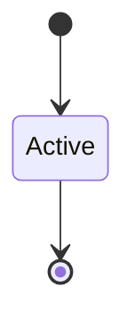

# Memory Safety Boundary

```yaml
status: authoritative
semantics_version: 1.0.0
epoch: 0
authored_by: migration
```

```yaml
status: authoritative
semantics_version: 1.0.0
```

Crate/module `unsafe` allow map. Directory-level CI rules.

---

## TCB crates

Kernel core: `unsafe` per [`UNSAFE_AUDIT.md`](UNSAFE_AUDIT.md). Count reported in `STATUS.md` by module.

---

## Policy

No new `unsafe` in TCB without second reviewer. No recursion beyond documented stack depth policy.

---

## State machine



