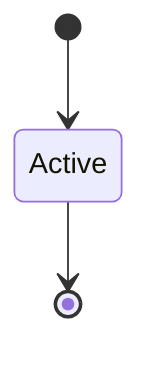

# Proof Coverage

```yaml
status: authoritative
semantics_version: 1.0.0
epoch: 0
authored_by: migration
```

```yaml
status: authoritative
semantics_version: 1.0.0
```

Three-tier evidence model. See [`KANI_SCOPE.md`](KANI_SCOPE.md), [`RIGHTS_ALGEBRA.md`](RIGHTS_ALGEBRA.md).

---

## Tiers

| Tier | Mechanism | Role |
|------|-----------|------|
| A | proptest | Broad state-space sampling |
| B | Kani (bounded) | Critical safety properties |
| C | Verus (selective) | High-assurance subsets |
| D | Formal model (TLA+ etc.) | Post-150; gated by framework decision |

---

## Verus triggers

1. Kani harness bound exceeds **H_max** (default depth 16), **or**
2. Threat node rated **critical** for TOCTOU/temporal property Kani cannot express

Verus escalation exhausted at N+2: charter decision per `CHARTER.md`.

---

## Composition laws

Sub-property proofs sufficient by stated composition theorem **or** dedicated top-level harness when cap kind count exceeds threshold N.

**Composition coverage metric:** cap-kind pairs with theorem or harness coverage — reported in `STATUS.md`.

---

## Invariant inventory

Each invariant lists: tier, harness bound, threat node id, CI gate, Verus/Kani/fuzz status.

| ID | Property | Tier | Bound | Threat node | CI gate | Status |
|----|----------|------|-------|-------------|---------|--------|
| RA-01 | Delegate child ⊆ parent | B | 32 | T-cap-amplification | `kani_gate.py` | Kani + proptest |
| RA-02 | Amplification denied (R-06) | B | 32 | T-cap-amplification | `kani_gate.py` | Kani vacuity cover |
| RA-03 | Depth-2 chain monotone | B | 32 | T-cap-amplification | `kani_gate.py` | Kani |
| RA-04 | `contains` / `intersect` laws | A | 10k samples | — | `rights_algebra_check.py` | proptest-style random |

---

## State machine



