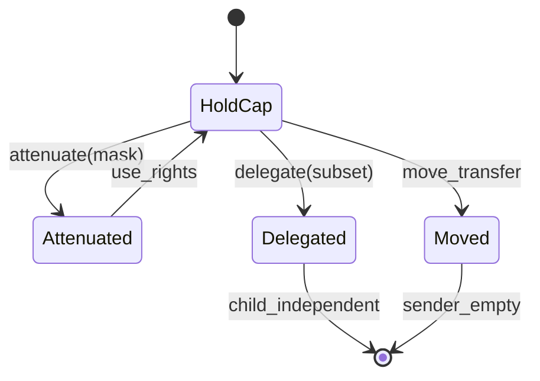

# Rights Algebra (Authority Calculus)

```yaml
status: authoritative
semantics_version: 1.2.0
epoch: 0
authored_by: kernel
```

**Gate G2** — phases **112–113** cap lifecycle implementation blocked until this document is signed off at phase 110.

**Epoch 0:** ratified as grounding doc for brokers epoch 1+. Composition laws below require Kani + proptest before epoch 1 brokers.

Formal semantics for authority — not informal permission flags. See [AXIOMS.md](../AXIOMS.md) A1, A3, A7, A10 and [SEMANTIC_SPECS.md](../SEMANTIC_SPECS.md) R-* cases.

See: [KERNEL_OBJECT_MODEL.md](KERNEL_OBJECT_MODEL.md) § Invariants, § Handle semantics.

---

## Core laws

### Monotonicity

Along any delegation chain, effective rights **only shrink** unless an explicit **re-derive** authority exists (e.g. permission broker + user consent + audit trail). Default: **no amplification** (A1).

### Transfer invariants

| Operation | Sender after | Receiver gets |
|-----------|--------------|---------------|
| **Move** | Cap slot empty / consumed | Same or attenuated rights; ownership of message/resource moves |
| **Borrow** | Retains cap; lender tracked | Strict subset; **cannot delegate**; must not outlive lender (R-02) |
| **Delegate** | Retains cap (unless move-delegate) | New cap with ⊆ rights |

Cross-domain transfer (process ↔ service ↔ endpoint) must be **explicit** (A3).

### Aliasing

Two caps may reference the same underlying authority only when documented. With **immutable identity + generation**, aliasing is `(ObjectId, Generation)` equality — not ambiguous in-place mutation.

### Amplification

| Rule | Detail |
|------|--------|
| Default | **Deny** — rights cannot grow vs parent cap |
| Exception | Named authority (permission broker), user-visible grant, auditable event |

Spec case **R-06** — amplification attempt without authority path **fails**.



---

## Operations (pre/post conditions)

| Op | Pre | Post |
|----|-----|------|
| **Derive** | Holder has derive right on subset | New cap with ⊆ rights |
| **Attenuate** | Holder has cap | New cap with strict subset |
| **Delegate** | Subset allowed | Child cap ⊆ parent |
| **Revoke** | Revoker has revoke authority on object/session | See revocation + TEMPORAL visibility |

---

## Revocation semantics

Capabilities are easy; **revocation is hard**. See [TEMPORAL_SEMANTICS.md](../TEMPORAL_SEMANTICS.md) for visibility timing.

| Mechanism | Use when |
|-----------|----------|
| **Hard revoke** | Cap slot invalidated immediately |
| **Lazy revoke** | Valid until next documented checkpoint (cheaper, weaker) |
| **Generation invalidation** | `ObjectId` stable; generation bump kills descendants (R-03) |
| **Proxy revocation** | Broker session ends → downstream minted caps die (R-04) |
| **Endpoint teardown** | Mailbox closed; cancel propagates to waiters |

Must remain coherent under: service death, broker restart, app update, user permission withdraw.

---

## Minimization (A10)

Prefer deriving IPC or storage rules from this algebra rather than parallel subsystem-only "permission" docs. New laws after phase 110 require minimization review in [AXIOMS.md](../AXIOMS.md).

---

## Spec case linkage

| ID | Law exercised |
|----|----------------|
| R-01 | Delegation ⊆ parent |
| R-02 | Borrow lifetime |
| R-03 | Generation invalidation |
| R-04 | Proxy / broker cascade |
| R-05 | Move consumes sender |
| R-06 | Amplification denied |

Full narratives in [SEMANTIC_SPECS.md](../SEMANTIC_SPECS.md).

---

## Composition laws (epoch 0)

See [PROOF_COVERAGE.md](../PROOF_COVERAGE.md) for tier mapping.

| Law | Specification |
|-----|---------------|
| **Chained attenuation** | `attenuate(attenuate(r, m1), m2) = attenuate(r, m1 ∪ m2)` (monotone) |
| **Transfer then attenuate** | Document order; Kani proves no amplification either path |
| **Dual caps same object** | **No implicit union** — operations require explicit cap unless `effective_rights` rule defined |
| **Broker composition** | Multi-step mint equals single attenuation from grant |
| **Broker idempotency** | Multi-step mint idempotent and order-independent where applicable |
| **Empty-rights cap** | Named policy: existence token / invalid at creation / valid-then-immediately-revoked |
| **IPC reply amplification** | No rights gain via round-trip IPC reply cap |
| **Attenuation at boundary** | Kernel applies attenuation at transfer — intermediate cannot skip masks |
| **Remediable structural retry** | Quota exceeded → release N caps → retry succeeds without amplification |

**Proptest:** uniform distribution over `(cap_kind, operation, mask)` tuples — not default arbitrary skew.
