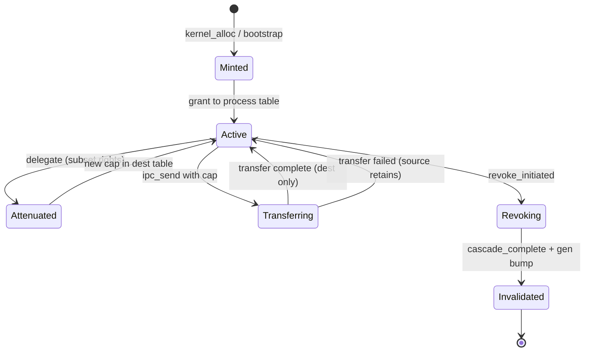
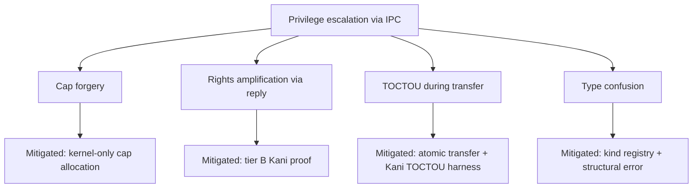

# Security Model

```yaml
status: authoritative
version: 0.1.0
epoch: 0
authored_by: security
```

Overview of the AresOS capability-secured authorization model, attacker taxonomy, and the closure statement defining what "secure" means in the QEMU era through milestone 400.

Cross-references: [KERNEL_OBJECT_MODEL.md](KERNEL_OBJECT_MODEL.md), [../THREAT_MODEL.md](../THREAT_MODEL.md), [../THREAT_NODES.toml](../THREAT_NODES.toml), [../RIGHTS_ALGEBRA.md](../RIGHTS_ALGEBRA.md), [../FAULT_ESCALATION.md](../FAULT_ESCALATION.md).

---

## Overview

AresOS uses an **object-capability model** as the sole kernel authorization mechanism. There is no ambient authority: every operation on every kernel object requires a capability with sufficient rights. DAC permission bits exist only in the POSIX compatibility server, not in the kernel.

Capabilities are unforgeable references `(object_id, kind, generation, rights)` indexed through per-process capability tables. The kernel never accepts a capability value from userspace without table lookup and generation validation.

---

## Invariants

1. **No ambient authority** — privilege is always traceable to an explicit capability grant in the call chain.
2. **Monotone rights** — delegation and attenuation never amplify rights.
3. **Atomic transfer** — a capability is in exactly one table during transfer (source reserved or destination active).
4. **Generation invalidation** — stale capabilities fail at lookup with a terminal error class.
5. **No oracle leakage** — unprivileged error responses never contain `cap_id`, `generation`, or kernel object addresses.
6. **Confined caps** — non-sendable capabilities are rejected at IPC transfer by the kernel.
7. **Mint authority** — only bootstrap ceremony and auditable broker mint paths from kernel root create authority ex nihilo.

---

## Capability lifecycle state machine



---

## Attacker taxonomy

### Goals

| Goal | Description |
|------|-------------|
| `privilege_escalation` | Gain authority beyond granted capabilities |
| `information_disclosure` | Leak data across trust boundaries |
| `denial_of_service` | Degrade availability without escalation |
| `integrity_violation` | Corrupt security state or forensic evidence |

### Classes

| Class | Capability | Primary goals |
|-------|------------|---------------|
| Unprivileged user process | Ring 3, compat syscalls, limited caps | escalation, DoS |
| Compromised userland service | Native caps from loader manifest | all four |
| Compromised compat shim | Compat-internal bridge (retired M400) | escalation, integrity |
| Malicious IPC peer | Valid endpoint, hostile patterns | DoS, escalation |
| Compromised CI runner | Build pipeline write | integrity |
| Compromised contributor | Merge with review bypass | integrity, escalation |
| Insider | TCB path author with review gap | integrity (mitigated: second reviewer) |
| Physical attacker | Hardware access | deferred post-150 |
| Side-channel observer | Timing/power | deferred with reopen trigger |

### Confused deputy variants

| Variant | Mitigation |
|---------|------------|
| Standard confused deputy | Server verifies cap grant purpose before privileged use |
| Forwarding confused deputy | Privileged service must not combine caller cap with ambient broker privilege |

---

## Threat tree: privilege escalation via IPC



Structured nodes: `docs/THREAT_NODES.toml`. CI requires zero `open` nodes at epoch gate.

---

## Operations

| Operation | Capability requirement | Error classes |
|-----------|------------------------|---------------|
| Object use | Valid cap, matching kind, sufficient rights, current generation | Structural, Terminal |
| Delegate | Delegate right on source cap | Structural, StructuralRemediable (quota) |
| Transfer | Send right; confined caps rejected | Structural, Terminal |
| Revoke | Revoke right on authority cap | Terminal to derived holders at checkpoint |
| IPC send | Endpoint cap + optional caps in message | Transient (retry), Terminal (revoked endpoint) |

---

## Error handling

All security errors map to `docs/ERROR_TAXONOMY.md` classes. Terminal errors on revoked capabilities require callers to drop stale handles and reconnect. Structural errors indicate caller misuse without invalidating unrelated caps.

---

## Security considerations

- **Audit:** kernel-only write path; chain-hash records for cap lifecycle events; security partition non-droppable before suspend.
- **Bootstrap ceremony:** PID-1 cap set is the only ambient-free mint path; threat node `T-bootstrap-scope-creep`.
- **Compat layer:** untrusted translator; cannot self-grant capabilities (bridge retired at M400).
- **AI subsystem (future):** accelerator caps, inference sandbox with minimal cap set, content-addressed model registry.

---

## Closure statement (QEMU era through M400)

**"Secure" for AresOS in the QEMU development era means:**

1. Every kernel object operation is capability-mediated with generation-checked lookup.
2. No known open threat nodes in `THREAT_NODES.toml` for in-scope attacker classes.
3. Tier B Kani harnesses pass at declared bounds for cap transfer, rights algebra, and revocation window.
4. Compat-internal IPC bridge call sites are zero (enforced by CI).
5. Audit lifecycle events for mint, delegate, revoke, transfer, and attenuation are recorded on the kernel write path.
6. Fault escalation tiers 1–3 are implemented with documented behavior for service crash and kernel halt paths.
7. Residual risks (physical attacker, side channels, debug introspection bypass) are explicitly deferred with machine-checkable reopen triggers in `architecture_state.toml`.

This is **not** a claim of complete formal verification of the OS. Tier B coverage is bounded; bounds are documented in `docs/KANI_SCOPE.md` and per-harness comments.

---

## Verification approach

| Property | Tier | Harness |
|----------|------|---------|
| Rights attenuation monotone | A | `proof-rights` proptest |
| No delegate amplification | B | `proof-rights` Kani |
| Transfer atomicity (TOCTOU) | B | `transfer_toctou_check.py` + Kani |
| Generation uniqueness | B | `proofs/kani/generation_uniqueness` |
| Revocation window | B | `proofs/kani/revocation_window` |
| IPC reply rights bound | B | epoch 3 harness |

---

## Cross-references

- [KERNEL_OBJECT_MODEL.md](KERNEL_OBJECT_MODEL.md) — object kinds and lifecycle
- [../THREAT_MODEL.md](../THREAT_MODEL.md) — attacker classes and surfaces
- [../ABI_SECURITY.md](../ABI_SECURITY.md) — syscall security boundary
- [../AUDIT_SUBSYSTEM.md](../AUDIT_SUBSYSTEM.md) — audit wire and tamper policy
- [../../DECISION_LOG.md](../../DECISION_LOG.md) — top-level architectural decisions
- [../../SECURITY.md](../../SECURITY.md) — disclosure process
