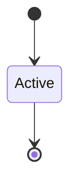

# Temporal Semantics

```yaml
status: authoritative
semantics_version: 1.0.0
epoch: 0
authored_by: migration
```

```yaml
status: authoritative
semantics_version: 1.0.0
```

**Gate G5** — when rights, revocation, cancellation, and restarts become visible across CPUs and async boundaries.

Ratified epoch 0 (2026-06-11). Aligns with [`FAULT_ESCALATION.md`](FAULT_ESCALATION.md) authority checkpoints and [`SCHEDULER_MODEL.md`](SCHEDULER_MODEL.md) revoke-while-runnable visibility.

*Distributed systems theory inside one OS* — multicore + async + endpoints + brokers on a single machine.

See: [AXIOMS.md](AXIOMS.md), [RIGHTS_ALGEBRA.md](RIGHTS_ALGEBRA.md), [ABI_IPC.md](ABI_IPC.md), [ABI_ASYNC.md](ABI_ASYNC.md), [SEMANTIC_SPECS.md](SEMANTIC_SPECS.md) T-* / M-* cases.

---

## Visibility domains

| Domain | Must define |
|--------|-------------|
| Rights changes | Visible after which syscall return / cap op checkpoint |
| Revocation propagation | Hard vs lazy; generation bump scope |
| Cancellation | Waiter wake time; in-flight message fate |
| SMP | Happens-before between cap ops on different CPUs (document assumptions) |
| Async memory | Message buffer visible after ownership transfer |
| Service restart | Peer observes generation bump before new mail accepted |

Phase 1–100 compat paths document **current** behavior in [ABI_SYSCALL.md](ABI_SYSCALL.md); native paths tighten visibility at implementation phases 111+.

---

## Checkpoint model

**Authority checkpoint:** a syscall return, explicit `cap_checkpoint`, or endpoint wait completion after which all prior revocations on observed generations are visible to that thread.

- **Hard revoke:** fails next cap use after checkpoint
- **Lazy revoke:** fails at or before next checkpoint (T-01)
- **Generation bump:** caps with `generation < current` fail at checkpoint (R-03)

Exact syscall list for native checkpoints is reserved in `ares-semantics-v1` (implementation phase 112+).

---

## Cancellation vs revocation

| Event | Primary owner |
|-------|----------------|
| Cancel token on endpoint | ABI_ASYNC + ABI_IPC |
| Revoke cap / generation bump | RIGHTS_ALGEBRA |

**T-02** — cancel + revoke race has **one** documented outcome (no double-free authority, no duplicate delivery).

---

## Meta-semantics M-* precedence table (epoch 8 graduation)

When **cancellation**, **revocation**, **endpoint teardown**, and **service restart** coincide:

| ID | Priority | Event | Outcome |
|----|----------|-------|---------|
| M-01 | 1 | Hard revoke / generation invalidation | All in-flight cap ops fail at next checkpoint |
| M-02 | 2 | Endpoint teardown | Peers observe closed boundary; no new sends |
| M-03 | 3 | Cancellation token | Waiters drained per ABI_ASYNC rules |
| M-04 | 4 | Service restart | New generation before mail accepted |
| M-05 | 5 | Lazy revoke | Fails at or before next authority checkpoint |

**T-04** / **M-01** — simultaneous multi-domain event resolves to highest-priority row (single outcome).

Jurisdiction: cap authority → [`RIGHTS_ALGEBRA.md`](RIGHTS_ALGEBRA.md); endpoint lifecycle → [`ABI_IPC.md`](ABI_IPC.md); async cancel → [`ABI_ASYNC.md`](ABI_ASYNC.md).

---

## SMP note

Until full memory-model documentation ships, native cap operations assume:

- Cap table mutations serialize per-process or use documented atomics
- No observer sees **amplified** rights after another CPU’s delegate (T-03)

Strengthen happens-before story when native cap syscalls land (phase 112+).

---

## Observability

Future law-linked traces: [SEMANTIC_OBSERVABILITY.md](SEMANTIC_OBSERVABILITY.md) (implementation post-170).

---

## State machine



