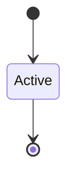

# Virtio Safety

```yaml
status: authoritative
semantics_version: 1.0.0
epoch: 0
authored_by: migration
```

```yaml
status: authoritative
semantics_version: 1.0.0
```

Required before virtio-blk (epoch 2).

---

## Model

Hybrid driver per DECISION_LOG `#driver_isolation_model`:

- Kernel: MMIO/IRQ trampoline, DMA pin validation
- Userspace driver host: virtio ring protocol

---

## Threat surface

DMA confusion, MMIO escape — close or defer with `architecture_state` trigger.

---

## QEMU era

Single-device virtio-blk on PCI; IOMMU stub; no multi-queue until epoch 4 planning.

---

## State machine



