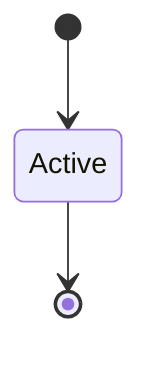

# Epoch Failure Procedure

```yaml
status: authoritative
semantics_version: 1.0.0
epoch: 0
authored_by: migration
```

```yaml
status: authoritative
semantics_version: 1.0.0
```

See [`CHARTER.md`](../CHARTER.md), [`DESIGN_NORTH_STAR.md`](DESIGN_NORTH_STAR.md).

---

## Stale epoch

Epoch marked stale on compound hard-gate failure or unresolved cross-doc drift. Recovery budget: ~2 scope-cycles; beyond → charter-level decision.

---

## Benchmark regression

Multi-scope regression uses bisection. Standard tool: `scripts/project_health.py --bisect <metric> <start> <end>` — binary search over git log re-running health checks.

---

## Source ↔ image reconciliation

Signed image must be reproducible from tagged source. Divergence procedures documented — not independent rollback silos.

---

## CAP_REGISTRY reconciliation

Registry ↔ markdown mismatch → epoch stale. Owner = scope owner who introduced drift.

---

## Epoch 0 scope freeze

After `scope-freeze` commit: new epoch-0 docs require charter approval. 90-day budget per `CHARTER.md`.

---

## Epoch 0 post-gate amendment

Additive/clarification semver OK with second reviewer. Breaking foundational change → full cross-doc review + affected domain re-sign-off.

---

## Soak test failure

Triage owner: epoch lead or named soak owner. Distinct from scope revert path.

---

## State machine



