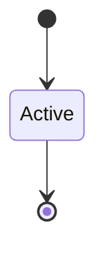

# Supply Chain Policy

```yaml
status: authoritative
semantics_version: 1.0.0
epoch: 0
authored_by: migration
```

```yaml
status: authoritative
semantics_version: 1.0.0
```

`cargo audit` / `cargo deny` triage. See [`DEPENDENCY_POLICY.md`](DEPENDENCY_POLICY.md).

---

## Responses

| Situation | Action |
|-----------|--------|
| Critical, no fix | Exception + documented risk acceptance |
| Critical, breaking fix | Planned bump + matrix re-run |
| Path not reached | Documented verification (Kani/fuzz/analysis) |

---

## Proactive review

Scheduled pin review cadence — not only audit-triggered.

---

## Day-zero soak

30d kernel TCB, 7d build tooling hold before admission. Emergency fix exempt with charter approval.

---

## State machine



