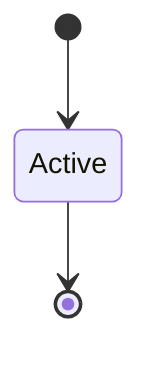

# Unsafe Code Audit Policy

```yaml
status: authoritative
semantics_version: 1.0.0
epoch: 0
authored_by: migration
```

```yaml
status: authoritative
semantics_version: 1.0.0
```

Policy for `unsafe` Rust, `extern "C"` FFI, and TCB-adjacent code in the AresOS kernel.

---

## Scope

Applies to:

- All `unsafe` blocks and `unsafe fn` in kernel TCB crates
- `extern "C"` entry points and FFI boundaries
- Assembly and inline arch-specific primitives

Module allow map: `MEMORY_SAFETY_BOUNDARY.md`.

---

## Review requirements

| Change | Requirement |
|--------|-------------|
| New `unsafe` in TCB | Second reviewer from a **different domain** than author |
| Modified verified function (Kani) | Reviewer checks vacuity assertions and bound justification |
| New `extern "C"` export | Charter approval if stable ABI; else epoch gate soft warning |
| AI-generated / AI-assisted TCB code | **Same second-reviewer treatment** as human `unsafe`; reviewer attestation that output was **understood and verified against relevant `KERNEL_OBJECT_MODEL` invariants** — not only compile/test/Kani pass |

---

## Annotations

Each `unsafe` block must cite:

- **Safety invariant** being relied upon
- **Threat node** or proof tier if applicable
- **Reviewer** id in commit message for TCB changes

---

## STATUS reporting

`project_health.py` reports **unsafe count by module** each epoch gate.

New `pub unsafe fn` and `extern "C"` trigger soft CI warnings cross-checked against `THREAT_NODES.toml`.

---

## C-ABI FFI charter gate

Stable `extern "C"` kernel exports require charter approval (`CHARTER.md`) before 1.0.

---

## State machine



